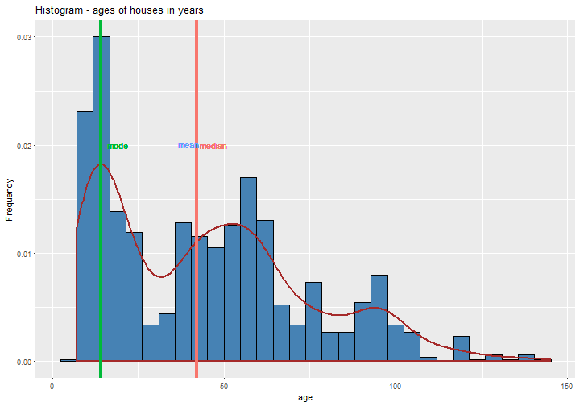
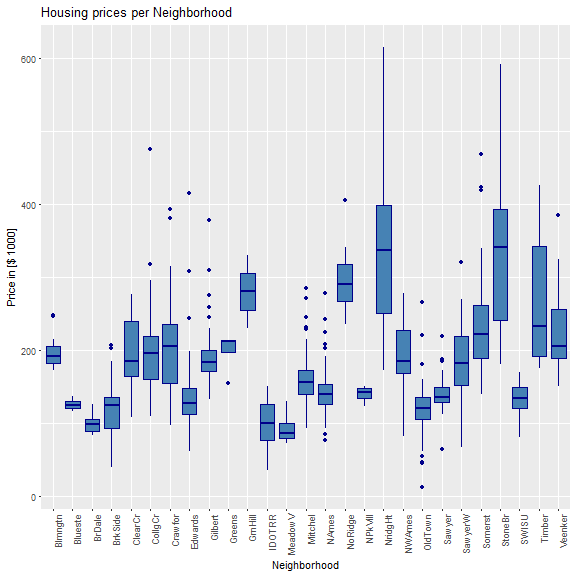
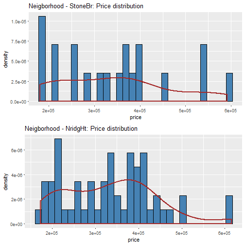
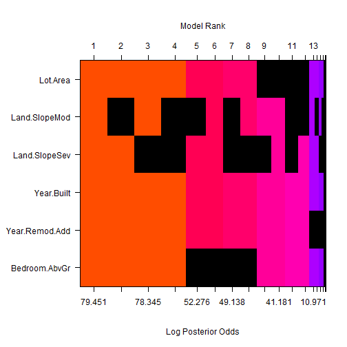
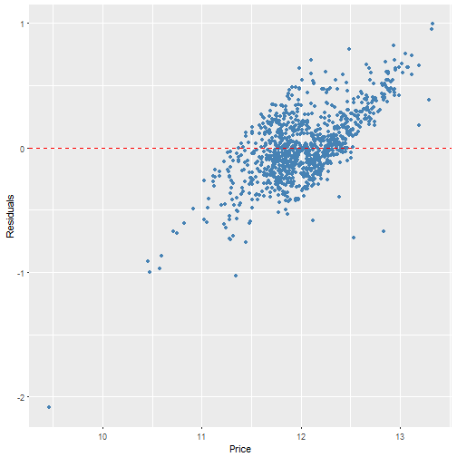
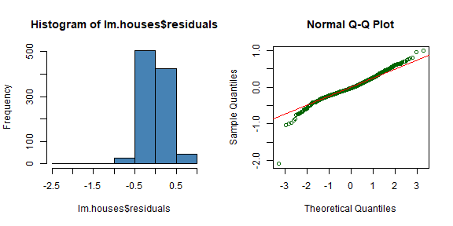
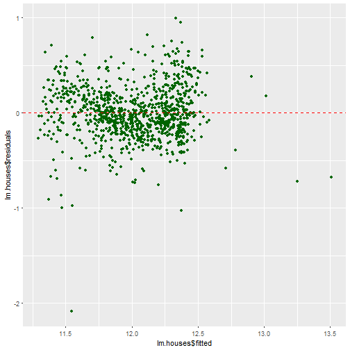
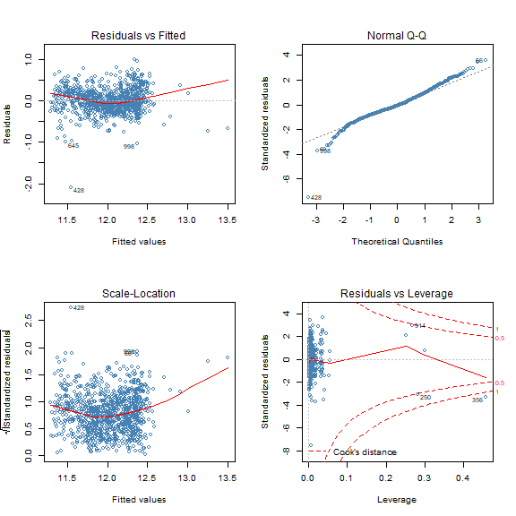
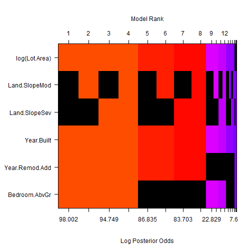
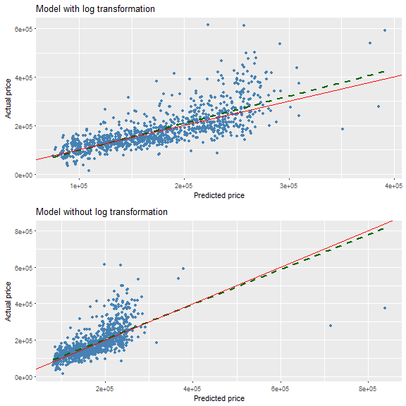

<h2><b>Peer Assessment I</b></h2>
<br>
Author: Bruno Hunkeler   
Date:   15.05.2017
<hr>

First, let us load the data and necessary packages:


```r
# ============================================================================================================
# Load Libraries
# ============================================================================================================

library('MASS')
library('ggplot2')      # library to create plots
library('dplyr')        # data manipulation
library('knitr')        # required to apply knitr options 
library('statsr')       # staistics functions   
source('utils.R')       # support functions used in the analysis - See Appendix

library('GGally')       # library to create plots
library('gridExtra')    # arrange plots
library('BAS')          # Bayesian statistics functions
library('labeling')     # dependency package to ggplot
library('tidyr')

# apply general knitr options
knitr::opts_chunk$set(comment=NA, fig.align='center')
```

Load the data set

```r
# ============================================================================================================
# load data file
# ============================================================================================================

load('Data/ames_train.Rdata')

data <- ames_train
```

<h3>Question 1</h3> 
Make a labeled histogram (with 30 bins) of the ages of the houses in the data set, and describe the distribution.


```r
data$age <- sapply(data$Year.Built, function(x) 2017 - x) 

# calculate the mode of the distribution
mode <- dmode(data$age)


ggplot(data = data, aes(x = age, y = ..density..)) +
  geom_histogram(bins = 30, fill = 'steelblue', colour = 'black') + #bdbdbd
  geom_density(size = 1, colour = 'brown') + #cccccc
  labs(title = "Histogram - ages of houses in years", x = 'age', y = "Frequency") +
  geom_vline(data = data, mapping = aes( xintercept = mean(data$Yage), colour = 'steelblue'), size = 1.5) +
  geom_vline(data = data,mapping = aes( xintercept = median(data$age), colour = 'green'), size = 1.5) +
  geom_vline(data = data, mapping = aes( xintercept = mode, colour = 'red'), size = 1.5) +
  geom_text(data = data, aes( x = (mean(data$age) - 5), y = .020, label = 'mean', colour = 'steelblue'), size = 4, parse = T) +
  geom_text(data = data,aes( x = (median(data$age) + 5),y = .020,  label = 'median', colour = 'green'), size = 4, parse = T) +
  geom_text(data = data, aes( x = (mode + 5), y = .020, label = 'mode', colour = 'red'), size = 4, parse = T) +
  guides(color = FALSE, size = FALSE)
```

```
Warning: Unknown or uninitialised column: 'Yage'.
```

```
Warning in mean.default(data$Yage): argument is not numeric or logical:
returning NA
```

```
Warning: Removed 1000 rows containing missing values (geom_vline).
```



```r
summary.age <- data %>% summarise(mean_age = mean(age),
                   median_age = median(age),
                   sd_age = sd(age),
                   min_age = min(age),
                   max_age = max(age),
                   IQR_age = IQR(age),
                   total = n())
```

The distribution of the feature 'age' of houses shows a general <b>right skewed distribution</b>. But it also indicates a multimodal behaviour. 
The <b>mean</b> is <b>44.797</b>, while the <b>median</b> is at <b>42</b> years. The <b>mode</b> is located at around <b>14.10053</b>. The construction boom is clearly visible from 1950 up to 1980. It also shows a drop of construction in the 80's. In the early 90's building houses started over again, basically driven by the low interest rates. Most houses have been built in recent years. The table below shows the features of the distribution of the given data. 

<b>Features of the distribution - Age</b>
  
  Function  | Value     |                     
  ----------|-----------|
  mean      | 44.797    | 
  median    | 42        | 
  mode      | 14.10053  | 
  sd        | 29.63741  |
  min       | 7         | 
  max       | 145       |  
  IQR       | 46        | 
  # items   | 1000      | 

<h3>Question 2</h3> 
The mantra in real estate is "Location, Location, Location!" Make a graphical display that relates a home price to its neighborhood in Ames, Iowa. Which summary statistics are most appropriate to use for determining the most expensive, least expensive, and most heterogeneous (having the most variation in housing price) neighborhoods? Report which neighborhoods these are based on the summary statistics of your choice. Report the value of your chosen summary statistics for these neighborhoods.


```r
# extract summary parameter 
price.neigborhood <- data %>% dplyr::select(price, Neighborhood)
price.neigborhood.summary <- price.neigborhood %>% group_by(Neighborhood) %>% summarise(mean_price = mean(price),
                                                                median_price = median(price),
                                                                min_price = min(price),
                                                                max_price = max(price),
                                                                IQR_price = IQR(price),
                                                                sd_price  = sd(price),
                                                                var_price = var(price),
                                                                total = n())
# find the required information in the summary data 
Most.exp.Neighborhood <- price.neigborhood.summary[which(price.neigborhood.summary$median_price == max(price.neigborhood.summary$median_price)),]
Least.exp.Neighborhood <- price.neigborhood.summary[which(price.neigborhood.summary$median_price == min(price.neigborhood.summary$median_price)),]
Most.het.Neighborhood <- price.neigborhood.summary[which(price.neigborhood.summary$sd_price == max(price.neigborhood.summary$sd_price)),]

# create box plot
ggplot(data, aes(x = Neighborhood, y = (data$price / 1000))) +
       geom_boxplot(color = "darkblue", fill = 'steelblue') + 
       labs(title = "Housing prices per Neighborhood", x = 'Neighborhood', y = "Price in [$ 1000]") +
       theme(axis.text.x = element_text(angle = 90, hjust = 1)) 
```



The boxplot shows the price distribution per Neighborhood. The most expensive Neighborhood is `StoneBr`. The value has been evaluated be calculating the maximum median value of all houses in a Neighborhood, while the least expensive Neighborhood is associated with `MeadowV`. This value has been evaluated by calculating the minimum median value of all houses in a Neighborhood.
When we have a look at the plot we see basically two Neighborhoods which need to be considered (`StoneBr` and `NridgHt`). Calculating the price range either via 
min/max or the range function implies that the highest spread lies with `NridgHt`. But since the variability does not equal spread, we need to consider the <b>variance</b> resp. the <b>standard deviation</b> of housing prices. Therefore the Neighborhood with the most heterogeneous house prices is again `StoneBr`. 


```r
kable(Most.exp.Neighborhood[1:9], caption = '<b>Most expensive Neighborhood</b>')
```


|Neighborhood | mean_price| median_price| min_price| max_price| IQR_price| sd_price|   var_price| total|
|:------------|----------:|------------:|---------:|---------:|---------:|--------:|-----------:|-----:|
|StoneBr      |     339316|     340691.5|    180000|    591587|    151358| 123459.1| 15242150036|    20|


```r
kable(Least.exp.Neighborhood[1:9], caption = '<b>Least expensive Neighborhood</b>')
```


|Neighborhood | mean_price| median_price| min_price| max_price| IQR_price| sd_price| var_price| total|
|:------------|----------:|------------:|---------:|---------:|---------:|--------:|---------:|-----:|
|MeadowV      |   92946.88|        85750|     73000|    129500|     20150| 18939.78| 358715156|    16|


```r
kable(Most.het.Neighborhood[1:9], caption = '<b>Most heterogenious Neighborhood</b>')
```


|Neighborhood | mean_price| median_price| min_price| max_price| IQR_price| sd_price|   var_price| total|
|:------------|----------:|------------:|---------:|---------:|---------:|--------:|-----------:|-----:|
|StoneBr      |     339316|     340691.5|    180000|    591587|    151358| 123459.1| 15242150036|    20|

The following table shows all the summary data evaluated for each Neighborhood


```r
kable(price.neigborhood.summary[1:9], caption = 'Summary Data Neighborhood vs. price')
```


|Neighborhood | mean_price| median_price| min_price| max_price| IQR_price|  sd_price|   var_price| total|
|:------------|----------:|------------:|---------:|---------:|---------:|---------:|-----------:|-----:|
|Blmngtn      |  198634.55|     191000.0|    172500|    246990|  22887.50|  26454.86|   699859385|    11|
|Blueste      |  125800.00|     123900.0|    116500|    137000|  10250.00|  10381.23|   107770000|     3|
|BrDale       |   98930.00|      98750.0|     83000|    125500|  16725.00|  13337.59|   177891222|    10|
|BrkSide      |  122472.56|     124000.0|     39300|    207000|  42000.00|  37309.91|  1392029619|    41|
|ClearCr      |  193153.85|     185000.0|    107500|    277000|  76000.00|  48068.69|  2310599359|    13|
|CollgCr      |  196950.86|     195800.0|    110000|    475000|  58836.00|  52786.08|  2786370244|    85|
|Crawfor      |  204196.55|     205000.0|     96500|    392500|  80100.00|  71267.56|  5079065345|    29|
|Edwards      |  136322.02|     127250.0|     61500|    415000|  35750.00|  54851.63|  3008701120|    60|
|Gilbert      |  193328.02|     183500.0|    133000|    377500|  28000.00|  41190.38|  1696647595|    49|
|Greens       |  198562.50|     212625.0|    155000|    214000|  16437.50|  29063.42|   844682292|     4|
|GrnHill      |  280000.00|     280000.0|    230000|    330000|  50000.00|  70710.68|  5000000000|     2|
|IDOTRR       |   97620.69|      99500.0|     34900|    150909|  48900.00|  31530.44|   994168913|    35|
|MeadowV      |   92946.88|      85750.0|     73000|    129500|  20150.00|  18939.78|   358715156|    16|
|Mitchel      |  165013.64|     156500.0|     93500|    285000|  32875.00|  39682.94|  1574735507|    44|
|NAmes        |  141355.97|     139900.0|     76500|    277500|  27050.00|  27267.97|   743542382|   155|
|NoRidge      |  295844.64|     290000.0|    235000|    405000|  50312.50|  35888.97|  1288018396|    28|
|NPkVill      |  139275.00|     142100.0|    123000|    149900|  13025.00|  11958.37|   143002500|     4|
|NridgHt      |  333646.74|     336860.0|    173000|    615000| 148800.00| 105088.90| 11043676986|    57|
|NWAmes       |  194093.90|     185000.0|     82500|    278000|  59100.00|  41340.50|  1709037274|    41|
|OldTown      |  120225.61|     120000.0|     12789|    265979|  29550.00|  36429.69|  1327122510|    71|
|Sawyer       |  139312.70|     136000.0|     63900|    219000|  20350.00|  21216.22|   450128096|    61|
|SawyerW      |  183101.00|     182500.0|     67500|    320000|  67000.00|  48354.36|  2338143789|    46|
|Somerst      |  234595.88|     221650.0|    139000|    468000|  72684.25|  65199.49|  4250973926|    74|
|StoneBr      |  339316.05|     340691.5|    180000|    591587| 151358.00| 123459.10| 15242150036|    20|
|SWISU        |  130619.50|     134000.0|     80000|    169000|  29250.00|  27375.76|   749432272|    12|
|Timber       |  265192.16|     232500.0|    175000|    425000| 151200.00|  84029.57|  7060968802|    19|
|Veenker      |  233650.00|     205750.0|    150000|    385000|  68125.00|  72545.41|  5262836111|    10|

As mentioned there are two Neigborhood's, which have a similar variability. Apart from the summary data I'll place an additional graph to support the decision 
to choose `StoneBr` as the most heterogenious Neighborhood. 


```r
q1 <- price.neigborhood %>% filter(Neighborhood == 'StoneBr')
q2 <- price.neigborhood %>% filter(Neighborhood == 'NridgHt')

p1 <- ggplot(data = q1, aes(x = price, y = ..density..)) +
  geom_histogram(bins = 30, fill = 'steelblue', colour = 'black') + 
  labs(title = "Neigborhood - StoneBr: Price distribution", x = 'price', y = "density") +
  geom_density(size = 1, colour = 'brown') 
  

p2 <- ggplot(data = q2, aes(x = price, y = ..density..)) +
  geom_histogram(bins = 30, fill = 'steelblue', colour = 'black') + 
  labs(title = "Neigborhood - NridgHt: Price distribution", x = 'price', y = "density") +
  geom_density(size = 1, colour = 'brown') 

grid.arrange(p1, p2)
```



<h3>Question 3</h3> 
Which variable has the largest number of missing values? Explain why it makes sense that there are so many missing values for this variable.


```r
# find the variable with the highest NA count
na_count <- sapply(data, function(x) sum(is.na(x)))
df.na_count <- data.frame(na_count)

df.merged <- cbind(c(row.names(df.na_count)), df.na_count[,1])
colnames(df.merged) <- c('feature', 'No_NA')

df.merged[which(df.na_count == max(df.na_count)),]
```

```
  feature     No_NA 
"Pool.QC"     "997" 
```

The feature <b>Pool Quality (Pool.QC)</b> has the higest number of NA's. Consulting the codebook we see that the parameter <b>NA</b> of the feature <b>Pool.QC</b> refers to houses without a pool. This in a way makes sense, if we look at the climate data below. 


```r
# prepare the climate data of ames, Iowa
term <- c('Av. high in °C', 'Av. low in °C', 'Av. precipitation in mm', 'Average snowfall in cm')
col.nm <-  c(' ', 'Jan', 'Feb', 'Mar', 'Apr', 'May', 'Jun',  'Jul', 'Aug', 'Sep', 'Oct', 'Nov', 'Dec' ) 

av.high <- c(-1.3 , 1.4, 8.8, 17.2, 22.8, 27.5, 29.1, 28.1, 24.9, 17.8, 8.4, 0.1 )
av.low <- c(-11.3, -8.6, -2.4, 3.7, 10.1, 15.5, 17.6, 16.4, 11.6, 5, -2.1, -9.3)
av.prec <- c(18, 21, 54, 94 , 122, 126, 123, 122, 83, 66, 52, 29 )
av.snow <- c(17.8, 20.3, 12.7, 2.5, 0, 0, 0, 0, 0, 0 ,5.1, 20.3)
climate <- rbind(av.high, av.low, av.prec, av.snow)

climate <- cbind(term, climate)
rownames(climate) <- NULL
climate <- data.frame(climate)
colnames(climate) <- col.nm
```

<h4>Climate Ames - Iowa</h4>
	
Ames, Iowa, gets 92 cm of rain per year. The US average is 100. Snowfall is 29 inches. The average US city gets 66 cm of snow per year. The number of days with any measurable precipitation is 64. On average, there are 202 sunny days per year in Ames, Iowa. The July high is around 30 degrees °C. The January low is -11 °C. The comfort index for Ames is 33 out of 100, where a higher score indicates a more comfortable year-around climate. The US average for the comfort index is 54. The 
index is based on the total number of days annually within the comfort range of 70-80 degrees.

Source: http://www.usclimatedata.com/climate/ames/iowa/united-states/usia0026


```r
kable(climate[1:13], caption = 'Climate table of Ames in Iowa')
```


|                        |Jan   |Feb  |Mar  |Apr  |May  |Jun  |Jul  |Aug  |Sep  |Oct  |Nov  |Dec  |
|:-----------------------|:-----|:----|:----|:----|:----|:----|:----|:----|:----|:----|:----|:----|
|Av. high in °C         |-1.3  |1.4  |8.8  |17.2 |22.8 |27.5 |29.1 |28.1 |24.9 |17.8 |8.4  |0.1  |
|Av. low in °C          |-11.3 |-8.6 |-2.4 |3.7  |10.1 |15.5 |17.6 |16.4 |11.6 |5    |-2.1 |-9.3 |
|Av. precipitation in mm |18    |21   |54   |94   |122  |126  |123  |122  |83   |66   |52   |29   |
|Average snowfall in cm  |17.8  |20.3 |12.7 |2.5  |0    |0    |0    |0    |0    |0    |5.1  |20.3 |

As mentioned above, the parameter <b>NA</b> of the feature <b>Pool Quality (Pool.QC)</b> indicates that this house doesn't have a pool.  
Economically spoken, given the climate data above makes it clear, that building a Pool in such a climate doesn't make much sense. The time span, an owner could make use of a pool is limitted to a few weeks per year. So, maintenance costs would be much to high, compared to the time one acctualy can use a pool. I got first hand experience, because the climate where I'm from, is around the same. It's hard to find houses with a pool in such climate zones.

<h3>Question 4</h3> 
We want to predict the natural log of the home prices. Candidate explanatory variables are lot size in square feet (Lot.Area), slope of property (Land.Slope), original construction date (Year.Built), remodel date (Year.Remod.Add), and the number of bedrooms above grade (Bedroom.AbvGr). Pick a model selection or model averaging method covered in the Specialization, and describe how this method works. Then, use this method to find the best multiple regression model for predicting the natural log of the home prices.

<h4><b>Model selection</b></h4> 
The best model is not always the most complicated. Sometimes including variables that are not evidently important can actually reduce the accuracy of predictions. In practice, the model that includes all available explanatory variables is often referred to as the full model. The full model may not be the best model, and if it isn't, we want to identify a smaller model that is preferable. Adjusted R^2^ describes the strength of a model, and it is a useful tool for evaluating, which predictors are adding value to the model, where adding value means they are (likely) improving the accuracy in predicting future outcomes.
Backwards elimination was applied to select an appropriate model. Hereby I start with a full model (containing all predictors), drop one predictor at a time until the parsimonious model is reached. I focused on the adjusted R^2^ value, since this leads to more reliable predictions. 

The analysis showed, that the full model gave the highest adjusted R^2^ value.

<b>Full Model</b></br>

So lets start from scratch, by using the following model for the model selection.</br>
<b>log(price) ~ Lot.Area + Land.Slope + Year.Built + Year.Remod.Add + Bedroom.AbvGr</b>


```r
# select only the relevant features
data.model <- data %>% dplyr::select( Lot.Area, Land.Slope, Year.Built, Year.Remod.Add, Bedroom.AbvGr, price)

# make sure no NA values are in the dataset
data.model <- data.model[complete.cases(data.model), ]
formula <- as.formula(log(price) ~ Lot.Area + Land.Slope + Year.Built + Year.Remod.Add + Bedroom.AbvGr)

lm.houses <- lm(formula, data.model)
summary(lm.houses)
```

```

Call:
lm(formula = formula, data = data.model)

Residuals:
    Min      1Q  Median      3Q     Max 
-2.0878 -0.1651 -0.0211  0.1657  0.9945 

Coefficients:
                 Estimate Std. Error t value Pr(>|t|)    
(Intercept)    -1.371e+01  8.574e-01 -15.996  < 2e-16 ***
Lot.Area        1.028e-05  1.106e-06   9.296  < 2e-16 ***
Land.SlopeMod   1.384e-01  4.991e-02   2.773  0.00565 ** 
Land.SlopeSev  -4.567e-01  1.514e-01  -3.016  0.00263 ** 
Year.Built      6.049e-03  3.788e-04  15.968  < 2e-16 ***
Year.Remod.Add  6.778e-03  5.468e-04  12.395  < 2e-16 ***
Bedroom.AbvGr   8.686e-02  1.077e-02   8.063 2.12e-15 ***
---
Signif. codes:  0 '***' 0.001 '**' 0.01 '*' 0.05 '.' 0.1 ' ' 1

Residual standard error: 0.279 on 993 degrees of freedom
Multiple R-squared:  0.5625,	Adjusted R-squared:  0.5598 
F-statistic: 212.8 on 6 and 993 DF,  p-value: < 2.2e-16
```

The summary of our model indicates that the adjusted R^2^ value is 0.5598 and the p-value: < 2.2e-16.
Removing the 'still significant' feature `Land.Slope` and running the analysis again would lead to a slightly smaller adjusted R^2^ value of 0.5526. This leads to the initial assumtion that the full model is indeed the parsimonious model.

Find below an excerpt of models, which give an indication how R_Squared changes with Backward elimination.

```r
formula1 <- as.formula(log(price) ~ Lot.Area + Land.Slope + Year.Built + Year.Remod.Add + Bedroom.AbvGr)
formula2 <- as.formula(log(price) ~ Land.Slope + Year.Built + Year.Remod.Add + Bedroom.AbvGr)
formula3 <- as.formula(log(price) ~ Lot.Area + Year.Built + Year.Remod.Add + Bedroom.AbvGr)
formula4 <- as.formula(log(price) ~ Lot.Area + Land.Slope + Year.Remod.Add + Bedroom.AbvGr)

lm.houses1 <- lm(formula1, data.model)
lm.houses2 <- lm(formula2, data.model)
lm.houses3 <- lm(formula3, data.model)
lm.houses4 <- lm(formula4, data.model)

m1 <- summary(lm.houses1)$adj.r.squared
m2 <- summary(lm.houses2)$adj.r.squared
m3 <- summary(lm.houses3)$adj.r.squared
m4 <- summary(lm.houses4)$adj.r.squared

R_Squared <- rbind(m1, m2, m3, m4)
model <- c('lm.houses1', 'lm.houses2', 'lm.houses3', 'lm.houses4')
df <- data.frame(cbind(model, R_Squared))

colnames(df) <- c('Model', 'R_Squared')
```


```r
kable(df[1:2], caption = 'Model - R_Squared')
```


|   |Model      |R_Squared         |
|:--|:----------|:-----------------|
|m1 |lm.houses1 |0.559834474177341 |
|m2 |lm.houses2 |0.522009031037836 |
|m3 |lm.houses3 |0.552606180049213 |
|m4 |lm.houses4 |0.447366335111107 |


<b>Final model</b></br> 
The final model as per backwards elimination was exactly the full model.</br>
<b>log(price) ~ Lot.Area + Land.Slope + Year.Built + Year.Remod.Add + Bedroom.AbvGr</b>

<bb>Remark:</b></br>
To cross check the solution, I ran a bayesian model selection as well, with a <b>Bayesian Information Criterion</b> prior. The result was exactly the same.


```r
data.model <- data %>% dplyr::select( Lot.Area, Land.Slope, Year.Built, Year.Remod.Add, Bedroom.AbvGr, price)

# make sure no NA values are in the dataset
data.model <- data.model[complete.cases(data.model), ]

formula <- as.formula(log(price) ~ Lot.Area + Land.Slope + Year.Built + Year.Remod.Add + Bedroom.AbvGr)

# Zellner-Siow Cauchy
houses.BIC = bas.lm(formula = formula,
                    prior = "BIC",
                    modelprior = uniform(),
                    data =data.model
)
image.bas(houses.BIC, subset=-1, rotate = FALSE)
```



Summary estimates should only be trusted if the conditions for the regression are reasonable. Having mentioned that, it will be relevant to validate the following aspects:

<h4>Evaluate conditions for Regression</h4>

(i) There is a linear relationship between any numerical predictor variables and the response variable.
(ii) The residuals are nearly normally distributed
(iii) The residuals display constant variability
(iv) The residuals are independent

We first will examine whether the numerical variables included in the model, are linearly related to the response variable (price) by examining the distribution of the residuals.


```r
ggplot(data = NULL, aes(x = log(data.model$price), y = lm.houses$residuals)) + 
      geom_point(col = 'steelblue') + geom_hline(yintercept = 0, linetype = 'dashed', color = 'red') + 
      ylab('Residuals') + xlab('Price') 
```



The residuals are scattered randomly around 0 for all features.
Next, we check whether the residuals display a nearly normal distribution centred around 0.


```r
par(mfrow = c(1,2))
hist(lm.houses$residuals, col = 'steelblue')
qqnorm(lm.houses$residuals, col = 'darkgreen')
qqline(lm.houses$residuals, col = 'red')
```



The results of the histogram of the residuals shows a normal distribution around 0, which is slightly left skewed. This might be driven by an 'extreme' outliners (see figure below). The Q-Q plot also indicates some skewness in the tails, but there are no major deviations. So we can conclude that the conditions for this model are reasonable. 


```r
par(mfrow = c(1,2))
ggplot(data = NULL, aes(x = lm.houses$fitted, y = lm.houses$residuals)) + geom_point(col = 'darkgreen') + 
      geom_hline(yintercept = 0, linetype = 'dashed', color = 'red')
```


The results show that the residuals are equally variable for low and high values of the predicted values, i.e., residuals have a constant variability.
We can also perform a hierarchical analysis of variance table by using the anova function: An ANOVA table shows the possible associations between the independent and dependent variables. That Information gets lost in the summary output of a t-test. The results of the ANOVA test are shown below.


```r
anova(lm.houses)
```

```
Analysis of Variance Table

Response: log(price)
                Df Sum Sq Mean Sq F value    Pr(>F)    
Lot.Area         1 10.392  10.392 133.462 < 2.2e-16 ***
Land.Slope       2  2.424   1.212  15.564 2.211e-07 ***
Year.Built       1 68.991  68.991 886.012 < 2.2e-16 ***
Year.Remod.Add   1 12.535  12.535 160.982 < 2.2e-16 ***
Bedroom.AbvGr    1  5.063   5.063  65.018 2.124e-15 ***
Residuals      993 77.322   0.078                      
---
Signif. codes:  0 '***' 0.001 '**' 0.01 '*' 0.05 '.' 0.1 ' ' 1
```

With regards to inference for the model, the p-value of the model’s F-statistic indicates that the model as a whole is significant. 

<h3>Question 5</h3> 

Which home has the largest squared residual in the previous analysis (Question 4)? Looking at all the variables in the data set, can you explain why this home stands out from the rest (what factors contribute to the high squared residual and why are those factors relevant)?


```r
par(mfrow = c(2, 2))
plot(lm.houses, col = 'steelblue')
```


The graphs indicate that the house number 428 has the highest residuals, but let us check this manually.


```r
# summary function
summary(lm.houses)
```

```

Call:
lm(formula = formula, data = data.model)

Residuals:
    Min      1Q  Median      3Q     Max 
-2.0878 -0.1651 -0.0211  0.1657  0.9945 

Coefficients:
                 Estimate Std. Error t value Pr(>|t|)    
(Intercept)    -1.371e+01  8.574e-01 -15.996  < 2e-16 ***
Lot.Area        1.028e-05  1.106e-06   9.296  < 2e-16 ***
Land.SlopeMod   1.384e-01  4.991e-02   2.773  0.00565 ** 
Land.SlopeSev  -4.567e-01  1.514e-01  -3.016  0.00263 ** 
Year.Built      6.049e-03  3.788e-04  15.968  < 2e-16 ***
Year.Remod.Add  6.778e-03  5.468e-04  12.395  < 2e-16 ***
Bedroom.AbvGr   8.686e-02  1.077e-02   8.063 2.12e-15 ***
---
Signif. codes:  0 '***' 0.001 '**' 0.01 '*' 0.05 '.' 0.1 ' ' 1

Residual standard error: 0.279 on 993 degrees of freedom
Multiple R-squared:  0.5625,	Adjusted R-squared:  0.5598 
F-statistic: 212.8 on 6 and 993 DF,  p-value: < 2.2e-16
```

```r
# evaluate the house with the highest residualsmax residuals 
which(abs(resid(lm.houses)) == max(abs(resid(lm.houses))))
```

```
428 
428 
```

```r
# show data row
as.data.frame(data.model[428, ])
```

```
  Lot.Area Land.Slope Year.Built Year.Remod.Add Bedroom.AbvGr price
1     9656        Gtl       1923           1970             2 12789
```


```r
data.model.pred <- data.model
data.model.pred <- as.data.frame(data.model.pred)

data.model.pred$predicted <- exp(predict(lm.houses))
data.model.pred$residuals <- residuals(lm.houses)

data.model.pred[428, ]
```

```
    Lot.Area Land.Slope Year.Built Year.Remod.Add Bedroom.AbvGr price
428     9656        Gtl       1923           1970             2 12789
    predicted residuals
428  103176.2 -2.087853
```

House number 428 certainly stands out because of the actual price of 12'789. Our predicted price was about 9 times higher 103176.

To figure out why that house stands out so much we need to have a look at the other parameters in the data set. I just picked out a few 
to indicate why the sales price might be so low. There are the following examples: `Overall.Qual` and `Overall.Cond` both are poor, The `BsmtFin.SF1` is completely unfinished. In general most Parameters, which refer towards the condition or the quality of any aspect around this house, are usually only marked as fair. 
Lastly the sales conditions were abnormal. All this parameters and probably many more lead to an actual sales price of only 12'789.

The mentioned indicators might have made a huge impact on better predicting the actual price. So, I understand that this house stands out of the crowd 
because our model is much too vague.

<h3>Question 6</h3> 
Use the same model selection method you chose in Question 4 to again find the best multiple regression model to predict the natural log of home prices, but this time **replacing Lot.Area with log(Lot.Area)**. Do you arrive at a model including the same set of predictors?


```r
data.model <- data %>% dplyr::select( Lot.Area, Land.Slope, Year.Built, Year.Remod.Add, Bedroom.AbvGr, price)

# make sure no NA values are in the dataset
data.model <- data.model[complete.cases(data.model), ]

formula <- as.formula(log(price) ~ log(Lot.Area) + Land.Slope + Year.Built + Year.Remod.Add + Bedroom.AbvGr)

lm.houses.log <- lm(formula, data.model)
summary(lm.houses.log)
```

```

Call:
lm(formula = formula, data = data.model)

Residuals:
     Min       1Q   Median       3Q      Max 
-2.14050 -0.15650 -0.01561  0.15350  0.90854 

Coefficients:
                 Estimate Std. Error t value Pr(>|t|)    
(Intercept)    -1.553e+01  8.197e-01 -18.947  < 2e-16 ***
log(Lot.Area)   2.442e-01  1.708e-02  14.297  < 2e-16 ***
Land.SlopeMod   1.151e-01  4.734e-02   2.431   0.0152 *  
Land.SlopeSev  -6.554e-02  1.222e-01  -0.536   0.5917    
Year.Built      5.981e-03  3.597e-04  16.628  < 2e-16 ***
Year.Remod.Add  6.734e-03  5.190e-04  12.975  < 2e-16 ***
Bedroom.AbvGr   5.909e-02  1.055e-02   5.599  2.8e-08 ***
---
Signif. codes:  0 '***' 0.001 '**' 0.01 '*' 0.05 '.' 0.1 ' ' 1

Residual standard error: 0.2649 on 993 degrees of freedom
Multiple R-squared:  0.6056,	Adjusted R-squared:  0.6032 
F-statistic: 254.1 on 6 and 993 DF,  p-value: < 2.2e-16
```

The adjusted formula leads to a slightly different parameters. The significance of the feature `Land.Slope` has been reduced. 


Let me run the reduced model by removing the statistically not Significant feature `Land.Slope` with formula: </br> 
`log(price) ~ log(Lot.Area) + Year.Built + Year.Remod.Add + Bedroom.AbvGr`


```r
formula.Q6_2 <- as.formula(log(price) ~ log(Lot.Area) + Year.Built + Year.Remod.Add + Bedroom.AbvGr)

lm.houses.red <- lm(formula.Q6_2, data.model)
summary(lm.houses.red)
```

```

Call:
lm(formula = formula.Q6_2, data = data.model)

Residuals:
     Min       1Q   Median       3Q      Max 
-2.14609 -0.15825 -0.01477  0.15354  1.01578 

Coefficients:
                 Estimate Std. Error t value Pr(>|t|)    
(Intercept)    -1.557e+01  8.213e-01 -18.964  < 2e-16 ***
log(Lot.Area)   2.471e-01  1.654e-02  14.935  < 2e-16 ***
Year.Built      5.964e-03  3.604e-04  16.547  < 2e-16 ***
Year.Remod.Add  6.765e-03  5.197e-04  13.017  < 2e-16 ***
Bedroom.AbvGr   5.726e-02  1.054e-02   5.434 6.94e-08 ***
---
Signif. codes:  0 '***' 0.001 '**' 0.01 '*' 0.05 '.' 0.1 ' ' 1

Residual standard error: 0.2655 on 995 degrees of freedom
Multiple R-squared:  0.6031,	Adjusted R-squared:  0.6015 
F-statistic: 377.9 on 4 and 995 DF,  p-value: < 2.2e-16
```

So all features are significant, but hold on. What about the adjusted R^2^? The full mode shows a higher adjusted R^2^ then the reduced model.

The adjusted R^2^ value tells us how much variation is explained by our model. So 0.1 adjusted R^2^ means that your model explains 10% of variation within the data. The greater adjusted R^2^ the better the model. 
Whereas p-value tells you about the F-statistic hypothesis testing of the "fit of the intercept-only model and our model are equal". So if the p-value is less than the significance level (usually 0.05) 
then our model fits the data well.

<b>hus we have four scenarios:</b>
1) low R-square and low p-value (p-value <= 0.05)
2) low R-square and high p-value (p-value > 0.05)
3) high R-square and low p-value
4) high R-square and high p-value

<b>Interpretation:</b></br>
1) means that your model doesn't explain much of variation of the data but it is significant (better than not having a model)</br>
2) means that your model doesn't explain much of variation of the data and it is not significant (worst scenario)</br>
3) means your model explains a lot of variation within the data and is significant (best scenario)</br>
4) means that your model explains a lot of variation within the data but is not significant (model is worthless) </br>

<b> Adjusted R^2^</b>

Model type     | Adj. R-squared  | Formula
---------------|-----------------|-----------------------------------------------------------------------------------------|
Full model     | 0.6032          | 'log(price) ~ log(Lot.Area) + Land.Slope + Year.Built + Year.Remod.Add + Bedroom.AbvGr' |
Reduced model  | 0.6015          | 'log(price) ~ log(Lot.Area) + Year.Built + Year.Remod.Add + Bedroom.AbvGr'              |

<b>Remark:</b></br>
Let me again cross check the solution again with bayesian model selection, with a <b>Bayesian Information Criterion</b> prior. 
The result supports the decision in continuing with the reduced model. 


```r
data.model <- data %>% dplyr::select( Lot.Area, Land.Slope, Year.Built, Year.Remod.Add, Bedroom.AbvGr, price)

# make sure no NA values are in the dataset
data.model <- data.model[complete.cases(data.model), ]

formula <- as.formula(log(price) ~ log(Lot.Area) + Land.Slope + Year.Built + Year.Remod.Add + Bedroom.AbvGr)

# Zellner-Siow Cauchy
houses.BIC = bas.lm(formula = formula,
                    prior = "BIC",
                    modelprior = uniform(),
                    data =data.model
)
image.bas(houses.BIC, subset=-1, rotate = FALSE)
```



<h4><b>Decision</b></h4>
Having just a slight drop in the adjusted R^2^ value and the interpretation (see above), leeds to the decision to use the reduced model.

<b>Model: log(price) ~ log(Lot.Area)  + Year.Built + Year.Remod.Add + Bedroom.AbvGr</b>

<h3>Question 7</h3> 
Do you think it is better to log transform Lot.Area, in terms of assumptions for linear regression? Make graphs of the predicted values of log home price versus the true values of log home price for the regression models selected for Lot.Area and log(Lot.Area). Referencing these two plots, provide a written support that includes a quantitative justification for your answer in the first part of question 7.


```r
data.model <- data %>% dplyr::select( Lot.Area, Land.Slope, Year.Built, Year.Remod.Add, Bedroom.AbvGr, price)

# make sure no NA values are in the dataset
data.model <- data.model[complete.cases(data.model), ]

# prepare formulas with log transformation of Lot.Area and without
formula.nolog <- as.formula(log(price) ~ Lot.Area + Year.Built + Year.Remod.Add + Bedroom.AbvGr)
formula.log   <- as.formula(log(price) ~ log(Lot.Area) + Year.Built + Year.Remod.Add + Bedroom.AbvGr)

# run regression on log version
lm.houses.log <- lm(formula.log, data.model)
summary(lm.houses.log)
```

```

Call:
lm(formula = formula.log, data = data.model)

Residuals:
     Min       1Q   Median       3Q      Max 
-2.14609 -0.15825 -0.01477  0.15354  1.01578 

Coefficients:
                 Estimate Std. Error t value Pr(>|t|)    
(Intercept)    -1.557e+01  8.213e-01 -18.964  < 2e-16 ***
log(Lot.Area)   2.471e-01  1.654e-02  14.935  < 2e-16 ***
Year.Built      5.964e-03  3.604e-04  16.547  < 2e-16 ***
Year.Remod.Add  6.765e-03  5.197e-04  13.017  < 2e-16 ***
Bedroom.AbvGr   5.726e-02  1.054e-02   5.434 6.94e-08 ***
---
Signif. codes:  0 '***' 0.001 '**' 0.01 '*' 0.05 '.' 0.1 ' ' 1

Residual standard error: 0.2655 on 995 degrees of freedom
Multiple R-squared:  0.6031,	Adjusted R-squared:  0.6015 
F-statistic: 377.9 on 4 and 995 DF,  p-value: < 2.2e-16
```

```r
# run regression on nolog version
lm.houses.nolog <- lm(formula.nolog, data.model)
summary(lm.houses.nolog)
```

```

Call:
lm(formula = formula.nolog, data = data.model)

Residuals:
     Min       1Q   Median       3Q      Max 
-2.09102 -0.16488 -0.02135  0.16605  1.13359 

Coefficients:
                 Estimate Std. Error t value Pr(>|t|)    
(Intercept)    -1.385e+01  8.633e-01 -16.049  < 2e-16 ***
Lot.Area        8.697e-06  9.168e-07   9.486  < 2e-16 ***
Year.Built      6.019e-03  3.819e-04  15.761  < 2e-16 ***
Year.Remod.Add  6.889e-03  5.505e-04  12.512  < 2e-16 ***
Bedroom.AbvGr   8.704e-02  1.082e-02   8.047  2.4e-15 ***
---
Signif. codes:  0 '***' 0.001 '**' 0.01 '*' 0.05 '.' 0.1 ' ' 1

Residual standard error: 0.2813 on 995 degrees of freedom
Multiple R-squared:  0.5544,	Adjusted R-squared:  0.5526 
F-statistic: 309.5 on 4 and 995 DF,  p-value: < 2.2e-16
```

Both models are statistically significant.


```r
# retrieve true values from data set
true.values <- data.model[, 'price']

# prepare dataset to run test
data.test <- subset(data.model, select = -c(price) )                           
data.prediction <- data.test

data.pred.log <- predict(lm.houses.log, data.prediction, interval = "prediction", level = 0.95)
data.pred.log <- data.frame(data.pred.log)
pred.log <- sapply(data.pred.log[1], function(x) exp(x) )  

data.pred.nolog <- predict(lm.houses.nolog, data.prediction, interval = "prediction", level = 0.95)
data.pred.nolog <- data.frame(data.pred.nolog)
pred.nolog <- sapply(data.pred.nolog[1], function(x) exp(x) )  

# merge pred.log and true.values
pred.log <- cbind(pred.log, true.values)
colnames(pred.log) <- c('pred', 'true.value')

# merge pred.nolog and true.values
pred.nolog <- cbind(pred.nolog, true.values)
colnames(pred.nolog) <- c('pred', 'true.value')

p1 <- ggplot(pred.log, aes(x = pred, y = true.values)) + 
  geom_point(col = 'steelblue') + 
  labs(title = "Model with log transformation", x = 'Predicted price', y = "Actual price") +
  geom_smooth(method = "lm", linetype = 'dashed', se = FALSE, col = 'darkgreen') + 
  geom_abline(intercept = 0, slope = 1, col = 'red')


p2 <- ggplot(pred.nolog, aes(x = pred, y = true.values)) + 
  geom_point(col = 'steelblue') + 
  labs(title = "Model without log transformation", x = 'Predicted price', y = "Actual price") +
  geom_smooth(method = "lm", linetype = 'dashed', se = FALSE, col = 'darkgreen') + 
  geom_abline(intercept = 0, slope = 1, col = 'red')

grid.arrange(p1, p2)
```




```r
# calculate the standard deviation and variance for each model (predicted vs. actual)
diff.log <- pred.log[1] - true.values
diff.nolog <- pred.nolog[1] - true.values

diff.log <- sapply(diff.log[1], function(x) as.double(x) ) 
diff.nolog <- sapply(diff.nolog[1], function(x) as.double(x) ) 

# Model 1
s1 <- sd(diff.log)
v1 <- var(diff.log)

# Model 2
s2 <- sd(diff.nolog)
v2 <- var(diff.nolog)

r.sd <- rbind(s1, s2)
r.var <- rbind(v1, v2)

model <- c('Model 1 (log)', 'Model 2 (nolog)')

df <- data.frame(cbind(model, r.sd, r.var))
colnames(df) <- c('Model', 'Standard Deviation', 'Variance')
```


```r
kable(df[1:3], caption = 'Model - Standard Deviation / Variance')
```


|   |Model           |Standard Deviation |Variance         |
|:--|:---------------|:------------------|:----------------|
|s1 |Model 1 (log)   |54550.6266134218   |2975770863.91696 |
|s2 |Model 2 (nolog) |61100.1052709908   |3733222864.12616 |

<b>Reasoning</b></br>
Scatter plots of <b>Actual vs Predicted</b> are one of the richest form of data visualization. You can tell pretty much everything from it. Ideally, all our points should be close to a regressed diagonal line (red line). So, if the Actual value is 100'000, our predicted should be reasonably close to 100'000 to. If the Actual is 200'000, your predicted should also be reasonably close to 200'000. So, we draw such a diagonal line within our graph and check out where the points lie. If our model has a high R^2^, all the points would be close to this diagonal line. The lower the R^2^, the weaker the Goodness of fit of our model, the more foggy or dispersed our points are (away from this diagonal line).
</br></br>
The red line is the diagonal (ideal regression line).</br>
The green line is the regressed function based on our actual vs. predicetd data.</br>
</br>
Given the graphs above it is not easy to tell which model is better. By comparing the regression line (green) and the diaginal (red), plot 2 seems more reliable, since the regression lines are almost parallel, while model 1 (plot1) shows a slightly steeper slope of the regressed function. 

<b>Model 1 (Plot 1)</b></br>
You will see that our model seems to have three subsections of performance. The first one is where actuals have values between 0 and 200'000. Within this zone, our model does not seem too bad. The second one is when Actuals are between 200'000 and 300'000, within this zone our model is essentially over estimating. The third zone for Actuals > 300'000. Within this zone, our model does neither over-, nor underestimate greatly the Actual values. 
The residuals more even distributed. This means the variance of the error is "closer to be constant" across various levels of dependent variables. As a result, the standard errors of our regression coefficients are more reliable (overstated). In turn, this also means that the statistical significance of our independent variables may be more understated. In other words, the statistical significance may be better as in model 2. Further more the adjusted R^2^
is also higher in model 2.

<b>Model 2 (Plot 2)</b></br>
You will see that our model seems to have three subsections of performance. The first one is where actuals have values between 0 and 200'000. Within this zone, our model does not seem too bad. The second one is when Actuals are between 200'000 and 300'000, within this zone our model is essentially over estimating. The third zone for Actuals > 300'000. Within this zone, our model steadily greatly underestimates the Actual values. 
From this scatter plot, you can tell other issues related to our model. The residuals are heteroskedastic. This means the variance of the error is not constant across various levels of dependent variable. As a result, the standard errors of our regression coefficients are unreliable and may be understated. In turn, this means that the statistical significance of our independent variables may be overstated. In other words, they may not be statistically significant. 
It also appears likely that your residuals are autocorrelated.

<b>Decision</b></br>
I would decide to go with model 1 <b>with</b> the `log transform Lot.Area` (plot 1), based on the above mentioned reasons.</br>
</br>
<b>Summary of Model 1</b></br>
The model is statistcally significant.</br>
The adjusted R^2^ is higher.</br>
The Standard deviation and variance is lower. 

