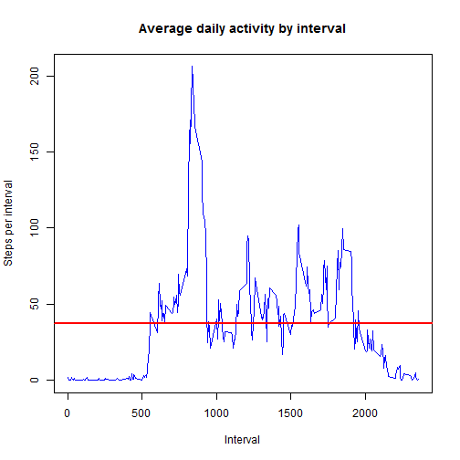

<h3>Reproducible Research - Project 1</h3>


<h3>Introduction</h3> 
It is now possible to collect a large amount of data about personal movement using activity monitoring devices such as 
a Fitbit, Nike Fuelband, or Jawbone Up. These type of devices are part of the "quantified self " movement - a group of 
enthusiasts who take measurements about themselves regularly to improve their health, to find patterns in their behavior, 
or because they are tech geeks. But these data remain under - utilized both because the raw data are hard to obtain and 
there is a lack of statistical methods and software for processing and interpreting the data.

This assignment makes use of data from a personal activity monitoring device. This device collects data at 5 minute 
intervals through out the day. The data consists of two months of data from an anonymous individual collected during 
the months of October and November, 2012 and include the number of steps taken in 5 minute intervals each day.

Dataset:       [Activity Monitoring Data](https://d396qusza40orc.cloudfront.net/repdata%2Fdata%2Factivity.zip) [52kB]<br> 
               
The variables included in this dataset are:
<ul>
<li><b>steps:</b>     Number of steps taking in a 5 - minute interval(missing values are coded as NA)
<li><b>date::</b>     The date on which the measurement was taken in YYYY - MM - DD format
<li><b>interval:</b>  Identifier for the 5 - minute interval in which measurement was taken
</ul>
<br>
<h4>Part 1 - Mean total number of steps taken per day</h4>

Step 1.1 - Loading data


```r
# ==========================================================================================================
# Load Libraries
# ==========================================================================================================

library('reshape2')
library('plyr')
library('timeDate')
library('ggplot2')

# ==========================================================================================================
# Download and extract Data and load file
# ==========================================================================================================

zipFile <- "repdata-data-activity.zip"

if (!file.exists("Data/activity.csv")) {
    dataURL <- "https://d396qusza40orc.cloudfront.net/repdata%2Fdata%2Factivity.zip"
    download.file(dataURL, zipFile, mode = "wb")
    unzip(zipFile, files = NULL, list = FALSE, overwrite = TRUE, junkpaths = FALSE, exdir = "Data", 
          unzip = "internal", setTimes = FALSE)
    file.remove(zipFile)
}

# Define Directory where File is located
dirName <- 'Data'

# load power consumption data
fileName = "activity.csv"
fileNameActivity <- file.path(dirName, fileName)

data <- read.csv(file = fileNameActivity, header = TRUE, colClasses = c("numeric", "Date", "numeric"))

head(data)
```

```
##   steps       date interval
## 1    NA 2012-10-01        0
## 2    NA 2012-10-01        5
## 3    NA 2012-10-01       10
## 4    NA 2012-10-01       15
## 5    NA 2012-10-01       20
## 6    NA 2012-10-01       25
```


Step 1.2 - Preprocessing the data for analysis


```r
# ==========================================================================================================
# Data preprocessing for analysis
# ==========================================================================================================

# add the weekday to the dataset
data$weekday <- weekdays(data$date)

# create a copy of data set with NA rows
data.WithNA <- data

# remove all rows with 'NA'
data.NoNA <- data[complete.cases(data),]

head(data.WithNA)
```

```
##   steps       date interval weekday
## 1    NA 2012-10-01        0  Monday
## 2    NA 2012-10-01        5  Monday
## 3    NA 2012-10-01       10  Monday
## 4    NA 2012-10-01       15  Monday
## 5    NA 2012-10-01       20  Monday
## 6    NA 2012-10-01       25  Monday
```

Step 1.3 - Calculate the total number of steps taken per day


```r
# Calculate total number of steps per day  
sum.steps.day <- ddply(data.NoNA, .(date), summarise, steps = sum(steps, na.rm = TRUE))

head(sum.steps.day)
```

```
##         date steps
## 1 2012-10-02   126
## 2 2012-10-03 11352
## 3 2012-10-04 12116
## 4 2012-10-05 13294
## 5 2012-10-06 15420
## 6 2012-10-07 11015
```


Step 1.4 - Histogram of the total number of steps taken each day


```r
plot(sum.steps.day$date, sum.steps.day$steps, type = "h", main = "Histogram of daily steps", xlab = "Date", ylab = "Steps per day", col = "blue", lwd = 6)
abline(h = mean(sum.steps.day$steps, na.rm = TRUE), col = "red", lwd = 2)
```


Step 1.5 - Calculate and report the mean and median of the total number of steps taken per day


```r
# Mean steps per Day (rounded)
paste("Mean steps per Day =", round(mean(sum.steps.day$steps, na.rm = TRUE), 0))
```

```
## [1] "Mean steps per Day = 10766"
```

```r
# Median steps per Day (rounded)
paste("Median steps per Day =", round(median(sum.steps.day$steps, na.rm = TRUE), 0))
```

```
## [1] "Median steps per Day = 10765"
```

<h4>Part 2 - Average daily activity pattern</h4>

Step 2.1 -  Calculate total number of steps per year and interval


```r
# Calculate total number of steps per year and interval
mean.steps.interval <- ddply(data.WithNA, .(interval), summarise, steps = mean(steps, na.rm = TRUE))

head(mean.steps.interval)
```

```
##   interval     steps
## 1        0 1.7169811
## 2        5 0.3396226
## 3       10 0.1320755
## 4       15 0.1509434
## 5       20 0.0754717
## 6       25 2.0943396
```

Step 2.2 - Time series plot of the 5-minute interval and the average number of steps taken, averaged across all days


```r
plot(mean.steps.interval$interval, mean.steps.interval$steps, type = "l", main = "Average daily activity by interval", xlab = "Interval",
     ylab = "Steps per interval", col = "blue", lwd = 1)
abline(h = mean(mean.steps.interval$steps, na.rm = TRUE), col = "red", lwd = 2)
```



Step 2.3 - Maximum number of steps on 5-minute interval, on average across all the days in the dataset


```r
# Maximum number of steps 5-minute interval
paste("Maximum number of steps in interval =", mean.steps.interval$interval[which.max(mean.steps.interval$steps)])
```

```
## [1] "Maximum number of steps in interval = 835"
```


<h4>Part 3 - Imputting missing values</h4>

Step 3.1 -  Calculate number of rows with missing data (NA)


```r
# Calculate number of rows in data.WithNA data set with NA rows
sum(is.na(data.WithNA$steps))
```

```
## [1] 2304
```

Step 3.2 -  Devise a strategy for filling in all of the missing values in the dataset

Humans usually follow certain patterns throughout the day/week. Therefore we assume that if we calculate the mean number of steps per 5-minute intervall, 
over all days, we will get a decent figure to add as NA value. 


```r
# Calculate the mean value per day and interval. This gives a good average of steps for a given day
mean.weekday <- ddply(data.WithNA, .(interval, weekday), summarise, steps = round(mean(steps, na.rm = TRUE), 2))

# Get list of indices where steps value = NA
naIndex = which(is.na(data.WithNA$steps))

# Merge dataset 'data.WithNA' with dataset mean.steps.interval 
merged.NA = merge(data.WithNA, mean.steps.interval, by = "interval", suffixes = c(".actual", ".stepsInt"))

# give the dataset a more precise name
data.Complete <- data.WithNA

# Replace NA values with value from steps
data.Complete[naIndex, "steps"] <- merged.NA[naIndex, 'steps.stepsInt']

# verify if dataset contains NA values
paste("Missing values in new dataset =", sum(is.na(data.Complete)))
```

```
## [1] "Missing values in new dataset = 0"
```

```r
# Calculate total number of steps per day  
steps.day <- ddply(data.Complete, .(date), summarise, steps = round(sum(steps, na.rm = TRUE),0))

head(steps.day)
```

```
##         date steps
## 1 2012-10-01   146
## 2 2012-10-02   126
## 3 2012-10-03 11352
## 4 2012-10-04 12116
## 5 2012-10-05 13294
## 6 2012-10-06 15420
```


Step 3.3 - Create a new dataset that is equal to the original dataset but with the missing data filled in


```r
plot(steps.day$date, steps.day$steps, type = "h", main = "Histogram of daily steps (added NA Values)", xlab = "Date", ylab = "Steps per day", col = "blue", lwd = 6)
abline(h = mean(steps.day$steps, na.rm = TRUE), col = "red", lwd = 2)
```


Step 3.4 - Calculate the mean and median based on new dataset


```r
# Calculate total number of steps per day  
sum.steps.day <- ddply(data.Complete, .(date), summarise, steps = sum(steps))

# Mean steps per Day
paste("Mean steps per Day =", round(mean(sum.steps.day$steps), 0))
```

```
## [1] "Mean steps per Day = 10890"
```


```r
# Median steps per Day
paste("Median steps per Day =", round(median(sum.steps.day$steps), 0))
```

```
## [1] "Median steps per Day = 11015"
```
<br>
<b>Remarks:</b> 

The following table shows the difference in 'Steps per day' for mean and median values. It also indicates the difference 
caused by adding mean values per interval for missing values (NA's)

Function   | original dataset (with NA values)  | new dataset (added mean value per interval for NA) | Difference
-----------|------------------------------------|----------------------------------------------------|-------------|
mean       | 10,766                             | 10,890                                             |   ~1.2%     |
median     | 10,765                             | 11,015                                             |   ~2.3%     |

<br>  
<h4>Part 3 - Differences in activity patterns between weekdays and weekends</h4>

Step 4.1 - Create a new factor variable in the dataset with two levels - "weekday" and "weekend" indicating whether a given date is a weekday or weekend day. 


```r
# Evaluate wether date is weekday or weekend
data.Complete$daytype <- lapply(data.Complete$date, function(x) ifelse(isWeekday(x, wday = 1:5), 'weekday', 'weekend'))

# flatten list to vector
data.Complete$daytype <- unlist(data.Complete$daytype, use.names = TRUE)

# Create Factor variable
data.Complete$daytype <- as.factor(data.Complete$daytype)

str(data.Complete)
```

```
## 'data.frame':	17568 obs. of  5 variables:
##  $ steps   : num  1.72 1.72 1.72 1.72 1.72 ...
##  $ date    : Date, format: "2012-10-01" "2012-10-01" ...
##  $ interval: num  0 5 10 15 20 25 30 35 40 45 ...
##  $ weekday : chr  "Monday" "Monday" "Monday" "Monday" ...
##  $ daytype : Factor w/ 2 levels "weekday","weekend": 1 1 1 1 1 1 1 1 1 1 ...
```

```r
head(data.Complete)
```

```
##      steps       date interval weekday daytype
## 1 1.716981 2012-10-01        0  Monday weekday
## 2 1.716981 2012-10-01        5  Monday weekday
## 3 1.716981 2012-10-01       10  Monday weekday
## 4 1.716981 2012-10-01       15  Monday weekday
## 5 1.716981 2012-10-01       20  Monday weekday
## 6 1.716981 2012-10-01       25  Monday weekday
```


Step 4.1 - Panel plot containing a time series plot of the 5-minute interval and the average number of steps taken, averaged across all weekday days or weekend days


```r
# Calculate the 5 - minute interval and the average number of steps taken on weekdays and weekends
day.interval.Steps <- ddply(data.Complete, .(interval, daytype), summarise, steps = mean(steps, na.rm = TRUE))
```


```r
# Plot the time series plot (facet) of 5 - minute interval and the average number of steps taken on weekdays and weekends
ggplot(day.interval.Steps, aes(x = interval, y = steps)) +
    geom_line(col='blue') +
    ylab('Number of steps') + xlab("Interval") +
    ggtitle("Number of Steps per Interval (weekend/weekend") +
    facet_grid(daytype ~ .)
```


