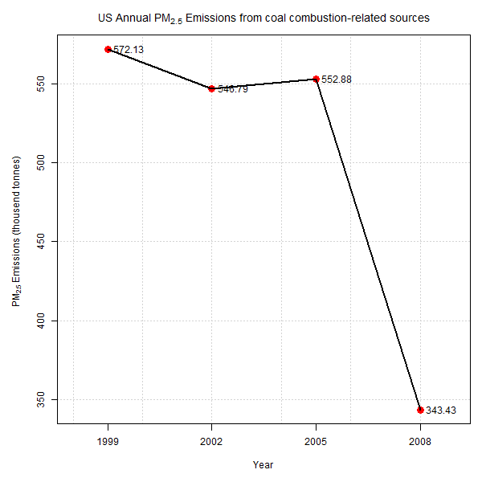

##   Coursera Exploratory Data Analysis<br>
<b>at Johns Hopkins University</b>


### Introduction
Part of the module <b>Exploratory Data Analysis</b> are 2 Project assignements: 

<li><b><a href="#Project1">Project 1</a></b>: Individual household electric power consumption
<li><b><a href="#Project2">Project 2</a></b>: unknown yet


<h3><a name = "Project1">Project 1</a></h3>

This assignment uses data from the <a href="http://archive.ics.uci.edu/ml/">UC Irvine Machine Learning Repository</a>, a popular repository for machine learning
datasets. In particular, we used the "Individual household electric power consumption Data Set" which is available on the course web site:

* <b>Dataset</b>: <a href="https://d396qusza40orc.cloudfront.net/exdata%2Fdata%2Fhousehold_power_consumption.zip">Electric power consumption</a> [20Mb]

* <b>Description</b>: Measurements of electric power consumption in one household with a one-minute sampling rate over a period of almost
4 years. Different electrical quantities and some sub-metering values are available.


The following descriptions of the 9 variables in the dataset are taken from the 
<a href="https://archive.ics.uci.edu/ml/datasets/Individual+household+electric+power+consumption">UCI web site</a>:

<ol>
<li><b>Date</b>: Date in format dd/mm/yyyy </li>
<li><b>Time</b>: time in format hh:mm:ss </li>
<li><b>Global_active_power</b>: household global minute-averaged active power (in kilowatt) </li>
<li><b>Global_reactive_power</b>: household global minute-averaged reactive power (in kilowatt) </li>
<li><b>Voltage</b>: minute-averaged voltage (in volt) </li>
<li><b>Global_intensity</b>: household global minute-averaged current intensity (in ampere) </li>
<li><b>Sub_metering_1</b>: energy sub-metering No. 1 (in watt-hour of active energy). It corresponds to the kitchen, containing mainly a dishwasher, an oven and a microwave (hot plates are not electric but gas powered). </li>
<li><b>Sub_metering_2</b>: energy sub-metering No. 2 (in watt-hour of active energy). It corresponds to the laundry room, containing a washing-machine, a tumble-drier, a refrigerator and a light. </li>
<li><b>Sub_metering_3</b>: energy sub-metering No. 3 (in watt-hour of active energy). It corresponds to an electric water-heater and an air-conditioner.</li>
</ol>

<h3>Download and read data</h3>

The dataset contains 2,075,259 observations and 9 columns, therefore the download will take a while. The given code below downloads the dataset and extracts the zip container. 
The unused zip container will be removed afterwards. A download will be omitted, if the file already exists on the local file system.

```r
zipFile <- "exdata%2Fdata%2Fhousehold_power_consumption.zip"

if(!file.exists("Data/household_power_consumption.txt")){ 
  dataURL <- "https://archive.ics.uci.edu/ml/machine-learning-databases/00235/household_power_consumption.zip"
  download.file(dataURL, zipFile, mode ="wb")  
  unzip(zipFile, files = NULL, list = FALSE, overwrite = TRUE, junkpaths = FALSE, exdir = "Data", unzip = "internal", setTimes = FALSE)
  file.remove(zipFile)
}
```

To read the dataset the <b>read.table</b> file reader  has been used.
```r
# Define Directory where File is located
dirName <- 'Data'

# load power consumption data
fileName = "household_power_consumption.txt"
fileNamePower <- file.path(dirName, fileName)

data <- read.table(file = fileNamePower, header = TRUE, sep = ';')
```

<h3>Data preparation (munging) </h3>
Only a subset of the dataset from the dates 2007-02-01 and 2007-02-02, will be used to prepare plots. A few adjustments need to be applied to get the data ready for the 
plots. Certain features required to be converted to numeric values while the date and time columns were converted and agregated in one column. 
Unused columns will be used to didy up the data set.

```r
# subset data set
data <- subset(data, Date == '1/2/2007' | Date == '2/2/2007')

# Convert some features to numeric features
ColNames <- names(data[3:9])
numericList <- c(ColNames)
data[, numericList] <- lapply(data[, numericList], function(x) as.numeric(as.character(x)))

# Merge date & time into single column
dateTime <- as.POSIXct(paste(data$Date, data$Time, sep = ";"), format = "%d/%m/%Y;%H:%M:%S")
data <- cbind("DateTime" = dateTime, data)
data$Date <- NULL
data$Time <- NULL
remove(dateTime)
```

<h3>Making Plots</h3>

Our overall goal here is simply to examine how household energy usage varies over a 2-day period in February, 2007. The mandate was to reconstruct 4 Plots, 
all of which were constructed using the base plotting system.

For each plot you should

* Construct the plot and save it to a PNG file with a width of 480 pixels and a height of 480 pixels.
* Name each of the plot files as `plot1.png`, `plot2.png`, etc.
* Create a separate R code file (`plot1.R`, `plot2.R`, etc.) that constructs the corresponding plot, i.e. code in `plot1.R` constructs the `plot1.png` plot. 


Find below the code and the resective plot.

<h4>Plot1</h4>

```r
# Plot graph
png(filename = "plot1.png", width = 480, height = 480, units = "px", bg = "transparent")
hist(data$Global_active_power, col = "red", main = "Global Active Power", xlab = "Global Active Power (kilowatts)")

dev.off()
```

 

<h4>Plot2</h4>

```r
# Plot graph
png(filename = "plot2.png", width = 480, height = 480, units = "px", bg = "transparent")
plot(data$Date, data$Global_active_power, type = "l", xlab = "", ylab = "Global Active Power (kilowatts)")

dev.off()

```
 

<h4>Plot3</h4>

```r
# Plot graph
png(filename = "plot3.png", width = 480, height = 480, units = "px", bg = "transparent")
plot(data$DateTime, data$Sub_metering_1, type = "l", col = "black", xlab = "", ylab = "Global Active Power (kilowatts)")
lines(data$DateTime, data$Sub_metering_2, type = "l", col = "red")
lines(data$DateTime, data$Sub_metering_3, type = "l", col = "blue")
legend("topright", c("Sub_metering_1", "Sub_metering_2", "Sub_metering_3"), lty = c(1, 1, 1), col = c("black", "red", "blue"))
dev.off()
```
 


<h4>Plot4</h4>

```r
# Plot graph
png(filename = "plot4.png", width = 480, height = 480, units = "px", bg = "transparent")

par(mfrow = c(2, 2))

# Add plot 1 to top, left
plot(data$DateTime, data$Global_active_power, type = "l", xlab = "", ylab = "Global Active Power")

# Add plot 2 to top, right
plot(data$DateTime, data$Voltage, type = "l", xlab = "datetime", ylab = "Voltage")

# Add plot 3 to bottom, left
plot(data$DateTime, data$Sub_metering_1, type = "l", col = "black", xlab = "", ylab = "Energy sub metering")
lines(data$DateTime, data$Sub_metering_2, type = "l", col = "red")
lines(data$DateTime, data$Sub_metering_3, type = "l", col = "blue")
legend("topright", c("Sub_metering_1", "Sub_metering_2", "Sub_metering_3"), lty = c(1, 1, 1), bty = 'n', col = c("black", "red", "blue"))

# Add plot 3 to bottom, right
plot(data$DateTime, data$Global_reactive_power, type = "l", xlab = "datetime", ylab = "Global_reactive_power", lwd = 0.5)

dev.off()
```
 


<h3><a name = "Project2">Project 2</a></h3>

Fine particulate matter (PM2.5) is an ambient air pollutant for which there is strong evidence that it is harmful to human health. In the United States, 
the Environmental Protection Agency (EPA) is tasked with setting national ambient air quality standards for fine PM and for tracking the emissions of 
this pollutant into the atmosphere. Approximatly every 3 years, the EPA releases its database on emissions of PM2.5. This database is known as the 
National Emissions Inventory (NEI). You can read more information about the NEI at the [EPA National Emissions Inventory](http://www.epa.gov/ttn/chief/eiinformation.html) web site.

The data for this assignment are available from the course web site as a single zip file:<br>
<ul>
  <li><b>Dataset:</b> [PM Emission Data](https://d396qusza40orc.cloudfront.net/exdata%2Fdata%2FNEI_data.zip) [29Mb]</li><br>
  <li><b>Description</b></li>
  PM2.5 Emissions Data <b>(summarySCC_PM25.rds)</b>: This file contains a data frame with all of the PM2.5 emissions data for 1999, 2002, 2005, and 2008. 
  For each year, the table contains number of tons of PM2.5 emitted from a specific type of source for the entire year. Here are the first few rows.<br>

  Source Classification Code Table <b>(Source_Classification_Code.rds)</b>: This table provides a mapping from the SCC digit strings in the Emissions table to 
  the actual name of the PM2.5 source. The sources are categorized in a few different ways from more general to more specific and you may choose to explore whatever 
  categories you think are most useful. For example, source “10100101” is known as “Ext Comb /Electric Gen /Anthracite Coal /Pulverized Coal”.

</ul>

Parameter description summarySCC_pm25:
<ul>
<li><b>fips:</b> A five-digit number (represented as a string) indicating the U.S. county
<li><b>SCC:</b> The name of the source as indicated by a digit string (see source code classification table)
<li><b>Pollutant:</b> A string indicating the pollutant
<li><b>Emissions:</b> Amount of PM2.5 emitted, in tons
<li><b>type:</b> The type of source (point, non-point, on-road, or non-road)
<li><b>year:</b> The year of emissions recorded
</ul>

The following questions will be answered
<ol>
<li>Have total emissions from PM2.5 decreased in the United States from 1999 to 2008? Using the base plotting system, make a plot showing the total PM2.5 emission from all sources for each of the years 1999, 2002, 2005, and 2008.</li>
<li>Have total emissions from PM2.5 decreased in the Baltimore City, Maryland (fips == "24510") from 1999 to 2008? Use the base plotting system to make a plot answering this question.</li>
<li>Of the four types of sources indicated by the type (point, nonpoint, onroad, nonroad) variable, which of these four sources have seen decreases in emissions from 1999–2008 for Baltimore City? Which have seen increases in emissions from 1999–2008? Use the ggplot2 plotting system to make a plot answer this question.</li>
<li>Across the United States, how have emissions from coal combustion-related sources changed from 1999–2008?</li>
<li>How have emissions from motor vehicle sources changed from 1999–2008 in Baltimore City?</li>
<li>Compare emissions from motor vehicle sources in Baltimore City with emissions from motor vehicle sources in Los Angeles County, California (fips == "06037"). Which city has seen greater changes over time in motor vehicle emissions?</li>
</ol>


<h3>Download and read data</h3>
The dataset contains 6,497,651 observations and 6 columns, therefore the download will take a while. The given code below downloads the dataset and extracts the zip container. 
The unused zip container will be removed afterwards. A download will be omitted, if the file already exists on the local file system.

```r
zipFile <- "exdata%2Fdata%2FNEI_data.zip"

if (!file.exists("Data/Source_Classification_Code.rds") && !file.exists("Data/summarySCC_PM25.rds")) {
    dataURL <- "https://d396qusza40orc.cloudfront.net/exdata%2Fdata%2FNEI_data.zip"
    download.file(dataURL, zipFile, mode = "wb")
    unzip(zipFile, files = NULL, list = FALSE, overwrite = TRUE, junkpaths = FALSE, exdir = "Data", unzip = "internal", setTimes = FALSE)
    file.remove(zipFile)
}

# Define Directory where File is located
dirName <- 'Data'

# load classification code data
fileNameClass = "Source_Classification_Code.rds"
fileNameClass <- file.path(dirName, fileNameClass)

# load Summary CSS PM25 data
fileNameSummary = "summarySCC_PM25.rds"
fileNameSummary <- file.path(dirName, fileNameSummary)

# data <- read.table(file = fileNamePower, header = TRUE, sep = ';')
NEI <- readRDS(file = fileNameClass)
SCC <- readRDS(file = fileNameSummary)
}
```

<h3>Plot1</h3>
Have total emissions from PM2.5 decreased in the United States from 1999 to 2008? Using the base plotting system, make a plot showing the total PM2.5 emission from 
all sources for each of the years 1999, 2002, 2005, and 2008.<br>
<h4>Data preparation (munging) </h4>
```r
# calculate total amount of emissions per year
data <- ddply(SCC, .(year), summarise, Emissions = sum(Emissions))

# devide total amount of emissions by 1'000'000 (million tons)
data$Emissions <- lapply(data$Emissions, function(x) round(x / 1e6, 2))

```

<h4>Create Plot</h4>
```r
png(filename = "plot1.png", width = 600, height = 600, units = "px", bg = "white")
# define margins
par(mfrow = c(1, 1), mar = c(5, 5, 3, 1))

with(data, plot(year, Emissions, pch = 20, col = "red", ylim = c(3, 8), xlim=c(1998, 2009), xaxt = "n", cex = 2.5, panel.first = grid(), main = expression("US Annual PM"[2.5] * " Emissions"),
     xlab = "Year", ylab = expression("PM"[2.5] * " Emissions (million tonnes)")))

# add a line between points
lines(data$year, data$Emissions, type = "l", lwd = 2)
axis(1, c(1999, 2002, 2005, 2008))

# print values for each point in graph
text(data$year, data$Emissions, data$Emissions, cex = 1.0, pos = 4, col = "black")

dev.off()

```


<h3>Plot2</h3>
Have total emissions from PM2.5 decreased in the Baltimore City, Maryland (fips == "24510") from 1999 to 2008? Use the base plotting system to make a plot 
answering this question.<br>

<h4>Data preparation (munging) </h4>
```r
# calculate total amount of emissions per year
data <- ddply(SCC, .(year), summarise, Emissions = sum(Emissions[fips == "24510"]))

# devide total amount of emissions by 1'000 (thousend tons)
data$Emissions <- lapply(data$Emissions, function(x) round(x / 1e3, 2))

```

<h4>Create Plot</h4>
```r
png(filename = "plot2.png", width = 600, height = 600, units = "px", bg = "white")

# define margins
par(mfrow = c(1, 1), mar = c(5, 5, 3, 1))

with(data, plot(year, Emissions, pch = 20, col = "red", ylim = c(1.5, 3.5), xlim = c(1998, 2009), xaxt = "n", cex = 2.5, panel.first = grid(),
    main = expression("Baltimore City Annual PM"[2.5] * " Emissions"), xlab = "Year", ylab = expression("PM"[2.5] * " Emissions (thousend tonnes)")))

# add a line between points
lines(data$year, data$Emissions, type = "l", lwd = 2)
axis(1, c(1999, 2002, 2005, 2008))

# print values for each point in graph
text(data$year, data$Emissions, data$Emissions, cex = 1.0, pos = 4, col = "black")

dev.off()

```


<h3>Plot3</h3>
Have total emissions from PM2.5 decreased in the Baltimore City, Maryland (fips == "24510") from 1999 to 2008? Use the base plotting system to make a plot 
answering this question.<br>

<h4>Data preparation (munging) </h4>
```r
# subset and retrieve only Baltimore City data
pm25_Baltimore <- subset(SCC, fips == '24510')

# calculate total amount of emissions per year and type - 
# rounding of emission values to 2 digits
data <- ddply(pm25_Baltimore, .(year, type), summarise, Emissions = round(sum(Emissions), 2))

```

<h4>Create Plot</h4>
```r
png(filename = "plot3.png", width = 800, height = 800, units = "px", bg = "white")

g <- ggplot(data, aes(year, Emissions))
g + facet_grid(type ~ ., scale = 'free') +
geom_line(col = 'black', lwd = 0.5) +
geom_point(col = 'black', size = 4) +

# adjust the size of the facet_grid variable 
theme(strip.text.y = element_text(size = 14), plot.margin = unit(c(2, 3, 2, 3), 'cm')) +

# change the size of the title 
theme(plot.title = element_text(lineheight = 3, face = "bold", color = "black", size = 20)) +

# add and change the size of the x and y label
xlab("Year") + ylab("Emissions [tonnes]") +
theme(axis.title.y = element_text(size = rel(1.5), angle = 90)) +
theme(axis.title.x = element_text(size = rel(1.5), angle = 00)) +

# add a title to the graph
ggtitle(expression(paste('Baltimore City\'s annual ', pm[2.5], ' emissions based on type'))) +
scale_x_continuous(breaks = c(1999, 2002, 2005, 2008))

dev.off()

```


<h3>Plot4</h3>
Have total emissions from PM2.5 decreased in the Baltimore City, Maryland (fips == "24510") from 1999 to 2008? Use the base plotting system to make a plot 
answering this question.<br>

<h4>Data preparation (munging) </h4>
```r
# calculate total amount of emissions per year and SCC  
dataSCC <- ddply(SCC, .(year, SCC), summarise, Emissions = sum(Emissions))

# remove not required columns 
NEI <- NEI[, c('SCC', 'EI.Sector')]

# convert all fields to lower case 
NEI$EI.Sector <- lapply(NEI$EI.Sector, function(x) tolower(as.character(x)))

# define regex pattern
pattern <- 'fuel comb - [a-z ,/]* - coal'  

# subset and retrieve only comb / coal data based on regex pattern
comb_coal <- subset(NEI, grepl(pattern, NEI$EI.Sector))

# evaluate which code exists in both data sets
exist_in_both <- ifelse(dataSCC$SCC %in% comb_coal$SCC, TRUE, FALSE)
dataSCC_ <- subset(dataSCC, exist_in_both)

# calculate total amount of emissions per year and SCC 
dataSCC_ <- ddply(dataSCC_, .(year), summarise, Emissions = sum(Emissions))

# devide total amount of emissions by 1'000 (thousend tons)
dataSCC_$Emissions <- lapply(dataSCC_$Emissions, function(x) round(x / 1e3, 2))

```

<h4>Create Plot</h4>
```r
png(filename = "plot4.png", width = 600, height = 600, units = "px", bg = "white")
# define margins
par(mfrow = c(1, 1), mar = c(5, 5, 3, 1))

with(dataSCC_, plot(year, Emissions, pch = 20, col = "red", xlim = c(1998, 2009), xaxt = "n", cex = 2.5, panel.first = grid(), main = expression("US Annual PM"[2.5] * " Emissions from coal combustion-related sources"),
     xlab = "Year", ylab = expression("PM"[2.5] * " Emissions (thousend tonnes)")))

# add a line between points
lines(dataSCC_$year, dataSCC_$Emissions, type = "l", lwd = 2)
axis(1, c(1999, 2002, 2005, 2008))

# print values for each point in graph
text(dataSCC_$year, dataSCC_$Emissions, dataSCC_$Emissions, cex = 1.0, pos = 4, col = "black")

dev.off()

```



<h3>Plot5</h3>
Have total emissions from PM2.5 decreased in the Baltimore City, Maryland (fips == "24510") from 1999 to 2008? Use the base plotting system to make a plot 
answering this question.<br>

<h4>Data preparation (munging) </h4>
```r
    # subset and retrieve only Baltimore City data
    pm25_Baltimore <- subset(SCC, fips == '24510' & type == 'ON-ROAD')

    # calculate total amount of emissions per year and type - 
    # rounding of emission values to 2 digits
    dataSCC <- ddply(pm25_Baltimore, .(year), summarise, Emissions = round(sum(Emissions), 2))

```

<h4>Create Plot</h4>
```r
    png(filename = "plot4.png", width = 600, height = 600, units = "px", bg = "white")

    par(mfrow = c(1, 1), mar = c(5, 5, 3, 1))

    with(dataSCC, plot(year, Emissions, pch = 20, col = "red", xlim = c(1998, 2009), xaxt = "n", cex = 2.5, panel.first = grid(), main = expression("Motor vehicle - related PM"[2.5] * " emissions in Baltimore County "),
     xlab = "Year", ylab = expression("PM"[2.5] * " Emissions (tonnes)")))

    # add a line between points
    lines(dataSCC$year, dataSCC$Emissions, type = "l", lwd = 2)
    axis(1, c(1999, 2002, 2005, 2008))

    # print values for each point in graph
    text(dataSCC$year, dataSCC$Emissions, dataSCC$Emissions, cex = 1.0, pos = 4, col = "black")

    dev.off()

```


<h3>Plot6<</h3>
Have total emissions from PM2.5 decreased in the Baltimore City, Maryland (fips == "24510") from 1999 to 2008? Use the base plotting system to make a plot 
answering this question.<br>

<h4>Data preparation (munging) </h4>
```r
# subset and retrieve only Baltimore City data
pm25_Baltimore <- subset(SCC, fips == '24510' & type == 'ON-ROAD')
pm25_LosAngeles <- subset(SCC, fips == '06037' & type == 'ON-ROAD')
pm25_Baltimore_LA <- subset(SCC, (fips == '06037' & type == 'ON-ROAD') | (fips == '24510' & type == 'ON-ROAD'))

# calculate total amount of emissions per year and type - rounding of emission values to 2 digits
dataSCC_Baltimore <- ddply(pm25_Baltimore, .(year), summarise, Emissions = round(sum(Emissions), 2))
dataSCC_LA <- ddply(pm25_LosAngeles, .(year), summarise, Emissions = round(sum(Emissions), 2))
dataSCC_Baltimore_LA <- ddply(pm25_Baltimore_LA, .(year, fips), summarise, Emissions = round(sum(Emissions), 2))

```

<h4>Create Plot</h4>
```r
png(filename = "plot6.png", width = 800, height = 800, units = "px", bg = "white")
g <- ggplot(dataSCC_Baltimore_LA, aes(year, Emissions))
g + geom_point(color = dataSCC_Baltimore_LA$fips, pch = 19, size = 5) +
geom_line(data = dataSCC_Baltimore, col = 'blue', lwd = 1) +
geom_line(data = dataSCC_LA, col = 'green', lwd = 1) +

# adjust the size of the facet_grid variable 
theme(strip.text.y = element_text(size = 14, face = "bold"), plot.margin = unit(c(2, 3, 2, 3), 'cm')) +

# change the size of the title 
theme(plot.title = element_text(lineheight = 3, face = "bold", color = "black", size = 20)) +

# add and change the size of the x and y label
xlab("Year") + ylab("Emissions [tonnes]") +

# add a title to the graph
ggtitle(expression(paste('Motor vehicle related emissions ', pm[2.5], ' Baltimore City vs Los Angeles'))) +
scale_x_continuous(breaks = c(1999, 2002, 2005, 2008))
dev.off()
```


Here the same data in facet_grid plot

```r
    png(filename = "plot6_.png", width = 800, height = 800, units = "px", bg = "white")

    g <- ggplot(dataSCC_Baltimore_LA, aes(year, Emissions))
    g + facet_grid(fips ~ ., scale = 'free') +
    geom_line(col = 'blue', lwd = 1) +
    geom_point(col = 'red', pch = 19, size = 5) +

    # adjust the size of the facet_grid variable 
    theme(strip.text.y = element_text(size = 14, face = "bold"), plot.margin = unit(c(2, 3, 2, 3), 'cm')) +

    # change the size of the title 
    theme(plot.title = element_text(lineheight = 3, face = "bold", color = "black", size = 20)) +

    # add and change the size of the x and y label
    xlab("Year") + ylab("Emissions [tonnes]") +

    # add a title to the graph
    ggtitle(expression(paste('Motor vehicle related emissions ', pm[2.5], ' Baltimore City vs Los Angeles'))) +
    scale_x_continuous(breaks = c(1999, 2002, 2005, 2008))
    dev.off()
```


