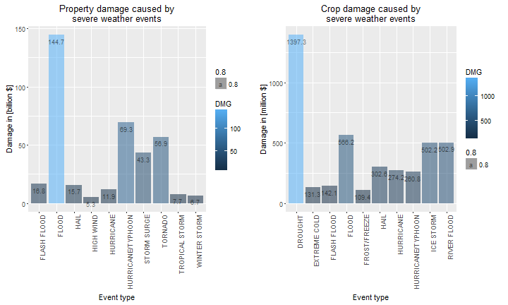

<h2>Reproducible Research Project 2</h2>

Author: Bruno Hunkeler   
Date:   20.04.2016
<hr>

<h3><b>Health and economic impacts caused by severe weather events in the US  
(1950 - 2011)</b></h2>

<h3>Synopsis</h3>
This report compares servere weather events, in respect to economic costs and populations health in the United States (US)  
between 1950 and 2011.

<h3>Hypothesis</h3>
The hypothesis is that a prevention for unregularly weather events like floods is hard to establish. Tornados on the other hand are highly
destructive and destroy large areas in a matter of hours. Therefore I assume that those events cause the most economic damages, while
extreme heat is assumed to be the most harmful to people’s health. This assumptions are based on the fact that measures taken to prevent
people being harmed by tornados should be in place by now, since they occur on a regular basis. This does not apply to extreme heat,
which occurs occasionally.

<h3>Results</h3>
We obtained storm data from the National Oceanic and Atmosphere Administration from 1950 - 2011 to verify the hypothesis. Fact is that  
floods (on property) and droughts (on crop) caused the most economic damages, while the most harmful events to the population’s health  
was caused by tornados (injuries as well as fatalities). The main cost driver in the area of property damage was caused by a series of  
storms end of 2005, which produced significant runoff over much of northern California (NAPA). Floods can spread across large areas and  
are somewhat uncontrollable. They occur on a unregularly basis. Tacking measures to prevention floods as such costs billions.  On the  
contrary, the harm on the population is relatively small. Tornadoes, on the other hand, are also able to destroy large areas, but occur  
relatively frequently in the US. Therefore the prevention on people’s health should be manageable, but the figures show a different picture.  
The measures taken to prevent people being harmed seems inadequate, or storm warnings are being activated far too late. Another possible  
cause might be that not enough shelters in homes and public places might be available.        

<h3>Data Processing</h3>

<h4>Load Data</h4>
The data and furter information were obtain from the following sources:  
<ul>
<li><b>Dataset</b>                                    [Storm Data](https://d396qusza40orc.cloudfront.net/repdata%2Fdata%2FStormData.csv.bz2) [47Mb]<br> 
<li><b>National Weather Service</b>                   [Storm Data Documentation](https://d396qusza40orc.cloudfront.net/repdata%2Fpeer2_doc%2Fpd01016005curr.pdf)
<li><b>National Climatic Data Center Storm Events</b> [FAQ](https://d396qusza40orc.cloudfront.net/repdata%2Fpeer2_doc%2FNCDC%20Storm%20Events-FAQ%20Page.pdf)
</ul>

The following 3rd party packages have been used, to tidy up the data.  


```r
library('plyr')
library('dplyr')
library('ggplot2')
library('gridExtra')
```

The raw data has been loaded via the 'read.csv' file reader method and placed in a 'Data' folder. The data is then loaded into a storm.data  
dataframe.    


```r
zipFile <- "repdata-data-StormData.csv.bz2"

if (!file.exists("Data/repdata-data-StormData.csv.bz2")) {
    dataURL <- "https://d396qusza40orc.cloudfront.net/repdata%2Fdata%2FStormData.csv.bz2"
    download.file(dataURL, zipFile, mode = "wb")

    if (!file.exists('Data')) {
        dir.create("Data")
    }
    file.copy(zipFile, 'Data')
    file.remove(zipFile)
}

# Define Directory where File is located
dirName <- 'Data'

# prepare the load path 
fileNameStorm <- file.path(dirName, zipFile)

# load storm data 
storm.data = read.csv(bzfile(fileNameStorm), header = TRUE)
```

Only a subset of columns will need to retrieved from the original data set to perform this analysis.     
The relevant columns are the following: <b>'EVTYPE', 'INJURIES', 'FATALITIES', 'PROPDMG', 'PROPDMGEXP', 'CROPDMG', 'CROPDMGEXP'</b>.    
The relevant columns are placed in a dataframe called 'data'. Unused variables are frequently removed.  


```r
# Define the columns relevant for Data anlysis
Col <- c('EVTYPE', 'INJURIES', 'FATALITIES', 'PROPDMG', 'PROPDMGEXP', 'CROPDMG', 'CROPDMGEXP')

# remove not required columns 
data <- storm.data[, Col]

# Clean Variable explorer - remove unnecessary variables
rm(zipFile)
rm(dirName)
rm(fileNameStorm)
rm(Col)
rm(storm.data)
```

<h4>Data aggregation</h4>

<h5>Property and crop damage</h5>

The storm data document provided by the National Weather Service, contains information regarding the financial aspects of the damage  
caused by severe weather conditions. The column PROPDMGEXP contains various characters and numbers, which indicate the magnitude of  
the damage. Characters as 'H','K', 'M' and 'B' stand for the magnitude hundred, thousand, million and billion, but there are other  
characters defined, which indicate unknown values such as '', '+', '-', '?'. Characters with 'H','K', 'M' and 'B' will be transformed  
into the respective magnitude (e.g. 1e+2, 1e+3, 1e+6 etc.), where the unknown values will be transformed to '0'. The data set also shows  
that various weather events have been named in different ways (uppercase, upper-lowercase or lowercase) for the same event. Only partial  
measures were taken to eliminate the 'potential' error caused by different naming, by converting all letters to upper case. Finally I  
applied a descending ordered for economic damage and filtered for the top 10 events.  
<br>
Below you see the assigned magnitudes for property and crop.

```r
summary(factor(data$PROPDMGEXP))
```

```
##             -      ?      +      0      1      2      3      4      5 
## 465934      1      8      5    216     25     13      4      4     28 
##      6      7      8      B      h      H      K      m      M 
##      4      5      1     40      1      6 424665      7  11330
```


```r
summary(factor(data$CROPDMGEXP))
```

```
##             ?      0      2      B      k      K      m      M 
## 618413      7     19      1      9     21 281832      1   1994
```


```r
# ===========================================================================================================
# Prepare Property- and Crop damage data 
# ===========================================================================================================

# convert all fields to uppercase 
data$PROPDMGEXP <- lapply(data$PROPDMGEXP, function(x) tolower(as.character(x)))
data$CROPDMGEXP <- lapply(data$CROPDMGEXP, function(x) tolower(as.character(x)))

# Prepare magnitudes for Property Damage
data$PROPDMGEXP[data$PROPDMGEXP %in% c('', '+', '-', '?')] <- "0"
data$CROPDMGEXP[data$CROPDMGEXP %in% c('', '?')] <- '0'

data$PROPDMGEXP[data$PROPDMGEXP %in% c('h')] <- '2'
data$PROPDMGEXP[data$PROPDMGEXP %in% c('k')] <- '3'
data$PROPDMGEXP[data$PROPDMGEXP %in% c('m')] <- '6'
data$PROPDMGEXP[data$PROPDMGEXP %in% c('b')] <- '9'

data$CROPDMGEXP[data$CROPDMGEXP %in% c('k')] <- '3'
data$CROPDMGEXP[data$CROPDMGEXP %in% c('m')] <- '6'
data$CROPDMGEXP[data$CROPDMGEXP %in% c('b')] <- '9'

# flatten list to vector
data$PROPDMGEXP <- unlist(data$PROPDMGEXP, use.names = TRUE)
data$CROPDMGEXP <- unlist(data$CROPDMGEXP, use.names = TRUE)

# Calculate damage 
data$PROPDMGEXP <- 10 ^ (as.numeric(data$PROPDMGEXP))
data$PROPDMG = as.numeric(data$PROPDMG) * data$PROPDMGEXP

data$CROPDMGEXP <- 10 ^ (as.numeric(data$CROPDMGEXP))
data$CROPDMG = as.numeric(data$CROPDMG) * data$CROPDMGEXP

# Clean-up unused columns
data$PROPDMGEXP <- NULL
data$CROPDMGEXP <- NULL

# convert all EVTYPE fields to upper case 
data$EVTYPE <- lapply(data$EVTYPE, function(x) toupper(as.character(x)))

# flatten list to vector
data$EVTYPE <- as.factor(unlist(data$EVTYPE, use.names = TRUE))

# Subsetting data and also devide by billion
Property.DMG <- ddply(data, .(EVTYPE), summarise, DMG = round((sum(PROPDMG) / 1e+9), 1))
Property.DMG <- subset(Property.DMG, DMG > 0)

# Subsetting data and also devide by million
Crop.DMG <- ddply(data, .(EVTYPE), summarise, DMG = round((sum(CROPDMG) / 10e+6), 1))
Crop.DMG <- subset(Crop.DMG, DMG > 0)

# order dataset descending and filter top 10 rows
Property.DMG <- Property.DMG[order( -Property.DMG$DMG),]
data.Property.DMG <- filter(Property.DMG, DMG > 1) %>% top_n(10)

# order dataset descending and filter top 10 rows
Crop.DMG <- Crop.DMG[order( -Crop.DMG$DMG),]
data.Crop.DMG <- filter(Crop.DMG, DMG > 1) %>% top_n(10)
```

<h5>Populations health damage</h5>
The same approach as mentioned above has been used to prepare injury and fatality data. 
Here as well some cleanup tasks have been performed.


```r
# =======================================================================================================
# Prepare Injury and Fatality data 
# =======================================================================================================

# Subsetting data 
injuries.DMG <- ddply(data, .(EVTYPE), summarise, Injuries = round((sum(INJURIES) / 1), 2))
fatalities.DMG <- ddply(data, .(EVTYPE), summarise, Fatalities = round(sum(FATALITIES), 2))

# order dataset descending and filter top 10 rows
injuries.DMG <- injuries.DMG[order( - injuries.DMG$Injuries),]
data.Injury.DMG <- filter(injuries.DMG, Injuries > 1) %>% top_n(10)

# order dataset descending and filter top 10 rows
fatalities.DMG <- fatalities.DMG[order( - fatalities.DMG$Fatalities),]
data.Fatality.DMG <- filter(fatalities.DMG, Fatalities > 1) %>% top_n(10)

data.injuries <- filter(injuries.DMG, Injuries > 1000)
data.fatalities <- filter(fatalities.DMG, Fatalities > 100)

# Clean Variable explorer - remove unnecessary variables
rm(fatalities.DMG)
rm(injuries.DMG)
rm(Crop.DMG)
rm(Property.DMG)
```

At this point all data is tidied up for our purpose. Only plotting remains.

<h3>Results and Conclusions</h3>
<h4>Economic consequences</h4>
This report determines, which severe weather events cause the most economic damage on property and crop. 
The plot reflects the top 10 economic damages.


```r
# ===========================================================================================================
# Prepare and create graph of property and crop damage data 
# ===========================================================================================================

property.plot <- ggplot(data = data.Property.DMG, aes(x = data.Property.DMG$EVTYPE, y = data.Property.DMG$DMG, 
         fill = DMG, alpha = 0.8)) +
         geom_bar(stat = "identity") +
         xlab("Event type") + ylab("Damage in [billion $]") +
         ggtitle("Property damage caused by\nsevere weather events") +
         theme(axis.text.x = element_text(angle = 90, hjust = 1)) +
         geom_text(aes(label = DMG), vjust = 1.6, color = "black", position = position_dodge(0.9), size = 3)


crop.plot <- ggplot(data = data.Crop.DMG, aes(x = data.Crop.DMG$EVTYPE, y = data.Crop.DMG$DMG, fill = DMG, 
     alpha = 0.8)) +
     geom_bar(stat = "identity") +
     xlab("Event type") + ylab("Damage in [million $]") +
     ggtitle("Crop damage caused by\nsevere weather events") +
     theme(axis.text.x = element_text(angle = 90, hjust = 1)) +
     geom_text(aes(label = DMG), vjust = 1.6, color = "black", position = position_dodge(0.9), size = 3)

     grid.arrange(property.plot, crop.plot, ncol = 2)
```



We can infer from the plot that floods cause the greatest total economic damage out of all the severe weather conditions. However, if we  
consider the 3 most destructive events after floods, we see that they are all related to storm events (Hurricane/Typhoon, Storm surges  
and Tornados). If we sum up the economic damages caused by storm related events, we see that they are even higher than those caused  
by floods.

<h4>Population Health</h4>
This report determines, which severe weather events causes the most harm to the population’s health. The data has been aggregated  
based on fatality and injury. The plot reflects the top 10 severe weather events, with the highest fatality and injury rate.  


```r
injury.plot <- ggplot(data = data.Injury.DMG, aes(x = data.Injury.DMG$EVTYPE, y = data.Injury.DMG$Injuries, fill = Injuries, 
      alpha = 0.8)) +
      geom_bar(stat = "identity") +
      xlab("Event type") + ylab("Injured people") +
      ggtitle("Injuries caused by\nsevere weather events") +
      theme(axis.text.x = element_text(angle = 90, hjust = 1)) +
      geom_text(aes(label = Injuries), vjust = 1.6, color = "black", position = position_dodge(0.9), size = 3)

fatality.plot <- ggplot(data = data.Fatality.DMG, aes(x = data.Fatality.DMG$EVTYPE, y = data.Fatality.DMG$Fatalities, 
      fill = Fatalities, alpha = 0.8)) +
      geom_bar(stat = "identity") +
      xlab("Event type") + ylab("Fatalities") +
      ggtitle("Fatalities caused by\nsevere weather events") +
      theme(axis.text.x = element_text(angle = 90, hjust = 1)) +
      geom_text(aes(label = Fatalities), vjust = 1.6, color = "black", position = position_dodge(0.9), size = 3)

# arrange 2 plots 
grid.arrange(injury.plot, fatality.plot, ncol = 2)
```


The plot clearly indicates that the fatality and injury rate caused by tornados outnumber other events by far.  
This leads to the conclusion that tornados are the most severe weather events, which cause harm to the  
population’s health.   


