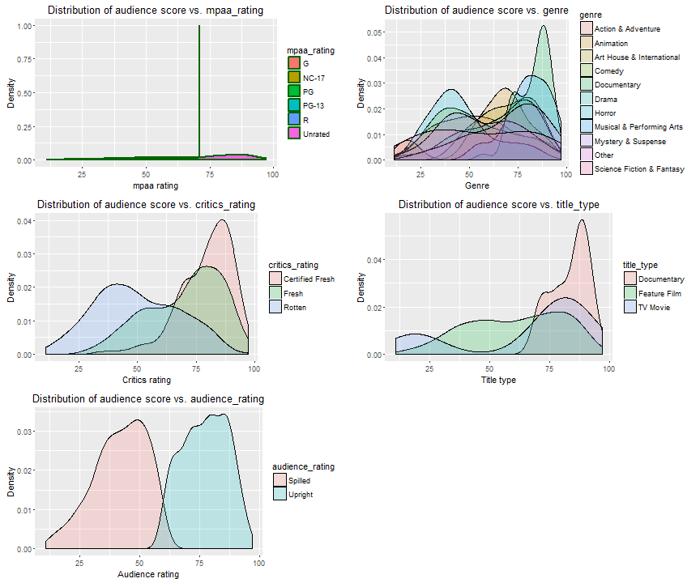
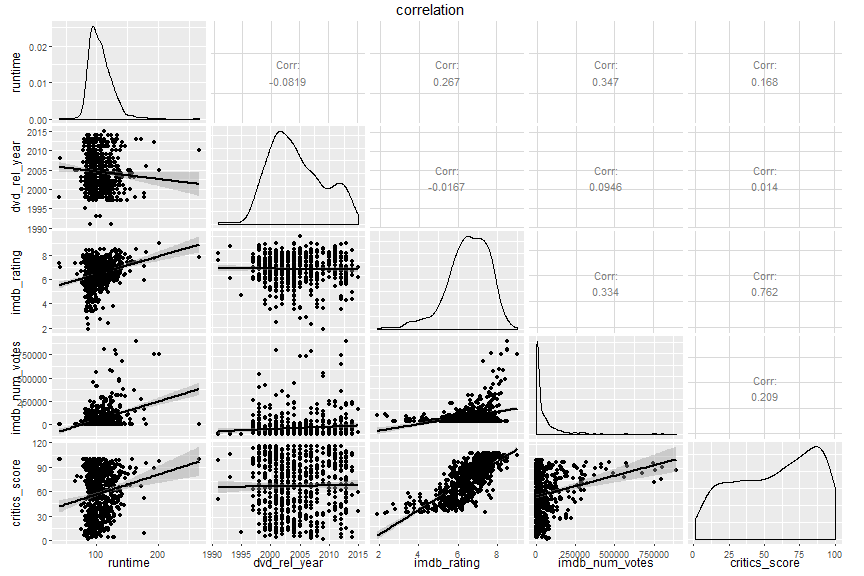
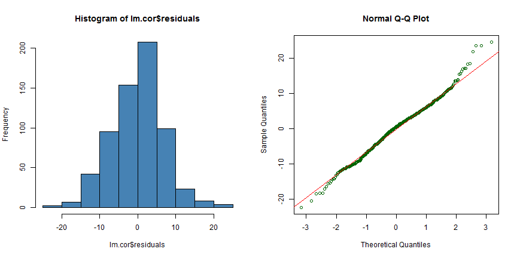

<h2><b>Linear Regression on movies data</b></h2>
<br>
Author: Bruno Hunkeler   
Date:   21.09.2016
<hr>

Rotten Tomatoes and the Tomatometer™ rating is the most trusted measurement of quality entertainment. As the leading online aggregator of movie and TV show reviews 
from professional critics, Rotten Tomatoes offers the most comprehensive guide to what's fresh. The world famous Tomatometer™ rating represents the percentage 
of positive professional reviews for films and TV shows and is used by millions every day, to help with their entertainment viewing decisions. 
Rotten Tomatoes designates the best reviewed movies and TV shows as Certified Fresh. That accolade is awarded with Tomatometer ratings of 75% and higher, and a 
required minimum number of reviews. Weekly Rotten Tomatoes podcasts can be found on RottenTomatoes.com, iTunes, Soundcloud and Stitcher, and Rotten Tomatoes' 
entertainment experts make regular TV and radio appearances across the US.

In 2016, Flixster and Rotten Tomatoes became part of Fandango's portfolio of digital properties, serving moviegoers and entertainment fans.
The Tomatometer rating – based on the published opinions of hundreds of film and television critics – is a trusted measurement of movie and TV programming 
quality for millions of moviegoers. It represents the percentage of professional critic reviews that are positive for a given film or television show.

<b>What is the Tomatometer?</b><br>
The Tomatometer rating - based on the published opinions of hundreds of film and television critics - is a trusted measurement of movie and TV programming 
quality for millions of moviegoers.
The Tomatometer rating represents the percentage of professional critic reviews that are positive for a given film or television show.
Back in the days of the open theaters, when a play was particularly atrocious, the audience expressed their dissatisfaction by not only booing and hissing at 
the stage, but throwing whatever was at hand -- vegetables and fruits included.

<ul>
<li>The full popcorn bucket means the movie received 3.5 stars or higher by Flixster and Rotten Tomatoes users.</li>
<li>The tipped over popcorn bucket means the movie received less than 3.5 stars by Flixster and Rotten Tomatoes users.</li>
<li>The plus sign will appear for movies that do not have audience ratings or reviews. The percentage you see associated with this icon is the percentage of 
users who added the movie to their Want-to-See list.</li>
</ul>

<b>What is the audience score?</b><br>
The Audience rating, denoted by a popcorn bucket, is the percentage of all Flixster.com and RottenTomatoes.com users who have rated the movie or TV Show positively.

<ul>
<li>A good review is denoted by a fresh red tomato. In order for a movie or TV show to receive an overall rating of Fresh, the reading on the Tomatometer 
for that movie must be at least 60%.</li>
<li>A bad review is denoted by a rotten green tomato splat (59% or less).</li>
<li>To receive a Certified Fresh rating a movie must have a steady Tomatometer rating of 75% or better. Movies opening in wide release need at least 80 reviews 
from Tomatometer Critics (including 5 Top Critics). Movies opening in limited release need at least 40 reviews from Tomatometer Critics (including 5 Top Critics).
A TV show must have a Tomatometer Score of 75% or better with 20 or more reviews from Tomatometer Critics (including 5 Top Critics). If the Tomatometer score drops 
below 70%, then the movie or TV show loses its Certified Fresh status. In some cases, the Certified Fresh designation may be held at the discretion of the Rotten 
Tomatoes editorial team.</li>
</ul>

<h3><b>Data collection</b></h3>
IMDb started in 1990 as a hobby project by an international group of movie and TV fans. IMDb is now the world’s most popular and authoritative 
source for movie, TV and celebrity content.

The information in IMDb comes from various sources. While they actively gather information from and verify items with studios and filmmakers, 
the bulk of our information is submitted by people in the industry and visitors like you.
In addition to using as many sources as we can, the data goes through consistency checks to ensure it's as accurate and reliable as possible. 
However, there's absolutely no substitute for an international team of entertainment fans with an encyclopedic knowledge of trivia and a large 
assortment of reference works (and we include in this group many of our loyal contributors). The sources of information include, but are not 
limited to, on-screen credits, press kits, official bios, autobiographies, and interviews.

<h4><b>Dataset and further Information</b></h4>
Dataset and further information used to perform the given analysis were obtained from the following sources:<br>
<ul>

<li>Dataset: [Movies Data](https://d3c33hcgiwev3.cloudfront.net/_e1fe0c85abec6f73c72d73926884eaca_movies.Rdata?Expires=1474070400&Signature=etwXCxObXIQM7TGkZ7dqRQPH0LB8Yla0zveWIMhc3TiyKaF0CJ~cyiJs8usF1vuhc~nsgvA~6FTzt7zZG8-LsN8MXHcdMNARiC7Lcj4Dyf86QD6D0ew~mg3Gqw-tJuZFDWt3SudNv4FpPdNt97NOadr2lTt351G7OxrB3kjaMkE_&Key-Pair-Id=APKAJLTNE6QMUY6HBC5A)</li>
<li>Codebook: [Movies Codebook](https://d3c33hcgiwev3.cloudfront.net/_73393031e98b997cf2445132f89606a1_movies_codebook.html?Expires=1473465600&Signature=M9ShITsr7TZCndmtN5udxcVWqXa-kYwLJrhFhD63eXcIAG4cpVnpHKSJCHi7kaNCQ-TPSpR4HPPL~zUJoVR1ZlUBS6jSLOCuRHTjcLoWueb40h2LF9wWh12d4ZFSggpHhY3GFEiXvrr1aDANMFHMuAuCJ1BdYxRlE-FViJesVkI_&Key-Pair-Id=APKAJLTNE6QMUY6HBC5A)</li>
<li>Rotten Tomatoes: [Rotten Tomatoes](https://www.rottentomatoes.com/)</li>
<li>IMDB: [IMDB](http://www.imdb.com/)</li>
</ul>

<h4><b>Generalizability</b></h4>
The present data were derived from an observational study. The data set is comprised of 651 randomly sampled movies produced and released from 1970 to 2014. 
According to IMDb, there have 9,962 movie release from 1972 to 2016 so that the 10% condition (9,962*10% = 996) is met. Since the sampling size is large enough and 
less than 10% of population, it can assume that the random sampling is conducted. Therefore we can conclude that the sample is indeed generalizable to the entire population. 

<h4><b>Causality</b></h4>
The data cannot be used to establish a causal relation between the variables of interest as there was no random assignment to the 
explanatory and independent variables.

<h3><b>Setup</b></h3>

<h4><b>Load packages</b></h4>


```r
library('ggplot2')      # library to create plots
library('dplyr')        # data manipulation
library('statsr')       # staistics functions
library('GGally')       # library to create plots
library('knitr')        # required to apply knitr options 
library('grid')         # arrange plots 
library('gridExtra')    # arrange plots
source('Utilities.R')   # support functions used in the analysis - See Appendix

# apply general knitr options
knitr::opts_chunk$set(comment=NA, fig.align='center')
```

<h4><b>Load data</b></h4>
Initial load of the dataset.  

```r
load("Data/movies.Rdata")
data <- movies
```

<h3><b>Part 1: Data</b></h3>
In order to examine the research question, the movies data from IMDB was used. 


```r
# evaluate the size of the dataset
dim(data)
```

```
[1] 651  32
```

The output for the summary- and str() - function has been hidden since the output would be quiet exhaustive (verbose) by having 32 variables.
<br>

```r
# verify types and summary of each variable 
str(data)
summary(data)
```


```r
table(data$genre)
```

```

       Action & Adventure                 Animation 
                       65                         9 
Art House & International                    Comedy 
                       14                        87 
              Documentary                     Drama 
                       52                       305 
                   Horror Musical & Performing Arts 
                       23                        12 
       Mystery & Suspense                     Other 
                       59                        16 
Science Fiction & Fantasy 
                        9 
```
The table above gives an idea of the number of occurences of different genres. Genre is assumed to be one of the central for predicting the audience_score.
One can see that dramas have the highest representation in the given dataset. Therefore we can assume that certain types of movies will have a better prediction rate then others.

I went through the dataset to separate the wheat from the chaff. I verified the number of 'NA' in each 
variable. Check if it is required to apply an algorithm to fill in the missing data or if I just can delete the incomplete rows. 
<br>

```r
Col <- colnames(data)

# Create a new dataset to explicitely show dataset containing NA's
data.full.na <- data[, Col]

# remove NA's 
data.full <- data.full.na[complete.cases(data.full.na), ]
100 - round(dim(data.full)[1] * 100 / dim(data)[1], 2)
```

```
[1] 4.92
```

```r
Col <- c('title','title_type','genre','runtime','mpaa_rating','studio','thtr_rel_year','dvd_rel_year','imdb_rating','imdb_num_votes','critics_rating','critics_score','audience_rating','audience_score','best_pic_nom','best_pic_win','best_actor_win','best_actress_win','best_dir_win','top200_box','director')

# Create a new dataset to explicitely show dataset containing NA's
data.full.na <- data[, Col]

# remove NA's 
data.full <- data.full.na[complete.cases(data.full.na), ]
100 - round(dim(data.full)[1] * 100 / dim(data)[1], 2)
```

```
[1] 2.92
```

Removing all NA's from the original dataset would reduce the dataset by around 5%. We removed features, which we think will not contribute to the final model. These features are 
actor1, actor2 ,actor3 ,actor4 , actor5, imdb_url, rt_url. Having removed those columns from the dataset left us with a dataset reduced by around 3%. I decided to just remove the 
incomplete rows since the remaining data set still provides enough information. The number of removed rows will even be reduced more when we narrow down to the final model.

<h3><b>Part 2: Research question</b></h3>
The following Research question is meant to be answered in this document.<br>

<ul>
<li><b>Is it possible to predict the audience score, based on combination of features (e.g. genre, reviews, runtime, release date 
etc.)?</b></li>
<li><b>Lead certain types of movies to a better audience score?</b></li>
</ul>


<b>This is interesting to me for the following reason:</b> <br>
Producing movies is associated with lots of costs. Companies producing movies should focus their offerings on movies that the audience is likely to enjoy. 
It is essential to prevent investments in movies, which are a complete failure (missing the revenue goals).

<h3><b>Part 3: Exploratory data analysis</b></h3>


<h4><b>Summary and density distribution of the audience score</b></h4>  
The response variable of interest is the audience score. So we perform a few initial verifications.

```r
summary(data.full$audience_score)
```

```
   Min. 1st Qu.  Median    Mean 3rd Qu.    Max. 
  11.00   46.00   65.00   62.57   80.00   97.00 
```

```r
g <- ggplot(data.full, aes(audience_score))
g + geom_density(size=1, colour="darkgreen") + labs(title = "Distribution of audience score") + labs(x = "Audience score", y = "Density")
```


The median audience score 65, with a mean of 62.57, and range of 11 - 97. The audience score distribution is unimodal and left skewed, 
with a peak at approximately 80.
<br>


```r
p1 <- ggplot(data.full, aes(audience_score, fill = mpaa_rating))
p1 <- p1 + geom_density(size=1, colour="darkgreen") + labs(title = "Distribution of audience score vs. mpaa_rating") + labs(x = "mpaa rating", y = "Density")

p2 <- ggplot(data.full, aes(audience_score, fill = genre))
p2 <- p2 + geom_density (alpha = 0.2) + labs(title = "Distribution of audience score vs. genre") + labs(x = "Genre", y = "Density")

p3 <- ggplot(data.full, aes(audience_score, fill = critics_rating))
p3 <- p3 + geom_density (alpha = 0.2) + labs(title = "Distribution of audience score vs. critics_rating") + labs(x = "Critics rating", y = "Density")

p4 <- ggplot(data.full, aes(audience_score, fill = title_type))
p4 <- p4 + geom_density (alpha = 0.2) + labs(title = "Distribution of audience score vs. title_type") + labs(x = "Title type", y = "Density")

p5 <- ggplot(data.full, aes(audience_score, fill = audience_rating))
p5  <- p5 + geom_density (alpha = 0.2) + labs(title = "Distribution of audience score vs. audience_rating") + labs(x = "Audience rating", y = "Density")

grid.arrange(p1, p2, p3, p4, p5,  ncol = 2)
```



Although it might be possible to combine the actor’s names of a particular movie into a single numerical or categorical variable it would not aid the interpretability of 
the regression model. Moreover, given the small sample size, it is a distinct possibility that most actors’ names may not be meaningful predictors. The same applies 
to the features "imdb_url" and "rt_url". Both won't support a meaningful prediction. Above a selection of Density plots have been visualized. The plots show different 
features compared to the audience score. One can see that certain features will certainly contribute better (i.e genre, critics_rating etc.) to the model then others.

<h3><b>Part 4: Modeling</b></h3>

<h4><b>Model selection</b></h4>  
The best model is not always the most complicated. Sometimes including variables that are not evidently important can actually reduce the accuracy of predictions.
In practice, the model that includes all available explanatory variables is often referred to as the full model. The full model may not be the best model, and if it 
isn't, we want to identify a smaller model that is preferable.
<b>Adjusted R^2^</b> describes the strength of a model, and it is a useful tool for evaluating which predictors are adding value to the model, where adding value means 
they are (likely) improving the accuracy in predicting future outcomes.

<b>Backwards elimination</b> was applied to select an appropriate model. Hereby I start with a full model (containing all predictors), drop one predictor at a 
time until the parsimonious model is reached. I focused on the adjusted R^2^ value, since this leads to more reliable predictions. The analysis showed, that the following 
model give me the highest adjusted R^2^ value. 

<b>Model:</b><br>
<b>audience_score ~ genre + runtime + dvd_rel_year + imdb_rating + imdb_num_votes + critics_score + audience_rating + best_pic_nom</b>

Backward Feature Elimination is a tedious task. Recursive Feature Elimination (RFE) is a helpful method in such a case. 
Out of an interest I used two independent approaches to retrieve a Parsimonious model. The types I used are listed below. A detailed implementation 
can be found in the appendix.

<ul>
<li><b>LEAP    - Recursive feature elimination (part of the Leaps Package)</b></li>
<li><b>stepAIC - Recursive feature elimination (part of the MASS Package)</b></li>
</ul>

<h4><b>Model evaluation</b></h4>

The following model is used for model evaluation.<br>
<b>audience_score ~ genre + runtime + dvd_rel_year + imdb_rating + imdb_num_votes + critics_score + audience_rating + best_pic_nom</b>


```r
Col <- c('genre','runtime','dvd_rel_year', 'imdb_rating', 'imdb_num_votes', 'critics_score', 'audience_rating', 'audience_score', 'best_pic_nom')
data.full.na <- data[, Col]

# remove NA's 
data.full <- data.full.na[complete.cases(data.full.na), ]

# Create Formula 
formula <- getFormula(data.full, 'audience_score')
lm.movies <- lm(formula, data.full)

summary(lm.movies)
```

```

Call:
lm(formula = formula, data = data.full)

Residuals:
     Min       1Q   Median       3Q      Max 
-21.8021  -4.5495   0.4992   4.2506  23.8522 

Coefficients:
                                 Estimate Std. Error t value Pr(>|t|)    
(Intercept)                     2.866e+02  1.235e+02   2.320   0.0207 *  
genreAnimation                  3.377e+00  2.472e+00   1.366   0.1724    
genreArt House & International -2.156e+00  2.139e+00  -1.008   0.3139    
genreComedy                     1.257e+00  1.142e+00   1.101   0.2714    
genreDocumentary                1.055e+00  1.505e+00   0.701   0.4834    
genreDrama                     -6.719e-01  9.940e-01  -0.676   0.4993    
genreHorror                    -1.933e+00  1.688e+00  -1.145   0.2526    
genreMusical & Performing Arts  3.339e+00  2.232e+00   1.496   0.1352    
genreMystery & Suspense        -3.120e+00  1.259e+00  -2.479   0.0134 *  
genreOther                     -1.484e-01  1.939e+00  -0.077   0.9390    
genreScience Fiction & Fantasy -6.089e-02  2.577e+00  -0.024   0.9812    
runtime                        -3.522e-02  1.610e-02  -2.187   0.0291 *  
dvd_rel_year                   -1.465e-01  6.148e-02  -2.383   0.0175 *  
imdb_rating                     9.299e+00  4.821e-01  19.289   <2e-16 ***
imdb_num_votes                  3.617e-06  2.943e-06   1.229   0.2196    
critics_score                   2.327e-02  1.513e-02   1.538   0.1246    
audience_ratingUpright          1.990e+01  7.881e-01  25.253   <2e-16 ***
best_pic_nomyes                 2.901e+00  1.617e+00   1.793   0.0734 .  
---
Signif. codes:  0 '***' 0.001 '**' 0.01 '*' 0.05 '.' 0.1 ' ' 1

Residual standard error: 6.845 on 624 degrees of freedom
Multiple R-squared:  0.8876,	Adjusted R-squared:  0.8845 
F-statistic: 289.9 on 17 and 624 DF,  p-value: < 2.2e-16
```
The summary of our parsimonious model indicates that the adjusted R^2^ value is 0.8845 and the p-value: < 2.2e-16. 

Summary estimates should only be trusted if the conditions for the regression are reasonable. Having mentioned that, it will be relevant to 
validate the following aspects: 

(i)   There is a linear relationship between any numerical predictor variables and the response variable.<br>
(ii)  The residuals are nearly normally distributed<br>
(iii) The residuals display constant variability<br>
(iv)  The residuals are independent<br>

We first will examine whether the numerical variables included in the model, are linearly related to the response variable (audience score) by examining the distribution 
of the residuals.


```r
p1 <- ggplot(data = NULL, aes(x = data.full$runtime, y = lm.movies$residuals)) + 
      geom_point(col = 'steelblue') + geom_hline(yintercept = 0, linetype = 'dashed', color = 'red')

p2 <- ggplot(data = NULL, aes(x = data.full$imdb_rating, y = lm.movies$residuals)) + 
      geom_point(col = 'darkgreen') + geom_hline(yintercept = 0, linetype = 'dashed', color = 'red')

p3 <- ggplot(data = NULL, aes(x = data.full$imdb_num_votes, y = lm.movies$residuals)) + 
      geom_point(col = 'brown') + geom_hline(yintercept = 0, linetype = 'dashed', color = 'red')

p4 <- ggplot(data = NULL, aes(x = data.full$critics_score, y = lm.movies$residuals)) + 
      geom_point(col = 'orange') + geom_hline(yintercept = 0, linetype = 'dashed', color = 'red')

grid.arrange(p1, p2, p3, p4)
```


The residuals are scattered randomly around 0 for all features.

Next, we check whether the residuals display a nearly normal distribution centred around 0.

```r
par(mfrow = c(1,2))
hist(lm.movies$residuals, col = 'steelblue')
qqnorm(lm.movies$residuals, col = 'darkgreen')
qqline(lm.movies$residuals, col = 'red')
```


The results of the histogram of the residuals shows a normal distribution around 0 while the Q-Q plot indicates some skewness in the tails but there are no major deviations.
So we can conclude that the conditions for this model are reasonable. 


```r
par(mfrow = c(1,2))
ggplot(data = NULL, aes(x = lm.movies$fitted, y = lm.movies$residuals)) + geom_point(col = 'darkgreen') + 
      geom_hline(yintercept = 0, linetype = 'dashed', color = 'red')
```


The results show that the residuals are equally variable for low and high values of the predicted values, i.e., residuals have a constant variability.

We can also perform a hierarchical analysis of variance table by using the <b>anova</b> function:
An ANOVA table shows the possible associations between the independent and dependent variables. That Information gets lost in the summary output of a t-test. 
The results of the ANOVA test are shown below.


```r
anova(lm.movies)
```

```
Analysis of Variance Table

Response: audience_score
                 Df Sum Sq Mean Sq   F value    Pr(>F)    
genre            10  49495    4950  105.6396 < 2.2e-16 ***
runtime           1   6023    6023  128.5498 < 2.2e-16 ***
dvd_rel_year      1   3428    3428   73.1557 < 2.2e-16 ***
imdb_rating       1 140510  140510 2998.9601 < 2.2e-16 ***
imdb_num_votes    1    404     404    8.6295   0.00343 ** 
critics_score     1    963     963   20.5562 6.944e-06 ***
audience_rating   1  29925   29925  638.6985 < 2.2e-16 ***
best_pic_nom      1    151     151    3.2160   0.07341 .  
Residuals       624  29236      47                        
---
Signif. codes:  0 '***' 0.001 '**' 0.01 '*' 0.05 '.' 0.1 ' ' 1
```

With regards to inference for the model, the p-value of the model’s F-statistic indicates that the model as a whole is significant. It should be noted that not all 
explanatory variables have a significant p-value as the model was developed using <b>highest adjusted R^2^</b> as a determinant. 

<h4><b>Correlation of features (Collinearity)</b></h4>
Correlation Coefficients are used to describe relationships among quantitative variables/features.  
The sign ± indicates the direction of the relationship (positive or inverse) and the magnitude indicates the strength of the relationship 
(ranging from 0 for no relationship to 1 for a perfectly predictable relationship). Finding the final model is a compromise between predictive accuracy 
(a model that fits the data as well as possible) and parsimony. Predictors are independent variables, so they should be independent of each other. 
Predictors are collinear when they are correlated with each other. In favour of this approach we will verify the correlation 
between the different numerical features. Non numerical features can't be used to assess correlation.


```r
Col <- c('genre','runtime','dvd_rel_year','imdb_num_votes','critics_score','audience_rating','audience_score','best_pic_nom')
data.cor.na <- data[, Col]

# remove NA's 
data.cor<- data.cor.na[complete.cases(data.cor.na), ]

# Create Formula 
formula <- getFormula(data.cor, 'audience_score')
lm.cor <- lm(formula, data = data.cor)

Col <- c('runtime','dvd_rel_year','imdb_rating','imdb_num_votes','critics_score')
data.cor <- data.full[, Col]

ggpairs(data.cor, 
        columns=1:5, 
        upper = list(continuous = wrap("cor", size = 4)), 
        lower = list(continuous = "smooth"), 
        title="correlation ",
        colour = "critics_score")
```

```
Warning in warn_if_args_exist(list(...)): Extra arguments: "colour" are
being ignored. If these are meant to be aesthetics, submit them using the
'mapping' variable within ggpairs with ggplot2::aes or ggplot2::aes_string.
```



The given image shows a strong relation (correlation) in one area. There is a positive Correlation of 0.76 between the predictors 'critics_score' and 'imdb_rating'. 
There seems to be a collinearity between the given predictors. This finding requires to run a second model with a reduced feature set. In the new model we remove 
'critics_score' and run the model again. Having two models at hand requires the step of comparing them. That step is discussed in the next section.


```r
# reduced feature list
Col <- c('genre','runtime','dvd_rel_year','imdb_rating','imdb_num_votes','audience_rating','audience_score','best_pic_nom')
data.cor.na <- data[, Col]

# remove NA's. 
data.cor <- data.cor.na[complete.cases(data.cor.na), ]

# Create Formula 
formula <- getFormula(data.cor, 'audience_score')
lm.cor <- lm(formula, data.cor)

summary(lm.cor)
```

```

Call:
lm(formula = formula, data = data.cor)

Residuals:
     Min       1Q   Median       3Q      Max 
-22.3073  -4.4462   0.5947   4.2330  24.6016 

Coefficients:
                                 Estimate Std. Error t value Pr(>|t|)    
(Intercept)                     2.773e+02  1.235e+02   2.244   0.0252 *  
genreAnimation                  3.537e+00  2.472e+00   1.431   0.1530    
genreArt House & International -2.290e+00  2.139e+00  -1.070   0.2849    
genreComedy                     1.321e+00  1.143e+00   1.156   0.2483    
genreDocumentary                1.288e+00  1.499e+00   0.859   0.3905    
genreDrama                     -5.257e-01  9.905e-01  -0.531   0.5958    
genreHorror                    -1.792e+00  1.687e+00  -1.062   0.2887    
genreMusical & Performing Arts  3.524e+00  2.232e+00   1.579   0.1148    
genreMystery & Suspense        -3.025e+00  1.258e+00  -2.404   0.0165 *  
genreOther                      7.743e-02  1.935e+00   0.040   0.9681    
genreScience Fiction & Fantasy  2.164e-01  2.573e+00   0.084   0.9330    
runtime                        -3.610e-02  1.611e-02  -2.241   0.0254 *  
dvd_rel_year                   -1.426e-01  6.149e-02  -2.318   0.0207 *  
imdb_rating                     9.712e+00  4.008e-01  24.231   <2e-16 ***
imdb_num_votes                  3.349e-06  2.941e-06   1.139   0.2553    
audience_ratingUpright          2.004e+01  7.840e-01  25.555   <2e-16 ***
best_pic_nomyes                 3.076e+00  1.615e+00   1.905   0.0573 .  
---
Signif. codes:  0 '***' 0.001 '**' 0.01 '*' 0.05 '.' 0.1 ' ' 1

Residual standard error: 6.852 on 625 degrees of freedom
Multiple R-squared:  0.8872,	Adjusted R-squared:  0.8843 
F-statistic: 307.2 on 16 and 625 DF,  p-value: < 2.2e-16
```
The model (lm.cor) with the removed feature (critics_score) indicates that the <b>adjusted R^2^</b> value is <b>0.8843</b> and the <b>p-value: < 2.2e-16</b>. The features are significant to the model, but the adjusted R^2^ value is slightly smaller then the original model. This can also be visualized as in the plots below.


```r
par(mfrow = c(1,2))
hist(lm.cor$residuals, col = 'steelblue')
qqnorm(lm.cor$residuals, col = 'darkgreen')
qqline(lm.cor$residuals, col = 'red')
```


Since there is no substantial difference between the two outcomes, one could conclude to get rid of the critics_score in favour of a smaller model. But we will stick with the 
model initially proposed.

Here as well we can perform a hierarchical analysis of variance table by using the <b>anova</b> function. 


```r
anova(lm.cor)
```

```
Analysis of Variance Table

Response: audience_score
                 Df Sum Sq Mean Sq   F value    Pr(>F)    
genre            10  49495    4950  105.4094 < 2.2e-16 ***
runtime           1   6023    6023  128.2697 < 2.2e-16 ***
dvd_rel_year      1   3428    3428   72.9963 < 2.2e-16 ***
imdb_rating       1 140510  140510 2992.4250 < 2.2e-16 ***
imdb_num_votes    1    404     404    8.6107  0.003465 ** 
audience_rating   1  30757   30757  655.0397 < 2.2e-16 ***
best_pic_nom      1    170     170    3.6275  0.057289 .  
Residuals       625  29347      47                        
---
Signif. codes:  0 '***' 0.001 '**' 0.01 '*' 0.05 '.' 0.1 ' ' 1
```

It reflects about the same result as in the previous anova analysis. The p-value of the model’s F-statistic indicates that the model as a whole is significant. Also here 
it should be noted that not all explanatory variables have a significant p-value as the model was developed using highest adjusted R2 as a determinant.

<h4><b>Comparing models</b></h4>

The selection of a final regression model always involves a compromise between predictive accuracy (a model that fits the data
as well as possible) and parsimony (a simple and replicable model). All things being equal, if you have two models with approximately 
equal predictive accuracy, We would favour the simpler one. Will use anova to compare the model fit. 
Anova() compares the fit of two nested models. A nested model is one whose terms are completely included in the other model.


```r
# in favour of the output
model1 <- lm.movies
model2 <- lm.cor 
  
# Compare Model fit
anova(model1, model2) 
```

```
Analysis of Variance Table

Model 1: audience_score ~ genre + runtime + dvd_rel_year + imdb_rating + 
    imdb_num_votes + critics_score + audience_rating + best_pic_nom
Model 2: audience_score ~ genre + runtime + dvd_rel_year + imdb_rating + 
    imdb_num_votes + audience_rating + best_pic_nom
  Res.Df   RSS Df Sum of Sq      F Pr(>F)
1    624 29236                           
2    625 29347 -1    -110.8 2.3649 0.1246
```
The model <b>model2 (lm.cor)</b> is nested in model <b>model1 (lm.movies)</b>
The summary output indicates that model2 with the removed feature (critics_score) is non significant (Pr(>F): 0.1246).
Therefore we will not drop the feature since it contributes to the linear prediction.

Having selected the model based on adjusted R^2^ or p-values does not per se mean that the model automatically generalizes better.
I'd like to take both models to see how each model generalize by predicting values.

We will use both models to predict the <b>audience_score</b>, as mentioned above. We will then see,
which model generalizes better. For that purpose I randomly selected 10 rows from the data set and predicted the 
values based on the models. 


```r
data.prediction <- data.full[, -8]

prediction_1.1 <- predict(lm.movies, data.prediction[7,])
prediction_1.2 <- predict(lm.movies, data.prediction[17,])
prediction_1.3 <- predict(lm.movies, data.prediction[37,])
prediction_1.4 <- predict(lm.movies, data.prediction[57,])
prediction_1.5 <- predict(lm.movies, data.prediction[100,])
prediction_1.6 <- predict(lm.movies, data.prediction[131,])
prediction_1.7 <- predict(lm.movies, data.prediction[151,])
prediction_1.8 <- predict(lm.movies, data.prediction[170,])
prediction_1.9 <- predict(lm.movies, data.prediction[243,])
prediction_1.10 <- predict(lm.movies, data.prediction[316,])

data.prediction <- data.prediction[, -6]

prediction_2.1 <- predict(lm.cor, data.prediction[7,])
prediction_2.2 <- predict(lm.cor, data.prediction[17,])
prediction_2.3 <- predict(lm.cor, data.prediction[37,])
prediction_2.4 <- predict(lm.cor, data.prediction[57,])
prediction_2.5 <- predict(lm.cor, data.prediction[100,])
prediction_2.6 <- predict(lm.cor, data.prediction[131,])
prediction_2.7 <- predict(lm.cor, data.prediction[151,])
prediction_2.8 <- predict(lm.cor, data.prediction[170,])
prediction_2.9 <- predict(lm.cor, data.prediction[243,])
prediction_2.10 <- predict(lm.cor, data.prediction[316,])
```

The following table contains the predicted values and deviation in % of the prediction. 

Model (lm.movies) | Audience_score | Prediction  | Deviation   |
------------------|----------------|-------------|-------------|
model 1           | 76             | 75.66       |   0.45 %    |
model 1           | 80             | 76.77       |   4.04 %    |
model 1           | 70             | 73.91       |  -5.58 %    |
model 1           | 59             | 49.63       |  15.88 %    |
model 1           | 80             | 76.80       |   4.00 %    |
model 1           | 87             | 80.24       |   7.77 %    |
model 1           | 85             | 77.37       |   8.97 %    |
model 1           | 32             | 36.11       | -12.84 %    |
model 1           | 66             | 73.32       | -11.09 %    |
model 1           | 84             | 75.31       |  10.34 %    |

Model (lm.cor)    | Audience_score | Prediction  | Deviation   |
------------------|----------------|-------------|-------------|
model 2           | 76             | 76.02       |  -0.04 %    |
model 2           | 80             | 77.16       |   3.55 %    |
model 2           | 70             | 73.76       |  -5.37 %    |
model 2           | 59             | 49.85       |  15.50 %    |
model 2           | 80             | 76.40       |   4.50 %    |
model 2           | 87             | 80.17       |   7.85 %    |
model 2           | 85             | 76.82       |   9.62 %    |
model 2           | 32             | 36.40       | -13.75 %    |
model 2           | 66             | 73.20       | -10.90 %    |
model 2           | 84             | 76.54       |   8.88 %    |

Both the models generalize in about the same way. Therefore we will stick with the model we initially proposed (lm.movies.).

<h3><b>Part 5: Prediction</b></h3>

Finally, I'll provide the predicted value, based on a 95% confidence interval. I used the movie Sully for that purpose.

```r
data.prediction <- data.frame( genre = 'Drama', 
                               runtime = 96, 
                               dvd_rel_year = 2016, 
                               imdb_rating = 8.0,
                               imdb_num_votes = 21057, 
                               critics_score = 82, 
                               audience_rating = 'Upright', 
                               best_pic_nom = 'yes')
predict(lm.movies, data.prediction, interval = "prediction", level = 0.95)
```

```
       fit      lwr      upr
1 86.35879 72.41683 100.3008
```

```r
# Error in percent  
Error_in_percent = round(100 - (round(86.35, 2) * 100 / 89), 2)
Error_in_percent
```

```
[1] 2.98
```
The predicted value is 86.36, which fairly close to the actual audience score of 89 and, based on the confidence interval, we can be 95% confident 
that the actual audience score for this particular movie has a lower bound of approximately 72.42 and a higher bound of approximately 100.30.
The calculated Error between eff. audience score (89) and predicted audience score (86.36) is about <b>2.97 %</b>

<h3><b>Part 6: Conclusion</b></h3>
The predictive model presented here is used to predict audience scores for a movie. To get to a Parsimonious model with 'backward elimination' 
manually is a rather tedious task. Therefore Recursive Feature Elimination is pretty helpful method in such cases. We used the adjusted R^2^ parameter to 
narrow down the features to a Parsimonious model, which leads to more reliable predictions. The proposed linear model shows a 'fairly good' 
prediction rate, but it should be noted that the model is based on a very small sample. 

It might be beneficial to gather more data for a better prediction. Especially the distribution of movies from different genres is certainly unsufficient. 
The only sufficiently represented genre type in the present dataset, is dramas (about 50%). The predicion of the 'audience score' for movies in other genres 
will indicate larger differences.

Another way to improve the prediction rate would be to extend the feature engineering part, which means to creating new features from existing or add new features,
while removing usless features (e.g. URL). In addition, as anticipated before the best prediction rate. 

Lower bound audience_scores show a much higher difference. Therefore we might think about a second or higher order polynomial model. But we still need be carefull to find a 
decent balance between over-, and underfitting the model. 

A useful additional analysis would be, to evaluate if we end up with better prediction results, if we focus on p-values (significant predictores) to evaluate predictors.

One last word. Having selected the model based on adjusted R^2^ or p-values does not per se mean that the model automatically generalizes better. So you are still free 
to add or remove certain predictors for the greater good. It's called the expert opinion.


<h3><b>Appendix</b></h3>

<h4>getFormula Function</h4>
The following Function has been used throughout the project. It is just a convenience function to improve the readability.


```r
# ==========================================================================================================
# getFormula  - will retrieve the formula based on a data set
# 
# Parameter:
#   data  - dataset
#   label - label 
# ==========================================================================================================

getFormula <- function(data = data, label = label) {
  
  # label Variable
  labelVar <- label
  
  # separate measure Variable y column from rest 
  groupVariables <- setdiff(colnames(data), list(label))
  
  # create formula for model 
  formula <- as.formula(paste(labelVar, paste(groupVariables, collapse = ' + '), sep = ' ~ '))
  
}
```

<h4>Recursive Feature Elimination (RFE)</h4>
I used the following methods to perform RFE.

<ul>
<li><b>LEAP    - Recursive feature elimination (part of the Leaps Package)</b></li>
<li><b>stepAIC - Recursive feature elimination (part of the MASS Package)</b></li>
</ul>


```r
LEAP <- FALSE

if (LEAP == TRUE) {
  library(leaps)  # Recursive Feature Elimination functions
  
  Col <- c('title_type','genre','runtime','mpaa_rating','thtr_rel_year','dvd_rel_year','imdb_rating','imdb_num_votes','critics_rating','critics_score','audience_rating','audience_score','best_pic_nom')
  data.full.na <- data[, Col]
  data.full <- data.full.na[complete.cases(data.full.na), ]
  
  # Create Formula 
  formula <- getFormula(data.full, 'audience_score')
  leaps <- regsubsets(formula, data=data.full, nbest = 1, nvmax = NULL, method = "backward")
  plot(leaps, scale = "adjr2", main = "Adjusted R^2") 

}

AIC <- FALSE

if(AIC == TRUE){
  library('MASS')  # Recursive Feature Elimination functions
  
  Col <- c('title_type','genre','runtime','mpaa_rating','thtr_rel_year','dvd_rel_year','imdb_rating','imdb_num_votes','critics_rating','critics_score','audience_rating','audience_score','best_pic_nom')
  data.AIC.na <- data[, Col]
  
  # remove NA's 
  data.AIC <- data.AIC.na[complete.cases(data.AIC.na), ]
  
  # Create Formula 
  formula <- getFormula(data.AIC, 'audience_score')
  lm.AIC <- lm(formula, data = data.AIC)
  
  parameter.final <- stepAIC(lm.AIC, direction='backward')

}
```

Both the Methods return reasonable results, even though they are different. Therefore don't just trust the provided solution. Reverify the respective solution in regards to 
adjusted R^2^ or p-value. I reduced the features above already by the parameters, which obviously do not contribute to the prediction. The reason is to reduce the evaluation time. 


