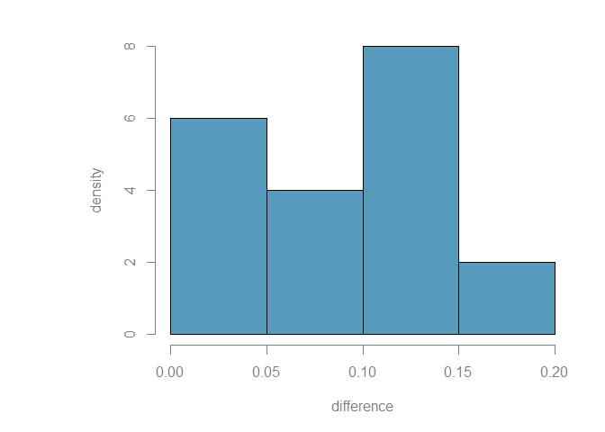
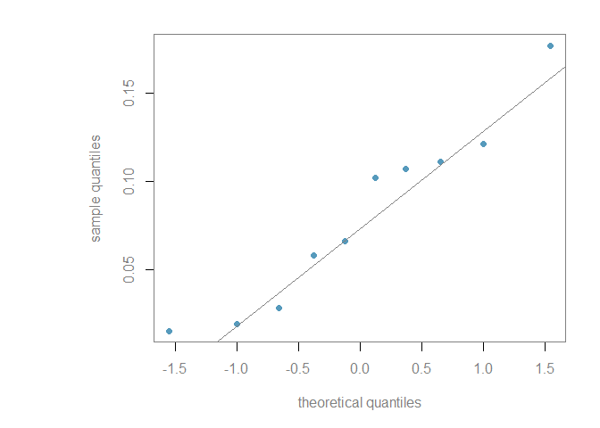
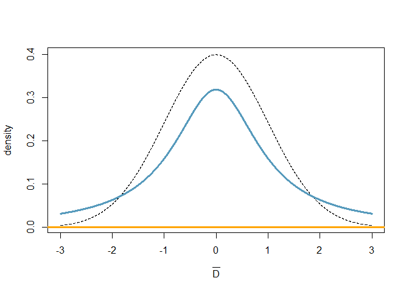

Comparing two paired means
================
Dr. Merlise Clyde, Duke University

Read in the data and calculate the diffence in zinc concentration

``` r
zinc =  read.table("https://onlinecourses.science.psu.edu/stat500/sites/onlinecourses.science.psu.edu.stat500/files/data/zinc_conc.txt", 
                   header=T, fileEncoding="UTF-16LE")
zinc$difference = zinc$bottom - zinc$surface
summary(zinc)
```

    ##      bottom          surface         difference    
    ##  Min.   :0.2660   Min.   :0.2380   Min.   :0.0150  
    ##  1st Qu.:0.4845   1st Qu.:0.4103   1st Qu.:0.0355  
    ##  Median :0.5780   Median :0.4690   Median :0.0840  
    ##  Mean   :0.5649   Mean   :0.4845   Mean   :0.0804  
    ##  3rd Qu.:0.6930   3rd Qu.:0.6080   3rd Qu.:0.1100  
    ##  Max.   :0.7230   Max.   :0.6320   Max.   :0.1770

Let's look at the distribution of the sampled differences

``` r
myblue = rgb(86,155,189, name="myblue", max=256)
mydarkgrey = rgb(.5,.5,.5, name="mydarkgrey", max=1)
par(mar=c(5, 9, 2, 2), col.lab=mydarkgrey, col.axis=mydarkgrey, col=mydarkgrey)

# histogram
hist(zinc$difference, col=myblue,
     xlab="difference", lwd=3, ylab="density",
     main="", prob=T, axes=F)
axis(1,col=mydarkgrey)
axis(2,col=mydarkgrey)
```



``` r
# Normal quantile plot
qqnorm(zinc$difference, col=myblue, pch=16, main="",
       xlab="theoretical quantiles",
       ylab="sample quantiles")
qqline(zinc$difference)
```



### Prior Distributions

``` r
x = seq(-3, 3, length=10000)
plot(x, dnorm(x), 
     xlab=expression(bar(D)), ylab="density",
     col=1, type="l", lty=2, lwd=1)
lines(x, dt(x, df=1), lty=1, lwd=3, col=myblue)
abline(h=0, lty=1, lwd=3, col="orange")
```



The black is a standard normal distribution, while the blue is a Student-t distribution with 1 degree of freedom otherwise known as the Cauchy distribution. The orange line corresponds to a limiting normal distribution as the variance or standard deviation goes to infinity.

### Bayes factors and posterior probabilities

Let's define a function to help simplify the calculations of the posterior probabilities and the Bayes factor using the normal prior
*μ* ∣ *σ*<sup>2</sup> ∼ *N*(*μ*<sub>0</sub>, *σ*<sup>2</sup>/*n*0)
 and
*p*(*σ*<sup>2</sup>)∝1/*σ*<sup>2</sup>

``` r
bayes.t.test = function(x, n0=1, mu0 = 0,  prior.H1=.5) {
  out = t.test(x - mu0)
  t = as.numeric(abs(out$statistic))
  n = length(x)
  df = n-1
  # BF is BF of H1 to H2
  BF=exp(.5*(log(n + n0) - log(n0) +
                 (df + 1)*(log(t^2*n0/(n + n0) + df) -
                           log(t^2 + df))))
  PO= BF*prior.H1/(1 - prior.H1)
  post.prob = 1/(1 + 1/PO)
  return(list(BF.H1.H2=BF, post.prob.H1 = post.prob,
              post.prob.H2= 1 - post.prob,
              t=t, p.value=out$p.value, df=n-1))
}
```

``` r
out = bayes.t.test(zinc$difference)
out
```

    ## $BF.H1.H2
    ## [1] 0.01539321
    ## 
    ## $post.prob.H1
    ## [1] 0.01515985
    ## 
    ## $post.prob.H2
    ## [1] 0.9848402
    ## 
    ## $t
    ## [1] 4.863813
    ## 
    ## $p.value
    ## [1] 0.0008911155
    ## 
    ## $df
    ## [1] 9

H1 is that the mean difference is 0 while H2 is that the mean difference is not zero. To obtain the Bayes factor for H2 to H1, we simply take 1/BF.H1.H2

``` r
1/out$BF.H1.H2
```

    ## [1] 64.96373

Note: this function could be used for any one sample hypothesis test of *μ* = *μ*<sub>0</sub> versus *μ* ≠ *μ*<sub>0</sub>.
