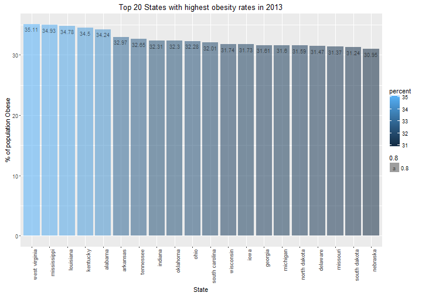
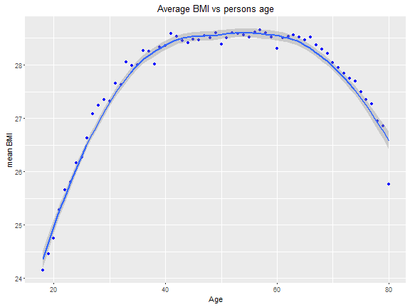

<h2>Coursera Introduction to Probability and Data</h2>
<b>at Duke University</b>

Author: Bruno Hunkeler<br> 
Date:   24.05.2016
<hr>


---
output: 
  md_document:
    variant: markdown_github
    fig_height: 4
    highlight: pygments
    theme: spacelab
    css: style.css
---

<h2> Behavioral Risk Factor Surveillance System </h2>

The Behavioral Risk Factor Surveillance System (BRFSS) is a collaborative project between all of the states in
the United States (US) and participating US territories and the Centers for Disease Control and Prevention (CDC).
The BRFSS is administered and supported by CDC's Population Health Surveillance Branch, under the Division
of Population Health at the National Center for Chronic Disease Prevention and Health Promotion. <b>BRFSS is an
ongoing surveillance system designed to measure behavioral risk factors for the non-institutionalized adult
population (18 years of age and older) residing in the US.</b> 

The BRFSS objective is to collect uniform, state-specific data on preventive health practices and risk
behaviors that are linked to chronic diseases, injuries, and preventable infectious diseases that affect the
adult population. Factors assessed by the BRFSS in 2013 include tobacco use, HIV/AIDS knowledge and
prevention, exercise, immunization, health status, healthy days — health-related quality of life, health care
access, inadequate sleep, hypertension awareness, cholesterol awareness, chronic health conditions, alcohol
consumption, fruits and vegetables consumption, arthritis burden, and seatbelt use. 

<h3>Data collection</h3>

Since 2011, BRFSS conducts both landline telephone- and cellular telephone-based surveys. In conducting the BRFSS landline
telephone survey, interviewers collect data from a randomly selected adult in a household. In conducting the
cellular telephone version of the BRFSS questionnaire, interviewers collect data from an adult who participates
by using a cellular telephone and resides in a private residence or college housing.

BRFSS field operations are managed by state health departments that follow protocols adopted by the states
with technical assistance provided by CDC. State health departments collaborate during survey development,
and conduct the interviews themselves or by using contractors. The data are transmitted to the CDC for editing,
processing, weighting, and analysis. An edited and weighted data file is provided to each participating health
department for each year of data collection, and summary reports of state-specific data are prepared by the
CDC.

The data and further information were obtained from the following sources:

Dataset: [Behavioral Risk Factor Surveillance System Data](https://d3c33hcgiwev3.cloudfront.net/_384b2d9eda4b29131fb681b243a7767d_brfss2013.RData?Expires=1464220800&Signature=QjjfkYt-C-wTRcwEvnuyFDvphasfoKEAkMo-088OscAJxIV7NbLUqOmkJZBXsVLUuJmJZmatWsi7bOoG9WMkp18BK4bGVvEpAjHyar9fOMmT9TcnFax5m2Dj8nJZzqox4IV20XOtnijNbzwQH4N8yd7CtbIc1tNTgeo8mq5ezjQ_&Key-Pair-Id=APKAJLTNE6QMUY6HBC5A) [53MB]

General Information: [2013 Survey Data Information](http://www.cdc.gov/brfss/annual_data/annual_2013.html) 

<ul>
<li>[2013 BRFSS Overview](http://www.cdc.gov/brfss/annual_data/2013/pdf/overview_2013.pdf) [PDF - 84 KB]<br> 
       Provides information on the background, design, data collection and processing, statistical, and <br>
       analytical issues for the combined landline and cell phone data set.<br><br>
<li>[2013 BRFSS Codebook](http://www.cdc.gov/brfss/annual_data/2013/pdf/codebook13_llcp.pdf) [PDF - 2.7 MB]<br>
       Codebook for the file showing variable name, location, and frequency of values for all reporting <br>
       areas combined for the combined landline and cell phone data set.<br><br>
<li>[Calculated Variables in Data Files](http://www.cdc.gov/brfss/annual_data/2013/pdf/2013_calculated_variables_version15.pdf) [PDF - 421 KB] <br>
<li>[Comparability of Data](http://www.cdc.gov/brfss/annual_data/2013/pdf/compare_2013.pdf) [PDF - 96 KB]</b> <br>
       Comparability of data across reporting areas for the combined landline and cell phone data set.  <br>
       The BRFSS 2012 data is not directly comparable to years of BRFSS data before 2011 because of the <br>
       changes in weighting methodology and the addition of the cell phone sampling frame.<br><br>
<li>[2013 Weighting Formula](http://www.cdc.gov/brfss/annual_data/2013/pdf/weighting_data.pdf) [PDF - 98 KB]<br>
<li>[Summary Matrix of Calculated Variables (CV) in the 2013 Data File](http://www.cdc.gov/brfss/annual_data/2013/summary_matrix_2013_version5.html)
</ul>

<h3>Generalizability / Causality</h3>

<h4>Target Population</h4>
Over time, the number of states participating in the survey increased; by 2001, 50 states were participating. Today all 
States in the US are part of the survey. BRFSS conducts both landline telephone- and cellular telephone-based surveys. 
In conducting the BRFSS landline telephone survey, interviewers collect data from a randomly selected adult in a household 
for the non-institutionalized adult population (18 years of age and older) residing in the US. 

Overall, an estimated 97.5% of US households had telephone service in 2012. Telephone coverage varies across states with 
a range of 95.3% in New Mexico to 98.6% in Connecticut. The data collection is based on a <b>stratified sampling</b> strategy. <br>
The population is divided into groups (States) called strata. Then a <b>random sampling</B> (telephone), has been employed within <br>
each stratum.

<h4>Genaralizability</h4>
Having an estimated 97.3% coverage of US households and a <b>stratified sampling strategy</b> with a <b>random sampling</b> via <br>
telefon numbers applied, leads to the fact that the survey is indeed genaralizable to all of the US population. There is still a <br>
small probability that two individuals living in the same household could participate in the survey, if they are using individual <br>
cell phones. I such cases we can assume that certain behavioral pattern might be equal (nutrition, excercise etc.). But still the chance<br>
is rather small.

<h4>Causality</h4>
The study, by gathering survey data, has the character of an observational study. Taking causal conclusions is almost never<br> 
recommended based on observational data. In observational studies as this one it is generally only sufficient to show <br>
associations.Even if random sampling, as mentionaed above, has been applied the questionnaire leaves a lot of open questions. <br>
There are environmetal, stress, social etc. aspects to be considered if we want to consider the health of a person.  

<h2><b>Setup</b></h2>

<h3><b>Load packages</b></h3>


```r
library('ggplot2')    # library to create plots
library('plyr')       # data manipulation
library('dplyr')      # data manipulation
library('gridExtra')  # supports the layout functionality with ggplot
library('ggmap')      # visualize maps 
library('knitr')      # required to apply knitr options 
library('gtable')     # used to overlay plots in ggplot
library('grid')       # used to overlay plots in ggplot

# apply general knitr options
knitr::opts_chunk$set(comment=NA, fig.align='center')
```

<h3><b>Load data</b></h3>

Initial load of the dataset. There is also a definition of the population living in the US in 2013. 
<br>

```r
# ============================================================================================================
# Download and extract Data and load file
# ============================================================================================================

# load the data set 
load(file = 'Data/brfss2013.RData')
```

<hr>

<h3><b>Part 1: Data</b></h3>

The initial part of the project is get to know your data. I mainly worked with two documents - 
[Calculated Variables in Data Files](http://www.cdc.gov/brfss/annual_data/2013/pdf/2013_calculated_variables_version15.pdf) and 
[2013 BRFSS Codebook](http://www.cdc.gov/brfss/annual_data/2013/pdf/codebook13_llcp.pdf). The analysis of the data requires 
various steps to figure out what information is useful or can be discarded. I'll focus on one example to transport the idea of how I 
analyzed the data. The plots won't be nice and tidy since those are only used for a quick and dirty analysis.
<br>

```r
# evaluate the size of the dataset
dim(brfss2013)
```

```
[1] 491775    330
```

The output for the summary- and str() - function has been hidden since the output would be quiet exhaustive (verbose) by having 330 variables.
<br>

```r
# verify types and summary of each variable 
str(brfss2013)
summary(brfss2013)
```

I reduced the dataset for convenience reasons. I went through the dataset to separate the wheat from the chaff. I verified the number of 'NA' in each 
variable. Check if it is required to apply an algorithm to fill in the missing data or if I just can delete the incomplete rows. I also verified IRQ's etc. 
Visualization has been used to verify the distribution and to find potential outliners. I used histogramms, boxplots and Q-Q Plot's to visually analyse the data.
The steps taken, gave me a quite clear picture of the dataset at hand. 
<br>

```r
# Create a subset of the analysed data, which might be interesting for the rresearch questions
Col <- c('X_state', 'X_bmi5', 'X_bmi5cat', 'genhlth', 'hlthpln1', 'exerany2', 'X_frtlt1', 'X_veglt1', 'X_pacat1', 'exract11', 'X_age80', 'weight2', 'height3', 'income2', 'educa')
data.analysis <- brfss2013[, Col]

str(data.analysis)
```

```
'data.frame':	491775 obs. of  15 variables:
 $ X_state  : Factor w/ 55 levels "0","Alabama",..: 2 2 2 2 2 2 2 2 2 2 ...
 $ X_bmi5   : int  3916 1822 2746 2197 3594 3986 2070 NA 3017 2829 ...
 $ X_bmi5cat: Factor w/ 4 levels "Underweight",..: 4 1 3 2 4 4 2 NA 4 3 ...
 $ genhlth  : Factor w/ 5 levels "Excellent","Very good",..: 4 3 3 2 3 2 4 3 1 3 ...
 $ hlthpln1 : Factor w/ 2 levels "Yes","No": 1 1 1 1 1 1 1 1 1 1 ...
 $ exerany2 : Factor w/ 2 levels "Yes","No": 2 1 2 1 2 1 1 1 1 1 ...
 $ X_frtlt1 : Factor w/ 2 levels "Consumed fruit one or more times per day",..: 1 2 2 2 2 1 1 2 1 2 ...
 $ X_veglt1 : Factor w/ 2 levels "Consumed vegetables one or more times per day",..: 2 1 1 1 1 1 1 1 1 1 ...
 $ X_pacat1 : Factor w/ 4 levels "Highly active",..: 4 3 4 3 4 3 2 3 2 2 ...
 $ exract11 : Factor w/ 75 levels "Active Gaming Devices (Wii Fit, Dance, Dance revolution)",..: NA 64 NA 64 NA 6 64 64 7 64 ...
 $ X_age80  : int  60 50 55 64 66 49 39 60 50 68 ...
 $ weight2  : Factor w/ 570 levels "",".b","100",..: 154 30 63 31 169 128 9 1 139 73 ...
 $ height3  : int  507 510 504 504 600 503 500 505 602 505 ...
 $ income2  : Factor w/ 8 levels "Less than $10,000",..: 7 8 8 7 6 8 NA 6 8 4 ...
 $ educa    : Factor w/ 6 levels "Never attended school or only kindergarten",..: 6 5 6 4 6 6 4 5 6 4 ...
```

```r
# slightly right skewed
summary(data.analysis$X_bmi5)
```

```
   Min. 1st Qu.  Median    Mean 3rd Qu.    Max.    NA's 
      1    2367    2663    2782    3081    9769   26727 
```

```r
# create a 2 by 2 plot 
par(mfrow = c(2, 2))

# show the histogram and boxplot to verify the distribution 
hist(data.analysis$X_bmi5, breaks = 100, col = 'steelblue')
boxplot(data.analysis$X_bmi5, main = "Boxplot")

# normal fit 
qqnorm(data.analysis$X_bmi5, col = 'blue');
qqline(data.analysis$X_bmi5, col = 'red')

# t(3Df) fit 
qqplot(rt(1000, df = 3), data.analysis$X_bmi5, main = "t(3) Q-Q Plot",
   ylab = "Sample Quantiles", col = 'blue')
abline(0, 1, col = 'red')
```


```r
# calculate mean value
mean(data.analysis$X_bmi5, na.rm = TRUE)
```

```
[1] 2782.448
```

```r
# calculate median values
median(data.analysis$X_bmi5, na.rm = TRUE)
```

```
[1] 2663
```

After analysing the data I created subsets of the initial dataset. Each research questing has it's own subset. One exception to every rule. 
Research question 3 has been separated into 3 different datasets right from the start.
<br>

```r
# ============================================================================================================
# Create Data subsets for each research question by providing only the required columns
# ============================================================================================================

# Data set for research question 1
Col <- c('X_state', 'X_bmi5', 'X_bmi5cat')
data.rsq1 <- brfss2013[, Col]

# Data set for research question 2
Col <- c('X_state', 'genhlth', 'hlthpln1', 'X_bmi5cat', 'exerany2')
data.rsq2 <- brfss2013[, Col]

# Data set for research question 3
Col <- c('X_bmi5', 'X_age80')
data.rsq3 <- brfss2013[, Col]

# Data set for research question 4
Col <- c('X_bmi5', 'X_frtlt1', 'X_frutsum', 'X_veglt1', 'X_vegesum', 'X_age80')
data.rsq3_a <- brfss2013[, Col]

# Data set for research question 5
Col <- c('pa1min_', 'X_age80')
data.rsq3_b <- brfss2013[, Col]
```

<hr>

<h3><b>Part 2: Research questions</b></h3>
I'll focus on a widespread social problem - overweight or obesity. 

<h4><b>Research question 1:</b></h4>
Does the access of health care influence the 'general health' of the population and can we infer a relation (association) <br>
between 'general health' the physical exercise a person performs? 
<br><br>
ObamaCare, officially called the Patient Protection and Affordable Care Act (PPACA), reforms the health insurance industry<br> 
and the American health care system as a whole. <br>
The law contains over a thousand pages of provisions that give Americans more rights and protections and expand access to <br>
affordable quality health care to tens of millions of uninsured. The health care plan is still relatively new, therefore<br>
it is interesting to see if, having a health care plan already has an impact on the general health of the population.
Health care does usually not only include access to doctors and financial aid. It also informs the population, what might be <br>
required in respect to better 'general health'. This includes information about balanced nutrition or physical activities (excercise) etc. 
<br>

<h4><b>Research question 2:</b></h4>

To continue the initial question about the US population belonging to which BMI category. I'm interested to find out, 
which state has the highest obesity rate in the US and what is the distribution troughout the United states in 2013?<br>
<br>
The distribution of the obese population might give an idea if there is a relation (pattern) between rural or municipal areas, <br>
which than leads to more detailled questions as if there might be relations between obesity and physical activity, nutrition, <br>
income, health care access or education. 
<br>

<h4><b>Research question 3:</b></h4>
Is there a relation between BMI and an 'age group' and can we infere a relation (association) between the BMI of age groups and their<br>
nutrition behavior as well as pysical activity pattern?  
<br>
Is it given that a person over the years gains weight, or does an aging person change its behavior in nutrition and pysical activity,<br> 
and therefore is able to lead ab healthier life?  

<hr>

<h3><b>Part 3: Exploratory data analysis</b></h3>

<h4><b>Research question 1:</b></h4>

The first part of this questions solves the question - what percentage of the us population is associated with which <br>
bmi category. This is only used to get an general overview, on how we have to classify the situation. ObamaCare, officially <br>
called the Patient Protection and Affordable Care Act (PPACA), reforms the health insurance industry and the <br> 
American health care system as a whole. The law gives Americans more rights and protections and expands access to <br>
affordable quality health care to tens of millions of uninsured. The health care plan is still relatively new, therefore <br>
it is interesting to see if, having a health care plan already has an impact on the general health of the population.<br>
<br>
I first preprocessed the data towards being able to evaluate the percentage of the US population based on BMI category. <br>
The calculated figures are displayed in the following plot as well as in a table below. The preprocessing step first cleans the 
data from NA values and then data manipulation to calculate the percentage for each category.
<br>

```r
    # ====================================================================================================
    # Data preprocessing
    # ====================================================================================================

    USPopulation2013 <- 315091138

    # remove rows with missing data
    data.rsq2 <- data.rsq2[complete.cases(data.rsq2),]

    # evaluate the percentage of the US population based on bmi Category
    bmi.cat <- plyr::count(data.rsq2, 'X_bmi5cat')
    bmi.cat <- bmi.cat[-5,]
    bmi.cat$percent <- prop.table(bmi.cat$freq)
    bmi.cat$population <- lapply(bmi.cat$percent, function(x) {
        USPopulation2013 * x
    })

    # ====================================================================================================
    # Create Plots
    # ====================================================================================================

    ggplot(bmi.cat, aes(x = factor(X_bmi5cat), y = percent, fill = percent, alpha = 0.8)) +
    geom_bar(stat = 'identity') +
    xlab('BMI Category') + ylab('Percentage of US population') +
    ggtitle('Distribution of US population in regards to \nBMI category') +
    geom_text(aes(label = round(percent * 100, 2)), vjust = 1.6, color = 'black', position = position_dodge(0.9), size = 3)
```


The table indicates that about 2/3 of the US population are overweight or obese. This means that around 200 million people<br> 
fall in one or the other category. Such numbers are alarming since this can cause enormous health- as well as economic cost <br>
in the future.
<br>

BMI category   | Percentage of US population  | Number of people in category |
---------------|------------------------------|------------------------------|
Underweight    |  1.74%                       | 5'497'557                    |
Normal weight  | 33.15%                       | 104'445'574                  |
Overweight     | 35.92%                       | 113'176'902                  |
Obese          | 29.19%                       | 91'971'105                   | 

<br>
The mosaic plots below show on one hand the relation between the general health and the health care access. On the <br>
other hand the relation between general health and the physical exercise.<br>
<br>
The 'health care plan' is still relatively new for lots of the US population , therefore it is interesting to see if, having a <br>
health care plan already has an impact on the general health of the population. The graphic indicates that there is no explicite <br>
trend (change) to be found, but if we assume that having a health care plan also sensitizes people with regard to physical exercise<br> 
or nutrition, we see a clear trend that people, performing physical exercise more often tend to lead a healthier life.<br>
Even if it seems that we might have a causal relation, I wouldn't go that far, since a lot of other factors might be influencing <br>
the general health of a person as environmental factors, stress related factors etc.
<br>


```r
    # ====================================================================================================
    # Create Plots
    # ====================================================================================================

    par(mfrow = c(1, 2))

    # is there a relation between healt care and general condition 
    mosaicplot( ~ genhlth + hlthpln1, data = data.rsq2, xlab = 'General health', ylab = 'Health care plan', color = c('lightblue', 'steelblue'), 
                main = 'General health vs helth care plan')

    # is there a relation between exercise and general condition 
    mosaicplot( ~ genhlth + exerany2, data = data.rsq2, xlab = 'General health', ylab = 'Physical excercise', color = c('lightblue', 'steelblue'), 
                main = 'General health vs physical excercise')
```


```r
    # clean up unused variables 
    rm(bmi.cat)
    rm(data.rsq2)
    rm(USPopulation2013)
```


<h4><b>Research question 2:</b></h4>

There is a data preprocessing step to clean and prepare the dataset. The original dataset contains 491775 rows. Cleaning the <br>
data from NA'values leaves us with 465048 rows. The data reduction is about 5.5%. This is still sufficient to answer our 
research question. We need to create a new data frame, which contains the number of person per state participating in the <br>
survey. Then we need to apply a filter to isolate only obese people per state. From there on we calcuate the percentages of <br>
obese people per state. There might be a slight inaccuracy in the calculation. People tend to gloss over when it comes to  <br>
heights and weights (BMI). The missing data might be from people who wanted to hide the fact of overweight.<br> 
<br>
My hypothesis was that the obesity rate is higher in rural then in municipal areas. But the analysis indicates a different <br>
picture. The center and the west of the US show a lower obesithy rate. The highest obesity rate can be found in the south <br>
eastern parts of the US.
<br>

```r
    # ====================================================================================================
    # Data preprocessing 
    # ====================================================================================================

    # remove rows with missing data
    data.rsq1 <- data.rsq1[complete.cases(data.rsq1),]

    # calculate sample size per state
    survey.population.State <- plyr::count(data.rsq1, 'X_state')
    colnames(survey.population.State) <- c('X_state', 'Sample')

    # filter for people being Obese
    # filter.Obese <- data.rsq1 %>% filter(X_bmi5cat == 'Obese')
    filter.Obese <- subset(data.rsq1, data.rsq1$X_bmi5cat == 'Obese')

    # calculate sample size of Obese people per state
    obese.population.State <- plyr::count(filter.Obese, 'X_state')
    colnames(obese.population.State) <- c('X_state', 'Obese')

    # merge data sets and calc percentage
    survey.population.State <- merge(survey.population.State, obese.population.State)
    survey.population.State$Percent <- with(survey.population.State, round(Obese * 100 / Sample, 2))
```

<br>
The prepared data is displayed in a 'heat map' of the United State, indicating which state has the highest <br> 
obesity rate. This requires to merge the map data with the preprocessed survey data. There is also a plot showing <br>
the ranking of the top 20 states.
<br>

```r
    # ====================================================================================================
    # Data preprocessing 
    # ====================================================================================================

    # load map data
    statesMap <- map_data("state")
```

```

 # maps v3.1: updated 'world': all lakes moved to separate new #
 # 'lakes' database. Type '?world' or 'news(package="maps")'.  #
```

```

Attaching package: 'maps'
```

```
The following object is masked from 'package:plyr':

    ozone
```

```r
    # str(statesMap)

    # merge the obesity with map data
    colnames(survey.population.State) <- c('region', 'sample', 'obese', 'percent')
    survey.population.State$region <- tolower(survey.population.State$region)
    surveyMap <- merge(statesMap, survey.population.State, by = "region")

    str(surveyMap)
```

```
'data.frame':	15537 obs. of  9 variables:
 $ region   : chr  "alabama" "alabama" "alabama" "alabama" ...
 $ long     : num  -87.5 -87.5 -87.5 -87.5 -87.6 ...
 $ lat      : num  30.4 30.4 30.4 30.3 30.3 ...
 $ group    : num  1 1 1 1 1 1 1 1 1 1 ...
 $ order    : int  1 2 3 4 5 6 7 8 9 10 ...
 $ subregion: chr  NA NA NA NA ...
 $ sample   : int  6244 6244 6244 6244 6244 6244 6244 6244 6244 6244 ...
 $ obese    : int  2138 2138 2138 2138 2138 2138 2138 2138 2138 2138 ...
 $ percent  : num  34.2 34.2 34.2 34.2 34.2 ...
```

```r
    # ====================================================================================================
    # Create Plots
    # ====================================================================================================

    # plot the US map and assign the heatmap
    ggplot() +
    geom_polygon(data = surveyMap, aes(x = long, y = lat, group = group, fill = percent), colour = "white") +
    scale_fill_continuous(low = "thistle2", high = "darkred", guide = "colorbar") +
    theme_bw() + labs(fill = "[%]", title = "Distribution of obesity rate in the US in 2013", x = "", y = "") +
    scale_y_continuous(breaks = c()) + scale_x_continuous(breaks = c()) + theme(panel.border = element_blank())
```


```r
    # order dataset descending and filter top 20 rows
    survey.population.State.ordered <- survey.population.State[order( - survey.population.State$percent),]
    survey.population.State.ordered$sample <- NULL
    survey.population.State.ordered$obese <- NULL
    survey.population.State.ordered <- filter(survey.population.State.ordered, percent > 1) %>% top_n(20)
```

```
Selecting by percent
```

```r
    ggplot(data = survey.population.State.ordered, aes(x = reorder(survey.population.State.ordered$region, 
           - survey.population.State.ordered$percent), y = survey.population.State.ordered$percent,
         fill = percent, alpha = 0.8)) +
         geom_bar(stat = "identity") +
         xlab("State") + ylab("% of population Obese") +
         ggtitle("Top 20 States with highest obesity rates in 2013") +
         theme(axis.text.x = element_text(angle = 90, hjust = 1)) +
         geom_text(aes(label = percent), vjust = 1.6, color = "black", position = position_dodge(0.9), size = 3)
```



<h4><b>Research question 3:</b></h4>
In this part I'll answer the question, if there is a relation between BMI and an 'age group' and can we infere <br>
a relation (association) between the BMI of age groups and their nutrition behavior as well as pysical activity pattern.<br>  
To answer this question we again have to perform some data preprocessing steps as removing NA values, calculating <br>
the average value of the BMI for each age goup and put them in relation.  
<br>
The fact that the BMI has a steep upwards curve from age 18 up to 40 and than levels out until the age 60, is no real surprise.<br>
But the fact that after 60 the average BMI drops again, 'nota bene' not only slightly, rather in a steep curve is quite suprising<br>
to me. My hypothesis was that with higher age the BMI levels out on a high rate and stays there for the last quarter of the life time.  
<br>

```r
    # ====================================================================================================
    # Data preprocessing
    # ====================================================================================================

    # print unique vales 
    unique(data.rsq3$X_age80)
```

```
 [1] 60 50 55 64 66 49 39 68 44 57 73 63 65 70 32 46 74 75 43 78 51 67 52
[24] 59 77 61 56 71 58 30 36 69 72 53 45 76 62 34 38 37 26 24 80 29 47 54
[47] 19 42 25 31 33 48 21 40 41 22 18 23 28 79 27 20 35  2 NA  1  0  3
```

```r
    # remove NA values
    data.rsq3 <- data.rsq3[complete.cases(data.rsq3),]

    # convert BMI to percentage and round value
    data.rsq3$X_bmi5 <- lapply(data.rsq3$X_bmi5, function(x) {
        round(x / 100, 2)
    })

    # flatten list to vector
    data.rsq3$X_bmi5 <- unlist(data.rsq3$X_bmi5, use.names = TRUE)

    mean.bmi <- ddply(data.rsq3, .(X_age80), summarise, mean = mean(X_bmi5))

    # remove age 1 and 2 
    mean.bmi <- mean.bmi[-1:-2,]

    # ====================================================================================================
    # Create Plots
    # ====================================================================================================

    ggplot(mean.bmi, aes(x = mean.bmi$X_age80, y = mean)) +
    geom_point(col = 'blue') +
    geom_smooth() +
    ylab('mean BMI') + xlab("Age") +
    ggtitle("Average BMI vs persons age")
```



The following plot show the average BMI per age as well as the average Nutition per age. Can we infere a causal relation between <br>
the two curves? As mentioned earlier, a causal relation might be implied, but there are lots of other factors who can <br>
influence such a situation. But we can imply an association of the different factors.
<br>

```r
    # ====================================================================================================
    # Data preprocessing
    # ====================================================================================================

    # remove NA values
    data.rsq3_a <- data.rsq3_a[complete.cases(data.rsq3_a),]

    data.rsq3_a <- data.rsq3_a %>% mutate(X_frtlt1 = ifelse(X_frtlt1 %in% 
                                                    c("Consumed fruit one or more times per day"), 1, 0))
    data.rsq3_a <- data.rsq3_a %>% mutate(X_veglt1 = ifelse(X_veglt1 %in% 
                                                    c("Consumed vegetables one or more times per day"), 1, 0))

    data.rsq3_a$nutrition <- with(data.rsq3_a, round(((X_frutsum + X_vegesum) / 100), 2))

    mean.nutrition <- ddply(data.rsq3_a, .(X_age80), summarise, meanNu = mean(nutrition))

    # remove age 1  
    mean.nutrition <- mean.nutrition[-1,]

    # ====================================================================================================
    # Create Plots
    # ====================================================================================================

    mean.p1 <- ggplot(mean.bmi, aes(x = X_age80, y = mean)) +
    geom_point(col = 'blue') +
    geom_smooth() +
    ylab('mean BMI') + xlab("Age") +
    ggtitle("Mean BMI vs persons age")

    mean.nutrition.p1 <- ggplot(mean.nutrition, aes(x = X_age80, y = mean)) +
    ylab('Mean fruit and vegi consumption') + xlab("Age") +
    ggtitle("Mean fruit and vegi consumption \nvs persons age") +
    geom_line(aes(y = mean.nutrition$mean, colour = "red"))

    grid.arrange(mean.p1, mean.nutrition.p1, ncol = 2)
```


The following plot uses a function, which allows to overlay two individual plots to better identify a relation.  
We see that people around ~40 up to 60 consume less fruits and vegis, which corresponds with a high BMI. The fruit and 
vegi consumtion again rises from 60 up to 80. This as well can be seen in the dropping BMI curve. I can assume that there is 
causaal relation between fruit and vegi consumption and BMI, but we also would need to consider other consumption pattern.
The fact that people often consume fruits and vegis is ofthen related to their general attitude in regards to helth. 
People being aware of health and nurtition often also lead a more active life in regards to physical excercise. That part 
will be next to discover.
<br>

```r
    # ====================================================================================================
    # Create Plots
    # ====================================================================================================

    grid.newpage()

    p1 <- ggplot(mean.bmi, aes(x = X_age80, y = mean)) +
    geom_point(col = 'blue') +
    ylab('mean BMI') + xlab("Age") +
    geom_smooth() + theme_bw()

    p2 <- ggplot(mean.nutrition, aes(x = X_age80, y = mean)) +
    geom_line(aes(y = mean.nutrition$mean), col = "red") +
    ylab('Mean Fruit and Vegi consumtion') +
    theme_bw() %+replace%
    theme(panel.background = element_rect(fill = NA), plot.margin = unit(c(2,2,2,2), 'cm'))

    # this function overlays two idividual plots to better identify a relation 
    overlay <- function(p1, p2) {

    # extract gtable
    g1 <- ggplot_gtable(ggplot_build(p1))
    g2 <- ggplot_gtable(ggplot_build(p2))

    # overlap the panel of 2nd plot on that of 1st plot
    pp <- c(subset(g1$layout, name == "panel", se = t:r))
    g <- gtable_add_grob(g1, g2$grobs[[which(g2$layout$name == "panel")]], pp$t,
    pp$l, pp$b, pp$l)

    # axis tweaks
    ia <- which(g2$layout$name == "axis-l")
    ga <- g2$grobs[[ia]]
    ax <- ga$children[[2]]
    ax$widths <- rev(ax$widths)
    ax$grobs <- rev(ax$grobs)
    ax$grobs[[1]]$x <- ax$grobs[[1]]$x - unit(1, "npc") + unit(0.15, "cm")
    g <- gtable_add_cols(g, g2$widths[g2$layout[ia,]$l], length(g$widths) - 1)
    g <- gtable_add_grob(g, ax, pp$t, length(g$widths) - 1, pp$b)

    # draw it
    grid.draw(g)
}

overlay(p1, p2)
```


We consider again the same data displayed previously with the average BMI per age, but this time we will put those data in relation <br>
to physical exercise. We see again two plots one we have seen before. The other displays the average excercise performed by the <br>
population of a certain age. 
<br>


```r
    # remove NA values
    data.rsq3_b <- data.rsq3_b[complete.cases(data.rsq3_b),]

    mean.exercise <- ddply(data.rsq3_b, .(X_age80), summarise, meanEx = mean(pa1min_))
    
    # remove age 1 and 2 
    mean.exercise <- mean.exercise[-1:-2,]

    mean.p1 <- ggplot(mean.bmi, aes(x = X_age80, y = mean)) +
    geom_point(col = 'blue') +
    geom_smooth() +
    ylab('mean BMI') + xlab("Age") +
    ggtitle("Average BMI vs persons age")

    mean.excercise.p1 <- ggplot(mean.exercise, aes(x = X_age80, y = mean)) +
    ylab('mean execise per week') + xlab("Age") +
    ggtitle("Average excercise vs persons age") +
    geom_line(aes(y = mean.exercise$mean, col = 'red'))

    grid.arrange(mean.p1, mean.excercise.p1, ncol = 2)
```


This two plots again will be overlayed to better see a relation. 
The final plot shows that up to the age of 40 not much physical activity has been performed. From there on it seems that a lot of people <br>
seem to feel uncomfortable with their weight and start to excercise. This itself only partially supports the weight reduction. But if we <br>
consider the previous curve with the 'fruit and vegi consumption' and also consider the 'physical exercise' data and put them in relaion <br>
(about age 60 to 80), we see a different picture. There seems to be a relation between nutrition, physical activity and BMI. 
<br>

```r
    grid.newpage()

    p1 <- ggplot(mean.bmi, aes(x = X_age80, y = mean)) +
    geom_point(col = 'blue') +
    ylab('Mean BMI') + xlab("Age") +
    geom_smooth() + theme_bw()

    p2 <- ggplot(mean.exercise, aes(x = X_age80, y = mean)) +
    geom_line(aes(y = mean.exercise$mean, colour = "red")) +
    ylab('Mean fruit and vegi consumption') +
    theme_bw() %+replace%
    theme(panel.background = element_rect(fill = NA), plot.margin = unit(c(2,2,2,2), 'cm'))

    overlay(p1, p2)
```


