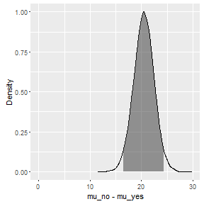

---
title: 
output: statsr:::statswithr_lab
---  


<h2><b>Bayesian modeling and prediction for movies</b></h2>
<br>
Author: Bruno Hunkeler   
Date:   01.01.2017
<hr>

Rotten Tomatoes and the Tomatometer™ rating is the most trusted measurement of quality entertainment. As the leading online aggregator of movie and TV show reviews 
from professional critics, Rotten Tomatoes offers the most comprehensive guide to what's fresh. The world famous Tomatometer™ rating represents the percentage 
of positive professional reviews for films and TV shows and is used by millions every day, to help with their entertainment viewing decisions. 
Rotten Tomatoes designates the best reviewed movies and TV shows as Certified Fresh. That accolade is awarded with Tomatometer ratings of 75% and higher, and a 
required minimum number of reviews. Weekly Rotten Tomatoes podcasts can be found on RottenTomatoes.com, iTunes, Soundcloud and Stitcher, and Rotten Tomatoes' 
entertainment experts make regular TV and radio appearances across the US.

In 2016, Flixster and Rotten Tomatoes became part of Fandango's portfolio of digital properties, serving moviegoers and entertainment fans.
The Tomatometer rating – based on the published opinions of hundreds of film and television critics – is a trusted measurement of movie and TV programming 
quality for millions of moviegoers. It represents the percentage of professional critic reviews that are positive for a given film or television show.

<b>What is the Tomatometer?</b><br>
The Tomatometer rating - based on the published opinions of hundreds of film and television critics - is a trusted measurement of movie and TV programming 
quality for millions of moviegoers.
The Tomatometer rating represents the percentage of professional critic reviews that are positive for a given film or television show.
Back in the days of the open theaters, when a play was particularly atrocious, the audience expressed their dissatisfaction by not only booing and hissing at 
the stage, but throwing whatever was at hand -- vegetables and fruits included.

<ul>
<li>The full popcorn bucket means the movie received 3.5 stars or higher by Flixster and Rotten Tomatoes users.</li>
<li>The tipped over popcorn bucket means the movie received less than 3.5 stars by Flixster and Rotten Tomatoes users.</li>
<li>The plus sign will appear for movies that do not have audience ratings or reviews. The percentage you see associated with this icon is the percentage of 
users who added the movie to their Want-to-See list.</li>
</ul>

<b>What is the audience score?</b><br>
The Audience rating, denoted by a popcorn bucket, is the percentage of all Flixster.com and RottenTomatoes.com users who have rated the movie or TV Show positively.

<ul>
<li>A good review is denoted by a fresh red tomato. In order for a movie or TV show to receive an overall rating of Fresh, the reading on the Tomatometer 
for that movie must be at least 60%.</li>
<li>A bad review is denoted by a rotten green tomato splat (59% or less).</li>
<li>To receive a Certified Fresh rating a movie must have a steady Tomatometer rating of 75% or better. Movies opening in wide release need at least 80 reviews 
from Tomatometer Critics (including 5 Top Critics). Movies opening in limited release need at least 40 reviews from Tomatometer Critics (including 5 Top Critics).
A TV show must have a Tomatometer Score of 75% or better with 20 or more reviews from Tomatometer Critics (including 5 Top Critics). If the Tomatometer score drops 
below 70%, then the movie or TV show loses its Certified Fresh status. In some cases, the Certified Fresh designation may be held at the discretion of the Rotten 
Tomatoes editorial team.</li>
</ul>

<h3><b>Data collection</b></h3>
IMDb started in 1990 as a hobby project by an international group of movie and TV fans. IMDb is now the world’s most popular and authoritative 
source for movie, TV and celebrity content.

The information in IMDb comes from various sources. While they actively gather information from and verify items with studios and filmmakers, 
the bulk of our information is submitted by people in the industry and visitors like you.
In addition to using as many sources as we can, the data goes through consistency checks to ensure it's as accurate and reliable as possible. 
However, there's absolutely no substitute for an international team of entertainment fans with an encyclopedic knowledge of trivia and a large 
assortment of reference works (and we include in this group many of our loyal contributors). The sources of information include, but are not 
limited to, on-screen credits, press kits, official bios, autobiographies, and interviews.

<h4><b>Dataset and further Information</b></h4>
Dataset and further information used to perform the given analysis were obtained from the following sources:<br>

<ul>
<li>Dataset: [Movies Data](https://d3c33hcgiwev3.cloudfront.net/_e1fe0c85abec6f73c72d73926884eaca_movies.Rdata?Expires=1474070400&Signature=etwXCxObXIQM7TGkZ7dqRQPH0LB8Yla0zveWIMhc3TiyKaF0CJ~cyiJs8usF1vuhc~nsgvA~6FTzt7zZG8-LsN8MXHcdMNARiC7Lcj4Dyf86QD6D0ew~mg3Gqw-tJuZFDWt3SudNv4FpPdNt97NOadr2lTt351G7OxrB3kjaMkE_&Key-Pair-Id=APKAJLTNE6QMUY6HBC5A)</li>
<li>Codebook: [Movies Codebook](https://d3c33hcgiwev3.cloudfront.net/_73393031e98b997cf2445132f89606a1_movies_codebook.html?Expires=1473465600&Signature=M9ShITsr7TZCndmtN5udxcVWqXa-kYwLJrhFhD63eXcIAG4cpVnpHKSJCHi7kaNCQ-TPSpR4HPPL~zUJoVR1ZlUBS6jSLOCuRHTjcLoWueb40h2LF9wWh12d4ZFSggpHhY3GFEiXvrr1aDANMFHMuAuCJ1BdYxRlE-FViJesVkI_&Key-Pair-Id=APKAJLTNE6QMUY6HBC5A)</li>
<li>Rotten Tomatoes: [Rotten Tomatoes](https://www.rottentomatoes.com/)</li>
<li>IMDB: [IMDB](http://www.imdb.com/)</li>
</ul>

<h4><b>Generalizability</b></h4>
The present data were derived from an observational study. The data set is comprised of 651 randomly sampled movies produced and released from 1970 to 2014. 
According to IMDb, there have 9,962 movies been release from 1972 to 2016 so that the 10% condition (9,962*10% = 996) is met. Since the sampling size is large enough and 
less than 10% of population, it can assume that the random sampling is conducted. Therefore we can conclude that the sample is indeed generalizable to the entire population. 

<h4><b>Causality</b></h4>
The data cannot be used to establish a causal relation between the variables of interest as there was no random assignment to the 
explanatory and independent variables.

<h3><b>Setup</b></h3>

<h4><b>Load packages</b></h4>


```r
library('ggplot2')      # library to create plots
library('dplyr')        # data manipulation
library('tidyr')
library('statsr')       # staistics functions
library('BAS')          # Bayesian statistics functions
library('GGally')       # library to create plots
library('knitr')        # required to apply knitr options 
library('grid')         # arrange plots 
library('gridExtra')    # arrange plots
library('MASS')         # AIC functions
source('Utilities.R')   # support functions used in the analysis - See Appendix

# apply general knitr options
knitr::opts_chunk$set(comment=NA, fig.align='center')
```

<h4><b>Load data</b></h4>
Initial load of the dataset.  


```r
load("Data/movies.Rdata")
data <- movies
```

<h2>Part 1: Data</h2>
The movies data from IMDB was used for the analysis at hand. Some of variables are in the original dataset provided, and others are new variables. This will need be to construct in the data manipulation section. 

<ul>
<li><b>feature_film:</b> 'yes' if title_type is Feature Film, 'no' otherwise</li>
<li><b>drama:</b> "yes" if genre is Drama, "no" otherwise</li>
<li><b>mpaa_rating_R:</b> "yes" if mpaa_rating is R, "no" otherwise</li>
<li><b>runtime:</b> </li>
<li><b>thtr_rel_year:</b> </li>
<li><b>oscar_season:</b> "yes" if movie is released in November, October, or December (based on thtr_rel_month), "no" otherwise</li>
<li><b>summer_season:</b> "yes" if movie is released in May, June, July, or August (based on thtr_rel_month), "no" otherwise</li>
<li><b>imdb_rating:</b> </li>
<li><b>imdb_num_votes:</b> </li>
<li><b>critics_score:</b> </li>
<li><b>best_pic_nom:</b> </li>
<li><b>best_pic_win:</b> </li>
<li><b>best_actor_win:</b> </li>
<li><b>best_actress_win:</b> </li>
<li><b>best_dir_win:</b> </li>
<li><b>top200_box:</b> </li>
</ul>


Perform an initial check of the loaded dataset. 

```r
# evaluate the size of the dataset
dim(data)
```

```
[1] 651  32
```

The output for the summary- and str() - function has been hidden since the output would be quiet exhaustive (verbose) by having 32 variables.
<br>

```r
# verify types and summary of each variable 
str(data)
summary(data)
```

<h3><b>Part 2: Data manipulation</b></h3>
In the original dataset , not all of the required features have been provided, so we will perform some feature engineering to create the required features. 
For the analysis new features as oscar_season, summer_season, mpaa_rating_R, drama and feature_film. All of them can be derived from existing variables 
in the dataset. 


```r
# ============================================================================================================
# Feature Engineering
# ============================================================================================================

# reasign yes or no to feature oscar_season, where release month is either  "10", "11", "12"
data <- data %>% mutate(oscar_season = as.factor(ifelse(thtr_rel_month %in% c('10', '11', '12'), 'yes', 'no')))

# reasign yes or no to feature summer_season, where release month is either  "6", "7", "8"
data <- data %>% mutate(summer_season = as.factor(ifelse(thtr_rel_month %in% c('6', '7', '8'), 'yes', 'no')))

# reasign yes or no to feature mpaa_rating_R, where mpaa_rating is "R"
data <- data %>% mutate(mpaa_rating_R = as.factor(ifelse(mpaa_rating == 'R', 'yes', 'no')))

# reasign yes or no to feature drama, where genre is "drama"
data <- data %>% mutate(drama = as.factor(ifelse(genre ==  'Drama', 'yes', 'no')))

# reasign yes or no to feature feature_film, where title_type is "Feature Film"
data <- data %>% mutate(feature_film = as.factor(ifelse(title_type ==  'Feature Film', 'yes', 'no')))
```

<h3><b>Part 3: Exploratory data analysis</b></h3>
The response variable of interest is <b> audience score</b>. To analyse the newly created features, we will create a subset of the full dataset, 
which only contains the required data. Then will remove the NA's from the dataset and check the audience_score data via a density function 
(incl. histogram) of the audience_score. I also applied the mean, median and the mode values to the figure. The dmode function is part of the 
utilities script and is available in the appendix.  


```r
features <- c('audience_score', 'oscar_season', 'summer_season', 'mpaa_rating_R', 'drama', 'feature_film' )
  
  # Create a new dataset to explicitely show dataset containing NA's
  data.analysis <- data[, features]
  
  # remove NA's
  data.analysis <- data.analysis[complete.cases(data.analysis), ]

  # calculate the mode of the distribution
  mode <- dmode(data.analysis$audience_score)
  
  ggplot(data = data.analysis, aes(x = audience_score, y = ..density..)) +
  geom_histogram(bins = 40, fill = 'steelblue', colour = 'black') + #bdbdbd
  geom_density(size = 1, colour = 'brown') + #cccccc
  geom_vline(data = data, mapping = aes( xintercept = mean(data$audience_score),
             colour = 'steelblue', show_guide = F ), size = 1.5) +
  geom_vline(data = data,mapping = aes( xintercept = median(data$audience_score),
             colour = 'green', show_guide = F), size = 1.5) +
  geom_vline(data = data, mapping = aes( xintercept = mode, colour = 'red', show_guide = F), 
             size = 1.5) +
  geom_text(data = data, aes( x = (mean(data$audience_score) - 5), y = .020, label = 'mean',
            colour = 'steelblue'), size = 4, parse = T) +
  geom_text(data = data,aes( x = (median(data$audience_score) + 5),y = .020,  label = 'median',
            colour = 'green'), size = 4, parse = T) +
  geom_text(data = data, aes( x = (mode + 5), y = .020, label = 'mode', colour = 'red'),
            size = 4, parse = T)
```


```r
  mean(data.analysis$audience_score)
```

```
[1] 62.36252
```

```r
  median(data.analysis$audience_score)
```

```
[1] 65
```

```r
  mode
```

```
[1] 80.42094
```

```r
  summary(data.analysis$audience_score)
```

```
   Min. 1st Qu.  Median    Mean 3rd Qu.    Max. 
  11.00   46.00   65.00   62.36   80.00   97.00 
```

```r
  IQR(data.analysis$audience_score)
```

```
[1] 34
```

The audience_score shows a slight left skewed structure. The IQR of the audience_score is 34 (1st Qu - 46 and 3rd Qu. 80), while the mean is around 62.4, the median is 65 
and the mode is about 80.42.

<h4><b>Analysis of the newly created features</b></h4>
We'll have a look at the newly created features <b>oscar_season, summer_season, mpaa_rating_R, drama and feature_film</b>. We create a boxplot for each feature, 
comparing them with the audience_score. We will also analyse the variability of the new features by comparing them to each other.


```r
data.grouped <- gather(data.analysis, 'features', 'flag', 2:6)

p1 <- ggplot(data = data.analysis, aes(x = summer_season, y = audience_score, fill = summer_season)) + 
      geom_boxplot() + ggtitle('Audience score vs summer season') + xlab('summer season') + 
      ylab('Audience Score') + scale_fill_brewer(name = "summer season")

p2 <- ggplot(data = data.analysis, aes(x = oscar_season, y = audience_score, fill = oscar_season)) + 
      geom_boxplot() + ggtitle('Audience score vs oscar_season') + xlab('oscar_season') + 
      ylab('Audience Score') + scale_fill_brewer(name = "oscar_season")

p3 <- ggplot(data = data.analysis, aes(x = drama, y = audience_score, fill = drama)) + geom_boxplot() +
      ggtitle('Audience score vs drama') + xlab('drama') + ylab('Audience Score') + 
      scale_fill_brewer(name = "drama")

p4 <- ggplot(data = data.analysis, aes(x = feature_film, y = audience_score, fill = feature_film)) + 
      geom_boxplot() + ggtitle('Audience score vs feature_film') + xlab('feature_film') + 
      ylab('Audience Score') + scale_fill_brewer(name = "feature_film")

p5 <- ggplot(data = data.analysis, aes(x = mpaa_rating_R, y = audience_score, fill = mpaa_rating_R)) + 
      geom_boxplot() + ggtitle('Audience score vs mpaa_rating_R') + xlab('mpaa_rating_R') + 
      ylab('Audience Score') + scale_fill_brewer(name = "mpaa_rating_R")

# arrange the previously created plots 
grid.arrange(p1, p2, p3, p4, p5, ncol = 2)
```


To compare the variability of the different features we aggregate all the above shown boxplots in one graph. We also prep a summary 
of all the newly created features to closer compare them.


```r
      ggplot(data = data.grouped, aes(x = features, y = audience_score, fill = flag)) + geom_boxplot() +
      ggtitle('Audience score vs grouped featues') + xlab('grouped featues') + ylab('Audience Score') +
      theme(axis.text.x = element_text(angle = 60, hjust = 1)) + 
      scale_fill_brewer(name = "grouped featues")
```


```r
data.grouped %>%
 group_by(features, flag) %>%
 summarise(mean = mean(audience_score), median = median(audience_score), min = min(audience_score), 
           max = max(audience_score), IQR = IQR(audience_score))
```

```
Source: local data frame [10 x 7]
Groups: features [?]

        features  flag     mean median   min   max   IQR
           <chr> <chr>    <dbl>  <dbl> <dbl> <dbl> <dbl>
1          drama    no 59.73121   61.0    11    97 38.00
2          drama   yes 65.34754   70.0    13    95 28.00
3   feature_film    no 81.05000   85.5    19    96 12.50
4   feature_film   yes 60.46531   62.0    11    97 33.50
5  mpaa_rating_R    no 62.68944   65.5    11    96 31.75
6  mpaa_rating_R   yes 62.04255   64.0    14    97 35.00
7   oscar_season    no 61.81304   64.0    11    96 33.00
8   oscar_season   yes 63.68586   69.0    13    97 33.50
9  summer_season    no 62.60370   65.0    11    97 34.00
10 summer_season   yes 61.64634   65.0    17    94 31.25
```

The new features do not show much variability in the different features, which <b>leads to the conclusion that none of the above 
features are valuable towards the prediction of the audience score. The only feature which might be relevant, could be the 
'feature_film' feature. There seems to be a clear differentiation.</b> But we shouldn't jump into conclusions right away, 
therefore we will continue analysing the data.

Finally we will have a look at the other features used in the dataset. I left out the features as runtime, imdb_rating, imdb_num_votes, 
Above a selection of Density plots have been visualized. The plots show different features compared to the audience score.


```r
features <- c( 'audience_score', 'feature_film', 'drama', 'runtime', 'mpaa_rating_R', 'thtr_rel_year', 
               'oscar_season', 'summer_season', 'imdb_rating', 'imdb_num_votes', 'critics_score', 
               'best_pic_nom', 'best_pic_win', 'best_actor_win', 'best_actress_win', 'best_dir_win', 
               'top200_box')

    # Create a new dataset to explicitely show dataset containing NA's
    data.model <- data[, features]
    
    # remove NA's
    data.model<- data.model[complete.cases(data.model), ]

    p1 <- ggplot(data.model, aes(audience_score, fill = feature_film))
    p1 <- p1 + geom_density(size=1, colour="darkgreen") + labs(title = "Dist. of audience score vs. feature_film") + 
               labs(x = "feature film", y = "Density")
    
    p2 <- ggplot(data.model, aes(audience_score, fill = drama))
    p2 <- p2 + geom_density (alpha = 0.2) + labs(title = "Dist. of audience score vs. drama") + 
               labs(x = "drama", y = "Density")
    
    p3 <- ggplot(data.model, aes(audience_score, fill = top200_box))
    p3 <- p3 + geom_density (alpha = 0.2) + labs(title = "Dist. of audience score vs. top200_box") +
               labs(x = "top200 box", y = "Density")
    
    p4 <- ggplot(data.model, aes(audience_score, fill = oscar_season))
    p4 <- p4 + geom_density(size=1, colour="darkgreen") + labs(title = "Dist. of audience score vs. oscar_season") + 
               labs(x = "oscar season", y = "Density")

    p5 <- ggplot(data.model, aes(audience_score, fill = summer_season))
    p5 <- p5 + geom_density (alpha = 0.2) + labs(title = "Dist. of audience score vs. summer_season") + 
               labs(x = "summer season", y = "Density")
    
    p6 <- ggplot(data.model, aes(audience_score, fill = best_pic_nom))
    p6  <- p6 + geom_density (alpha = 0.2) + labs(title = "Dist. of audience score vs. best_pic_nom") + 
                labs(x = "best pic nom", y = "Density")
    
    p7 <- ggplot(data.model, aes(audience_score, fill = best_pic_win))
    p7 <- p7 + geom_density(size=1, colour="darkgreen") + labs(title = "Dist. of audience score vs. best pic win") + 
               labs(x = "best pic win", y = "Density")
    
    p8 <- ggplot(data.model, aes(audience_score, fill = best_actor_win))
    p8 <- p8 + geom_density (alpha = 0.2) + labs(title = "Dist. of audience score vs. best_actor_win") + 
               labs(x = "best actor win", y = "Density")
    
    p9 <- ggplot(data.model, aes(audience_score, fill = best_dir_win))
    p9 <- p9 + geom_density (alpha = 0.2) + labs(title = "Dist. of audience score vs. best_dir_win") + 
               labs(x = "best dir win", y = "Density")
    
    p10 <- ggplot(data.model, aes(audience_score, fill = best_actress_win))
    p10 <- p10 + geom_density (alpha = 0.2) + labs(title = "Dist. of audience score vs. best_actress_win") + 
                 labs(x = "best actress win", y = "Density")
    
    grid.arrange(p1, p2, p3, p4, p5, p6, p7, p8, p9, p10, ncol = 2)
```


<h4><b>Hypothesis Test</b></h4>

As with the frequentist approach we use these data to perform basic inference on μ the audience_score of all movies in the dataset. To do this we will use the bayes_inference function, which will allow us to construct credible intervals perform a hypothesis test and calculate Bayes factors for a variety of different circumstances.
The main goal is to investigate if the newly created features influence the audience_score. Remember we assumed that the new fetures will not influence the audience_score very much. 

We will conduct a Bayesian hypothesis test by calculating a Bayes factor for each feature. The following hypothesis is meant to be generic and needs to be adjusted for each individual feature 
(feature_film, drama, mpaa_rating_R, oscar_season and summer_season). We assigned a uniform prior and use a 'two sided' direction for each analysis. I'll just print on of the summaries to indicate the information which is contained. 
All others will be suppressed to save some space. Enable the params - show_res and show_summ by setting the value to TRUE.

$$ H_1: \mu = (value) $$

$$ H_2: \mu \ne (value) $$


```r
bayes_inference(y = audience_score, data = data.analysis, cred_level = 0.95, statistic = "mean", type = "ci", null = 0, show_res = FALSE, show_summ = FALSE)
```


```r
bayes_inference(x = feature_film, y = audience_score, data = data.analysis, cred_level = 0.95, hypothesis_prior = c(0.5, 0.5), statistic = "mean", type = "ht", null = 0, alternative = 'twosided', show_res = TRUE, show_summ = TRUE)
```

```
Response variable: numerical, Explanatory variable: categorical (2 levels)
n_no = 60, y_bar_no = 81.05, s_no = 13.5764
n_yes = 591, y_bar_yes = 60.4653, s_yes = 19.824
(Assuming intrinsic prior on parameters)
Hypotheses:
H1: mu_no  = mu_yes
H2: mu_no != mu_yes

Priors:
P(H1) = 0.5 
P(H2) = 0.5 

Results:
BF[H2:H1] = 4.221452e+13
P(H1|data) = 0 
P(H2|data) = 1 
```


```r
bayes_inference(x = feature_film, y = audience_score, data = data.analysis, cred_level = 0.95, hypothesis_prior = c(0.5, 0.5), statistic = "mean", type = "ht", null = 0, alternative = 'twosided', show_res = FALSE, show_summ = FALSE )
```



```r
bayes_inference(x = oscar_season, y = audience_score, data = data.analysis, cred_level = 0.95, hypothesis_prior = c(0.5, 0.5), statistic = "mean", type = "ht", null = 0, alternative = 'twosided', show_res = FALSE, show_summ = FALSE)
```


```r
bayes_inference(x = summer_season, y = audience_score, data = data.analysis, cred_level = 0.95, hypothesis_prior = c(0.5, 0.5), statistic = "mean", type = "ht", null = 0, alternative = 'twosided', show_res = FALSE, show_summ = FALSE)
```


```r
bayes_inference(x = drama, y = audience_score, data = data.analysis, cred_level = 0.95, hypothesis_prior = c(0.5, 0.5), statistic = "mean", type = "ht", null = 0, alternative = 'twosided', show_res = FALSE, show_summ = FALSE)
```


```r
bayes_inference(x = mpaa_rating_R, y = audience_score, data = data.analysis, cred_level = 0.95, hypothesis_prior = c(0.5, 0.5), statistic = "mean", type = "ht", null = 0, alternative = 'twosided', show_res = FALSE, show_summ = FALSE)
```


<b>Bayes Factors</b>

feature           | BF[H1:H2] | BF[H2:H1] | Evidence against    |                    
------------------|-----------|-----------|---------------------|
feature_film      |           | 4.22e+13  |   H1 (Very Strong)  |
oscar_season      | 13.3993   |           |   H2 (Positive)     |
summer_season     | 19.8084   |           |   H2 (Positive)     |
drama             |           | 22.6567   |   H1 (Positive)     |
mpaa_rating_R     | 23.9679   |           |   H2 (Positive)     |

The newly created features seem not to be very indicative for the prediction of the audience_score as shown in the table above. The only feature which shows a differentiation is 'feature_film'. There is strong evidence against H1, which means that there is a significant difference in mean audience_score for feature- and non-feature films. While the data 
provides a positive evidence that there is no difference between 'audience_scores' and all the other (new) features (mpaa_rating_R, oscar_season, summer_season, drama).

<h3><b>Part 4: Modelling</b></h3>
The best model is not always the most complicated. Sometimes including variables that are not evidently important, can actually reduce the accuracy of predictions. 
In practice, the model that includes all available explanatory variables is often referred to as the full model. The full model may not be the best model, and if 
it isn't, we want to identify a smaller model that is preferable.

<b>Full model:</b><br>
<b>audience_score ~ feature_film + drama + runtime + mpaa_rating_R + thtr_rel_year + oscar_season + summer_season + imdb_rating + imdb_num_votes + critics_score + 
best_pic_nom + best_pic_win + best_actor_win + best_actress_win + best_dir_win + top200_box</b>

<b>Bayesian Model Averaging (BMA)</b></br>
A comprehensive approach to address model uncertainty is Bayesian model averaging, which allows us to assess the robustness of results to alternative specifications by 
calculating posterior distributions over coefficients and models. Given the 17 features (n) there can be 2^n = 2^17 possible models. We will explore model uncertainty using 
posterior probabilities of models based on BIC. We will use BIC as a way to approximate the log of the marginal likelihood. The Bayesian information criterion (BIC) runs through </br></br>
several fitted model objects for which a log-likelihood value can be obtained, according to the formula -2*log-likelihood + npar*log(nobs), where npar represents the number of 
parameters and nobs the number of observations in the fitted model. 

We show the model selection based on two different priors (Zellner and BIC), but we will also compare the model selection based on the following priors
"g-prior", "AIC", "hyper-g-n", "EB-local". The last part will indicate the Akaike information criterion (AIC), which uses a backward feature elimination method 
and the model which is proposed by this approach.


```r
features <- c( 'audience_score', 'feature_film', 'drama', 'runtime', 'mpaa_rating_R', 'thtr_rel_year', 
               'oscar_season', 'summer_season', 'imdb_rating', 'imdb_num_votes', 'critics_score', 
               'best_pic_nom', 'best_pic_win', 'best_actor_win', 'best_actress_win', 'best_dir_win', 
               'top200_box')

    # Create a new dataset to explicitely show dataset containing NA's
    data.model <- data[, features]
    
    # remove NA's
    data.model<- data.model[complete.cases(data.model), ]

    # str(data.model)

    formula <- getFormula(data.model, 'audience_score')
```

<h4><b>Bayesian Information Criterion</b></h4>

```r
    audience.BIC = bas.lm(
      formula = formula,
      prior = "BIC",
      modelprior = uniform(),
      data = data.model
    )
```

The object provides the marginal posterior inclusion probabilities. The marginal posterior inclusion probability is the probability that the predictor variable is included in the model. We can also extract this directly from the object as
    

```r
    audience.BIC$probne0
```

```
 [1] 1.00000000 0.06475617 0.04308556 0.47067030 0.20009502 0.09050567
 [7] 0.07703667 0.04080086 1.00000000 0.05796731 0.89156709 0.13014756
[13] 0.03982897 0.14531668 0.14134972 0.06679156 0.04771535
```

<b>Coefficient Summaries</b><br>
The summary outputs have been aggregated for convenience purposes. The section shows the marginal posterior mean, standard deviation and posterior inclusion probabilities obtained by BMA.


```r
audience.BIC.coef = coef(audience.BIC)
interval   <- confint(audience.BIC.coef)
names <- c("post mean", "post sd", colnames(interval))
interval   <- cbind(audience.BIC.coef$postmean, audience.BIC.coef$postsd, interval)
colnames(interval) <- names
interval
```

```
                        post mean      post sd        2.5  %      97.5  %
Intercept            6.234769e+01 3.946167e-01  6.153756e+01 6.308359e+01
feature_filmyes     -1.026910e-01 5.587450e-01 -9.115289e-01 1.661284e-01
dramayes             1.578519e-02 1.931899e-01  0.000000e+00 0.000000e+00
runtime             -2.574711e-02 3.121048e-02 -8.360803e-02 0.000000e+00
mpaa_rating_Ryes    -3.041432e-01 7.038116e-01 -2.135862e+00 0.000000e+00
thtr_rel_year       -4.518100e-03 1.815856e-02 -5.202761e-02 0.000000e+00
oscar_seasonyes     -8.402533e-02 3.848415e-01 -8.977113e-01 4.381160e-03
summer_seasonyes     1.399590e-02 1.990719e-01  0.000000e+00 0.000000e+00
imdb_rating          1.497376e+01 7.284561e-01  1.367940e+01 1.654314e+01
imdb_num_votes       2.101237e-07 1.318417e-06 -4.334806e-08 2.114481e-06
critics_score        6.332453e-02 3.013544e-02  0.000000e+00 1.050981e-01
best_pic_nomyes      5.009061e-01 1.558141e+00  0.000000e+00 4.891951e+00
best_pic_winyes     -8.236391e-03 8.471404e-01  0.000000e+00 0.000000e+00
best_actor_winyes   -2.903941e-01 8.358697e-01 -2.550719e+00 0.000000e+00
best_actress_winyes -3.090744e-01 9.060905e-01 -2.903550e+00 0.000000e+00
best_dir_winyes     -1.190122e-01 6.214955e-01 -1.246314e+00 0.000000e+00
top200_boxyes        8.704627e-02 7.065880e-01  0.000000e+00 0.000000e+00
                             beta
Intercept            6.234769e+01
feature_filmyes     -1.026910e-01
dramayes             1.578519e-02
runtime             -2.574711e-02
mpaa_rating_Ryes    -3.041432e-01
thtr_rel_year       -4.518100e-03
oscar_seasonyes     -8.402533e-02
summer_seasonyes     1.399590e-02
imdb_rating          1.497376e+01
imdb_num_votes       2.101237e-07
critics_score        6.332453e-02
best_pic_nomyes      5.009061e-01
best_pic_winyes     -8.236391e-03
best_actor_winyes   -2.903941e-01
best_actress_winyes -3.090744e-01
best_dir_winyes     -1.190122e-01
top200_boxyes        8.704627e-02
```

The summary of the given model indicates the top 5 models. The model containing the intercept, runtime, mdb_rating and critics_score, show the best performance, but as one can see, the top 2 models contain only about 27 percent of the posterior mass over all models. 

```r
summary(audience.BIC)
```

```
     Intercept feature_filmyes dramayes runtime mpaa_rating_Ryes
[1,]         1               0        0       1                0
[2,]         1               0        0       0                0
[3,]         1               0        0       0                0
[4,]         1               0        0       0                1
[5,]         1               0        0       1                1
     thtr_rel_year oscar_seasonyes summer_seasonyes imdb_rating
[1,]             0               0                0           1
[2,]             0               0                0           1
[3,]             0               0                0           1
[4,]             0               0                0           1
[5,]             0               0                0           1
     imdb_num_votes critics_score best_pic_nomyes best_pic_winyes
[1,]              0             1               0               0
[2,]              0             1               0               0
[3,]              0             1               0               0
[4,]              0             1               0               0
[5,]              0             1               0               0
     best_actor_winyes best_actress_winyes best_dir_winyes top200_boxyes
[1,]                 0                   0               0             0
[2,]                 0                   0               0             0
[3,]                 1                   0               0             0
[4,]                 0                   0               0             0
[5,]                 0                   0               0             0
            BF PostProbs     R2 dim   logmarg
[1,] 1.0000000    0.1353 0.7549   4 -3615.279
[2,] 0.9968489    0.1348 0.7525   3 -3615.282
[3,] 0.2543185    0.0344 0.7539   4 -3616.648
[4,] 0.2521327    0.0341 0.7539   4 -3616.657
[5,] 0.2391994    0.0324 0.7563   5 -3616.710
```

<b>Model Space</b><br>
To visualize the space of models (by default the top 20 models in terms of their posterior probabilities), we may use the image function. The image below shows the best model 
on the left hand side (indicated with a 1). It indicates that the best model can be built by using the features - runtime, critics_score and imdb_rating.
    

```r
image(audience.BIC, rotate = FALSE)
```


    

```r
par(mfrow=c(2,2))
plot(audience.BIC, ask = F, add.smooth = F, caption="", col.in = 'steelblue', col.ex  = 'darkgrey', pch=17, lwd=2)
```


The first is a plot of residuals and fitted values under Bayesian Model Averaging. Ideally, of our model assumptions hold, we will not see outliers or non-constant variance. The second plot shows the cumulative probability of the models in the order that they are sampled. This plot indicates that the cumulative probability is levelling off as each additional model adds only a small increment to the cumulative probability, which earlier, there are larger jumps corresponding to sampling high probability models. The third plot shows the dimension of each model (the number of regression coefficients including the intercept) versus the log of the marginal likelihood of the model. The last plot shows the marginal posterior inclusion probabilities (pip) for each of the covariates, with marginal pips greater than 0.5 shown in red. The variables with pip > 0.5 correspond to what is known as the median probability model. Variables with high inclusion probabilities are generally important for explaining the data or prediction, but marginal inclusion probabilities may be small if there are extreme correlations among predictors, like p-values may be large in the presence of multicollinearity.

<h4><b>Zellner-Siow Cauchy</b></h4>

We are going to use the Zellner-Siow Cauchy prior with an MCMC method. We define 10^6 iterations for the model.


```r
audience.ZS =  bas.lm(formula = formula, 
                   data = data.model,
                   prior="ZS-null",
                   modelprior=uniform(),
                   method = "MCMC", 
                   MCMC.iterations = 10^6) 
```

<b>Model Space</b><br>
To visualize the space of models (by default the top 20 models in terms of their posterior probabilities), we may use the image function. The image below shows the best model 
on the left hand side (indicated with a 1). It indicates that the best model can be built by using the features - runtime, critics_score and imdb_rating.
    

```r
image(audience.ZS, rotate = FALSE)
```


```r
par(mfrow=c(2,2))
plot(audience.ZS, ask=F, add.smooth=F, caption="", col.in = 'steelblue', col.ex  = 'darkgrey', pch=17, lwd=2)
```


As we can see the, based on the different priors (BIC and ZS-null) the models as such differ. With a BIC prior, we have an ideal model which proposes the features 'runtime', 'imdb_rating' and 'critics_score', while on the other hand the ZS-null prior proposes a model with features 'imdb_rating' and 'critics_score'.

<h4><b>AIC Model Selection</b></h4>  
The Akaike information criterion (AIC) is a measure of the relative quality of statistical models for a given set of data. Given a collection of models for the data, AIC estimates the quality of each model, relative to each of the other models. Hence, AIC provides a means for model selection.

The AIC model might not deliver the parsimonious model, but often provides a model, which provides a better prediction. We use the backward elimination to find 
the best model.


```r
      lm.AIC <- lm(formula, data = data.model)
      aic.model <- stepAIC(lm.AIC, direction = 'backward', trace = FALSE)
      aic.model$anova
```

```
Stepwise Model Path 
Analysis of Deviance Table

Initial Model:
audience_score ~ feature_film + drama + runtime + mpaa_rating_R + 
    thtr_rel_year + oscar_season + summer_season + imdb_rating + 
    imdb_num_votes + critics_score + best_pic_nom + best_pic_win + 
    best_actor_win + best_actress_win + best_dir_win + top200_box

Final Model:
audience_score ~ runtime + mpaa_rating_R + thtr_rel_year + imdb_rating + 
    critics_score + best_pic_nom + best_actor_win + best_actress_win

              Step Df    Deviance Resid. Df Resid. Dev      AIC
1                                       633   63080.98 3007.881
2  - summer_season  1   0.2583583       634   63081.23 3005.884
3     - top200_box  1  12.1318917       635   63093.37 3004.009
4   - best_dir_win  1  46.6853202       636   63140.05 3002.490
5   - best_pic_win  1  85.5472230       637   63225.60 3001.370
6   - oscar_season  1 106.3793211       638   63331.98 3000.463
7   - feature_film  1 155.7300727       639   63487.71 3000.059
8          - drama  1 121.3556022       640   63609.06 2999.300
9 - imdb_num_votes  1 147.8290884       641   63756.89 2998.809
```

As one can see, the conventional AIC proposes the following model, which uses several additional features for prediction:</br>
audience_score ~ runtime + mpaa_rating_R + thtr_rel_year + imdb_rating + critics_score + best_pic_nom + best_actor_win + best_actress_win

<h4><b>Analysis with different priors </b></h4>
To indicate which parameters would be favoured output would be quiet exhaustive. So we only used the reduced feature set proposed by Zellner-Siow and BIC.


```r
    features <-
      c( 'audience_score', 'runtime', 'imdb_rating', 'critics_score')

    # Create a new dataset to explicitely show dataset containing NA's
    data.final <- data[, features]
    
    # remove NA's
    data.final<- data.final[complete.cases(data.final), ]
    formula <- getFormula(data.final, 'audience_score')

      n = nrow(data.final)   
      movie.g   = bas.lm(formula, data = data.final, prior = "g-prior",   a=n, modelprior = uniform()) 
      movie.ZS  = bas.lm(formula, data = data.final, prior = "ZS-null",   a=n, modelprior = uniform())
      movie.BIC = bas.lm(formula, data = data.final, prior = "BIC",       a=n, modelprior = uniform())
      movie.AIC = bas.lm(formula, data = data.final, prior = "AIC",       a=n, modelprior = uniform())
      movie.HG  = bas.lm(formula, data = data.final, prior = "hyper-g-n", a=3, modelprior = uniform()) 
      movie.EB  = bas.lm(formula, data = data.final, prior = "EB-local",  a=n, modelprior = uniform())
      
      probne0 = cbind(movie.BIC$probne0, movie.g$probne0, movie.ZS$probne0, movie.HG$probne0, movie.EB$probne0, 
                      movie.AIC$probne0)
      colnames(probne0) = c("BIC","g", "ZS", "HG", "EB", "AIC")
      rownames(probne0) = c(movie.BIC$namesx)
      
      for (i in 2:4) {
        barplot(height = probne0[i,], ylim = c(0,1), main = movie.g$namesx[i], col.main = 'darkgrey', 
                col = 'steelblue')
      }
```


All models favour the reduced model with only the 'imdb_rating' and 'critics_score' except AIC. AIC would also include the 'runtime' feature.

<h4><b>Final Model</b></h4>
Based on the previous analysis we will use the following model to continue with the prediction: <b>audience_score ~ imdb_rating + critics_score</b></br>
It seems a little fuzzy to me, that a final model basically follows 'one' predictor - 'critics_score'. I suppose there must be better predictors, 
which we weren't asked to use.


```r
    features <- c( 'audience_score', 'imdb_rating', 'critics_score' )

    # Create a new dataset to explicitely show dataset containing NA's
    data.final <- data[, features]
    
    # remove NA's
    data.final<- data.final[complete.cases(data.final), ]
    formula <- getFormula(data.final, 'audience_score')
    
    audience.ZS =  bas.lm(audience_score ~ .,  
                          data = data.final,
                          prior = "ZS-null",
                          modelprior = uniform(),
                          method = "MCMC", 
                          MCMC.iterations = 10^6)    
```


<h4><b>Inference with model selection</b></h4>
In addition to using BMA, we can use the posterior means under model selection. This corresponds to a decision rule that combines estimation and selection. 

<b>Bayesian model averaging</b>


```r
model <- audience.ZS
BMA  = predict(model, estimator="BMA")
```


```r
HPM = predict(model, estimator="HPM")

model.ZS = coef(model)
model.ZS$conditionalmeans[HPM$best,]
```

```
    Intercept   imdb_rating critics_score 
  62.36251920   14.64077841    0.07309197 
```

```r
model.ZS$conditionalsd[HPM$best,]
```

```
    Intercept   imdb_rating critics_score 
   0.39501689    0.56557991    0.02160024 
```


```r
BMA <- predict(model, estimator="BMA")  # Bayesian model averaging, using optionally only the 'top' models 
HPM <- predict(model, estimator="HPM")  # The highest probability model 
BPM <- predict(model, estimator="BPM")  # The model that is closest to BMA predictions under squared error loss. 
# MPM <- predict(model, estimator="MPM")  # The median probability model of Barbieri and Berger

library(GGally)
ggpairs(data.frame(HPM = as.vector(HPM$fit),  #this used predict so we need to extract fitted values
                   BPM = as.vector(BPM$fit),  # this used fitted
                   BMA = as.vector(BMA$fit))) # this used predict
```


```r
BPM = predict(audience.ZS, estimator="BPM", se.fit=TRUE)
audience.conf.fit = confint(BPM, parm="mean")
audience.conf.pred = confint(BPM, parm="pred")
# cbind(audience.conf.fit, audience.conf.pred)
# plot(audience.conf.fit)
```

<h3><b>Part 5: Prediction</b></h3>

Finally, I'll provide the predicted value, based on a 95% CI. We used the movie <b>Sully</b> for that purpose. We couldn't find the actual audience score, 
therefore it is unclear, how precise the predicted values is, but we went the route to train the model with a training set and used the test set to validate the 
actual values.


```r
    features <- c( 'audience_score', 'imdb_rating', 'critics_score' )

    # Create a new dataset to explicitely show dataset containing NA's
    data.final <- data[, features]
    
    # remove NA's
    data.final<- data.final[complete.cases(data.final), ]
    
    ds <- splitTrainTestSet(data = data.final, 0.6)
    df.train <- data.frame(ds$train)
    df.test  <- data.frame(ds$test)   

    audience.ZS =  bas.lm(audience_score ~ .,  
                          data = df.train,
                          prior = "ZS-null",
                          modelprior = uniform(),
                          method = "MCMC", 
                          MCMC.iterations = 10^6)    

    predict.value <- ds$test[2,]
    pred.A <- predict(audience.ZS, newdata = predict.value, estimator="BMA")

    # Error in percent  
    Error_in_percent.A = round(100 - (round(pred.A$Ybma, 2) * 100 / predict.value$audience_score), 2)

    predict.value <- ds$test[34,]
    pred.B <- predict(audience.ZS, newdata = predict.value, estimator="BMA")

    # Error in percent  
    Error_in_percent.B = round(100 - (round(pred.B$Ybma, 2) * 100 / predict.value$audience_score), 2)
    
    # ===============================================================================================
    # Sully 
    # ===============================================================================================
   
    audience.ZS =  bas.lm(audience_score ~ .,  
                          data = data.final,
                          prior = "ZS-null",
                          modelprior = uniform(),
                          method = "MCMC", 
                          MCMC.iterations = 10^6)    
    
    predict.value <- data.frame( imdb_rating = 7.6, critics_score = 74, audience_score = 80 )
    predict.sully <- predict(audience.ZS, newdata = predict.value, estimator="BMA")
    predict.sully$Ybma
```

```
        [,1]
[1,] 79.8057
```
To verify the model we initially separate the dataset into a training and a test dataset. We train the model with the training data and afterwards use some test sets to verify the defined model. 

The predicted value for Sully is ~80, which might be a realistic value, based on the previously validated values. The actual audience score for this particular movie has a lower bound of approximately 60.42 and a higher bound of approximately 100.03.

<h3><b>Part 6: Conclusion</b></h3>

The predictive model presented here is used to predict the audience scores for a movie. Using Bayesian model average many models can be constructed to perform 
better predictions. The proposed linear model shows a 'fairly good' prediction rate, but it should be noted that the model is based on a very small sample. 
Fact is that imdb_rating has the highest posterior probability, and that basically all of the newly created features were useless to support a better prediction. Creating a model, which has a high 
predictive power is not so easy to reach. Using Bayes for better prediction is only one part of the game. It might be beneficial to gather more data or try to extend the feature engineering part,
which means to creating new meaningful features from existing or gather data for new features. I doubt that a feature as 'summer_season' or if a movie has an mpaa_rating - R is supporting the prediction.
 
I have my personal view on how I would rely on other features to evaluate a audience score (e.g. genre, actors etc.). What I figured as well is, that Lower bound audience_scores show a much higher difference. 
Therefore we might think about a second or higher order polynomial model. But we still need be carefull to find a decent balance between over-, and underfitting the model. 

One last word. Having selected the model based on a bayesian model does not per se mean that the model automatically generalizes better. So you are still free to add or remove certain predictors for the 
greater good. It's called the expert opinion.

<h3>Appendix</h3>

<h4>getFormula Function</h4>
The following Function has been used throughout the project. It is just a convenience function to improve the readability.


```r
# ===============================================================================================================
# getFormula  - will retrieve the formula based on a data set
# 
# Parameter:
#   data  - dataset
#   label - label 
# ===============================================================================================================

getFormula <- function(data = data, label = label) {
  
  # label Variable
  labelVar <- label
  
  # separate measure Variable y column from rest 
  groupVariables <- setdiff(colnames(data), list(label))
  
  # create formula for model 
  formula <- as.formula(paste(labelVar, paste(groupVariables, collapse = ' + '), sep = ' ~ '))
  
}
```

<h4>dmode Function</h4>

```r
# ===============================================================================================================
# dmode  - will retrieve the mode of a given desity function (data) 
# 
# Parameter:
#   vector - label 
# ===============================================================================================================

dmode <- function(x) {
  den <- density(x, kernel = c("gaussian"))
  ( den$x[den$y == max(den$y)] )   
}  
```

<h4>splitTrainTestSet Function</h4>

```r
# ===============================================================================================================
# Computing splitTrainTestSet 
# 
# Split the data set into a training and test set based on the given split ratio
# 
# Parameter:
#   data  - data set
#   split - split ratio
# ===============================================================================================================

splitTrainTestSet <- function(data = data, split = 0.5) {
  
  sub <- sample(nrow(data), floor(nrow(data) * split))
  train <- data[sub,]
  test <- data[ - sub,]
  
  split.set <- list(train = train, test = test)
  
  return(split.set)
}
```


